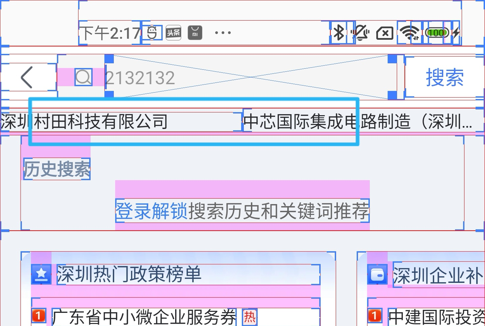

# 问题

碰到了一个诡异的问题， 当TextView的代码如下：

```hmtl

        <LinearLayout
            android:orientation="horizontal"
            android:weightSum="2"
            android:layout_width="match_parent"
            android:layout_height="wrap_content">

            <TextView
                android:layout_width="0dp"
                android:layout_weight="1"
                android:includeFontPadding="false"
                android:layout_height="wrap_content"
                android:maxLines="1"
                android:ellipsize="end"
                android:textColor="@color/qizhidao_color_text_title"
                android:textSize="@dimen/common_26"
                android:text="深圳村田科技有限公司"
                tools:text="标题" />

            <TextView
                android:layout_width="0dp"
                android:layout_weight="1"
                android:includeFontPadding="false"
                android:layout_height="wrap_content"
                android:maxLines="1"
                android:ellipsize="end"
                android:textColor="@color/qizhidao_color_text_title"
                android:textSize="@dimen/common_26"
                android:text="中芯国际集成电路制造（深圳）有限责任公司哈哈哈哈或或"
                tools:text="标题" />

        </LinearLayout>
```

includeFontPadding = false,TextView 触发 ellipsize 的时候,界面的表现如下:




"深圳村田科技有限公司"和“中芯国际集成电路制造(深圳...”  二个 TextView 的高度不一致，触发了 ellipsize 的TextView 的高度变高了。


如果includeFontPadding = "true" 则不会发生这种情况。


# 原因分析

到目前为止，都没有找到具体的原因，猜测是 TextView 的内部bug ;


具体的，TextView 的 lineHeight 和 measuredHeight 不一样。

# 临时解决方案

## 方案一

includeFontPadding = true  进行规避


## 方案二  


自定义ViewGroup去修正这个偏差


``` koltin

 override fun onMeasure(widthMeasureSpec: Int, heightMeasureSpec: Int) {

       // 其它的业务代码
       val measureHeight = if (textView.lineHeight < textView.measuredHeight) {
            textView.lineHeight
        } else {
            textView.measuredHeight
        }
     }
 override fun onLayout(changed: Boolean, l: Int, t: Int, r: Int, b: Int) {
        val left = paddingLeft + marginLeft
        var  top = paddingTop + marginTop
        if (textView.lineHeight < textView.measuredHeight){
            top -= textView.measuredHeight -textView.lineHeight
        }
        textView.layout(left, top, left + textView.measuredWidth, top + textView.measuredHeight)
        /// 其它的代码
        
        }
```