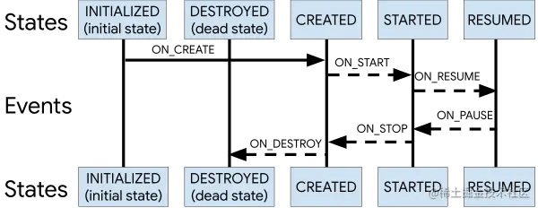

# 概述


## LifecycleOwner 

```
/**
 * A class that has an Android lifecycle. These events can be used by custom components to
 * handle lifecycle changes without implementing any code inside the Activity or the Fragment.
 *
 * @see Lifecycle
 * @see ViewTreeLifecycleOwner
 */
@SuppressWarnings({"WeakerAccess", "unused"})
public interface LifecycleOwner {
    /**
     * Returns the Lifecycle of the provider.
     *
     * @return The lifecycle of the provider.
     */
    @NonNull
    Lifecycle getLifecycle();
}
```

这就是一个规范而已。该组件是否有Lifecycle 的规范


核心的 就是 Lifecycle; Lifecycle 的子类只有一个实现就是 LifecycleRegistry 关于  LifecycleRegistry 的代码不建议去看，因为没有必要。有两个主要的疑点

- 为什么会有 Event 和State
- “重入”的概念

# Lifecycle

Lifecycle关键核心的代码如下：

```
public abstract class Lifecycle {
    @MainThread
    public abstract void addObserver(@NonNull LifecycleObserver observer);

    @MainThread
    public abstract void removeObserver(@NonNull LifecycleObserver observer);

    @MainThread
    @NonNull
    public abstract State getCurrentState();
}
```


- LifecycleRegistry 是 Lifecycle 的具体实现，所有的业务逻辑处理都是在  LifecycleRegistry 进行处理的
  
> LifecycleRegistry核心代码就是方法sync

- androidx.frgment.Fragment 和 FragmentActivity 直接在各自的生命周期回调中处理（LifecycleRegistry.handleLifecycleEvent）;但是 ComponentActivity 确使用了ReportFragment作为什么周期的观察者.

**关于ReportFragment**

在 api>= 29 的时候通过在 Aplication 中注入Application.ActivityLifecycleCallbacks ；<29则是  通过 ReportFragment 


## Lifecycle 设计的难点

### 粘性

 在 onResume 中添加 LifecycleObserver 那么 它依然可以收到 onCreateEvent ,OnStartEvent,OnResumeEvent;这个就是粘性。


### 回流

简单的说，就是新加入的 observer 状态不大于前面的；因此引入了 mParentStates.

```
fun oResume(){
lifecycle.addObserver(object :LifecycleEventObserver{
            override fun onStateChanged(source: LifecycleOwner, event: Lifecycle.Event) {
                if (event == Lifecycle.Event.ON_START){
                    lifecycle.addObserver(object :LifecycleEventObserver{
                        override fun onStateChanged(source: LifecycleOwner, event: Lifecycle.Event) {
                        }
                    })
                }
            }

}

```

- 在 OnResume中添加 A
- 在 A 的 event的 start 中添加 新的观察着B

问题就来了，此时 A的分发状态才到 statr 但是新加入的B 此时的状态应该是 resume ；为了让A的状态不大于A,引入了 mParentState 去检验状态。


**其实就是后添加的观察者执行的顺序应该在前面执行之后，比如先添加了A，再添加了B,那么A的onStatr应该先于B的onStartt的Event顺序**

**怎么办**

mParentStates就出现用处了，mParentStates会在观察者生命周期回调的执行内保存观察者，生命周期执行完成后移出观察者，所以一般情况下，这个mParentStates都是空的，


###  Evern 和 State 

为什么 有 Event 和 State 这两个设计？答案是为了方便计算和处理,简化条件语句的执行，如果不这样，每次都要进行枚举处理，麻烦的很。


