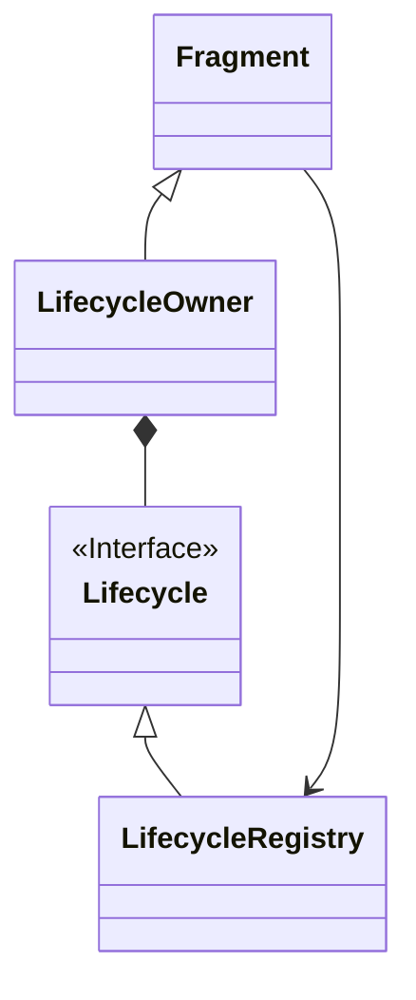

# 概述
Lifecycle 生命周期感知组件基本上是项目中必用的功能;


涉及到三个主要的类

Lifecycle ， LifecycleObserver,LifecyOwner


## LifecycleOvserver 

对于 这个  Interface ,它的注解如下：

/**
 * Marks a class as a LifecycleObserver. Don't use this interface directly. Instead implement either
 * {@link DefaultLifecycleObserver} or {@link LifecycleEventObserver} to be notified about
 * lifecycle events.
 *
 * @see Lifecycle Lifecycle - for samples and usage patterns.
 */


于是常用的 LifecycleEventObserver 用法如下：

```
   lifecycle.addObserver(object :LifecycleEventObserver{
            override fun onStateChanged(source: LifecycleOwner, event: Lifecycle.Event) {
                when(event){
                    Lifecycle.Event.ON_CREATE ->{
                        
                    }
                    Lifecycle.Event.ON_START ->{
                        
                    }
                    else ->{
                    }
                }
            }
        })
```

##  LifecyOwner 

这个 Interface 更像一种规范，它的源码非常的简单：
```
public interface LifecycleOwner {
    /**
     * Returns the Lifecycle of the provider.
     *
     * @return The lifecycle of the provider.
     */
    @NonNull
    Lifecycle getLifecycle();
}
```

其中，ComponentActivity。Fragment 都实现了其接口。


## Lifecycle 

Lifecycle 有一个子类 LifecycleRegistry;


下面是一个简单的类图，似乎有点像桥接设计模式




ComponentActivity 由 ReportFragment 处理


# 关键代码阅读

Lifecycle 有一个子类 LifecycleRegistry。它负责处理具体的业务。


ComponentActivity， Fragment 的Lifecycle就是 LifecycleRegistry；

LifecycleRegistry 中有一个重要的 方法就是 handleLifecycleEvent。负责将对应的事件分发给观察者。


对于 ComponentActivity， 使用了一个 ReportFragment 负责观察 Activity的生命周期，并将事件分发给 LifecycleRegistry.handleLifecycleEvent

**请注意**
> ReportFragment 是继承 android.app.Fragment，不是 androidx.fragment.app

而对于 androidx.fragment.app 的Fragment，则是在各个生命周期内直接 LifecycleRegistry.handleLifecycleEvent

整个代码逻辑很简单。

# 总结

就是一个典型的观察者模式，实在是没啥说的，不过我看到了这样的一个类，FastSafeIterableMap；值得一看


