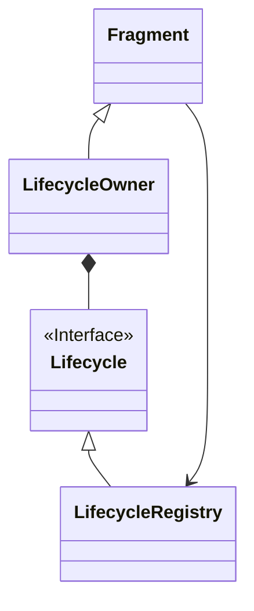

# 概述
Lifecycle 生命周期感知组件基本上是项目中必用的功能；在Google 没有推出该组件时，需要自己去封装。


在使用中，涉及到二个类

Lifecycle 和  LifecycleObserver

对于 LifecycleObserver 常用的是继承它的 LifecycleEventObserver 

```
   lifecycle.addObserver(object :LifecycleEventObserver{
            override fun onStateChanged(source: LifecycleOwner, event: Lifecycle.Event) {
                when(event){
                    Lifecycle.Event.ON_CREATE ->{
                        
                    }
                    Lifecycle.Event.ON_START ->{
                        
                    }
                    else ->{
                    }
                }
            }
        })
```
>通过注解的方式，官方已经标识为过时。


下面是一个简单的类图，似乎有点像桥接设计模式




ComponentActivity 由 ReportFragment 处理


# 代码阅读

Lifecycle 有一个子类 LifecycleRegistry。它负责处理具体的业务。

- LifecycleOwner

```
public interface LifecycleOwner {
    /**
     * Returns the Lifecycle of the provider.
     *
     * @return The lifecycle of the provider.
     */
    @NonNull
    Lifecycle getLifecycle();
}

```

ComponentActivity， Fragment 实现了该接口。getLifecycle 返回的是 LifecycleRegistry；

LifecycleRegistry 中有一个重要的 方法就是 handleLifecycleEvent。负责将对应的事件分发给观察者。


对于 ComponentActivity， 使用了一个 ReportFragment 负责观察 Activity的生命周期，并将事件分发给 LifecycleRegistry.handleLifecycleEvent

**请注意**
> ReportFragment 是继承 android.app.Fragment，不是 androidx.fragment.app

而对于 androidx.fragment.app 的Fragment，则是在各个生命周期内直接 LifecycleRegistry.handleLifecycleEvent

整个代码逻辑很简单。

# 总结

就是一个典型的观察者模式，实在是没啥说的，不过我看到了这样的一个类，FastSafeIterableMap；值得一看


