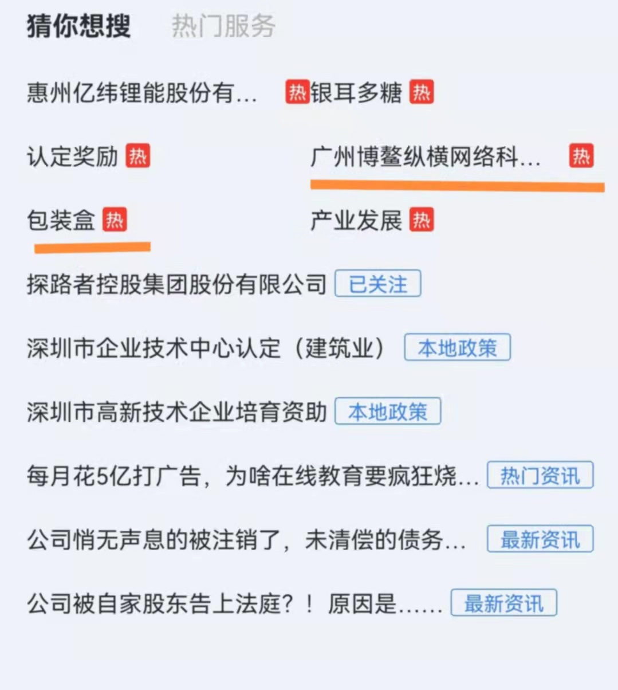

# 问题描述


 

 
 下划线的二个部分，展示了问题：

```html
 <TextView
        android:ellipsize="end"
        android:layout_width="wrap_content"
        android:layout_height="wrap_content"
        android:maxLines="1"
        android:layout_marginRight="@dimen/common_8"
        android:text="发明专利申请"
        >
    </TextView>
```
 TextView 的 ellipsize = "end" android:maxLines="1"，文字的长度超过一行后，"..."后面有空白间距。

 橙红色下划线 “广州博鳌纵横网络科...  ” 展示就是这个问题，左边是正常的展示，奇怪的是，ellipsize = "start" 和 ellipsize = "middle"都不会出现这个问题

## 问题分析

研究了很久也没有找到问题的关键，尝试了下面的手段

- 间距调整，包括 padding ，margin 等
- TextView的父布局调整
- ....

发现都没有作用

猜测 是字符宽度引发，"..." 的字符宽度 可能是这样？


# 解决

最终还是没有确定问题发生的根本原因，但是确定了一个解决方案：
> 当文字的长度过长时，手动的截取 能容纳的最长长度字符，新字符串末尾添加"..."


于是根据业务需求，自定义布局

代码如下:

``` kotlin

package com.qizhidao.clientapp.container.search.view

import android.content.Context
import android.text.TextUtils.TruncateAt
import android.util.AttributeSet
import android.view.ViewGroup
import android.widget.TextView
import androidx.core.view.marginLeft
import androidx.core.view.marginTop
import com.qizhidao.clientapp.container.R

/**
 *  高度定制化的，解决当 TextView ellipsize  end  ... 之后会有空白的问题
 */
const val ELLIP_TEXT = "..."

class TextLabelLayout(context: Context, attrs: AttributeSet, defStyleAttr: Int, defStyleRes: Int) :
    ViewGroup(context, attrs, defStyleAttr, defStyleRes) {

    constructor(context: Context, attrs: AttributeSet, defStyleAttr: Int) : this(
        context,
        attrs,
        defStyleAttr,
        0
    )

    constructor(context: Context, attrs: AttributeSet) : this(context, attrs, 0)

    private val dividerWidth by lazy {
        resources.getDimensionPixelOffset(R.dimen.search_service_hot_divider)
    }
    private var ellipSize = 0f
    private val textView by lazy {
        val view = getChildAt(0) as TextView
        ellipSize = view.paint.measureText(ELLIP_TEXT)
        view
    }
    private val labelView by lazy {
        getChildAt(1)
    }

    override fun onMeasure(widthMeasureSpec: Int, heightMeasureSpec: Int) {
        val width = MeasureSpec.getSize(widthMeasureSpec)
        if (labelView.visibility != VISIBLE) {
            textView.ellipsize = TruncateAt.END
            textView.measure(widthMeasureSpec, heightMeasureSpec)
            setMeasuredDimension(textView.measuredWidth, textView.measuredHeight)
        } else {
            labelView.measure(widthMeasureSpec, heightMeasureSpec)
            val useWidth = width - labelView.measuredWidth
            textView.measure(
                MeasureSpec.makeMeasureSpec(useWidth, MeasureSpec.AT_MOST),
                heightMeasureSpec
            )
            if (textView.measuredWidth >= useWidth) {
                textView.ellipsize = null
                val text = textView.text
                val paint = textView.paint
                var siz = ellipSize
                var index = 0
                for ((i, c) in text.withIndex()) {
                    siz += paint.measureText(c.toString())
                    if (siz >= useWidth) {
                        index = i
                        break
                    }
                }
                val newText = text.subSequence(0, index)
                textView.text = "$newText$ELLIP_TEXT"
                textView.measure(
                    MeasureSpec.makeMeasureSpec(
                        textView.measuredWidth,
                        MeasureSpec.AT_MOST
                    ), heightMeasureSpec
                )
                labelView.measuredWidth + textView.measuredWidth + dividerWidth
            } else {
                textView.ellipsize = TruncateAt.END
            }
            val measuredWidth = labelView.measuredWidth + textView.measuredWidth + dividerWidth
            setMeasuredDimension(measuredWidth, textView.measuredHeight)
        }
    }

    override fun onLayout(changed: Boolean, l: Int, t: Int, r: Int, b: Int) {
        val left = paddingLeft + marginLeft
        val top = paddingTop + marginTop
        textView.layout(left, top, left + textView.measuredWidth, top + textView.measuredHeight)
        if (labelView.visibility == VISIBLE) {
            val l = textView.measuredWidth + dividerWidth + left
            val r = l + labelView.measuredWidth
            // 这里考虑到 labelView 高度小于 textView
            val diff = textView.measuredHeight - labelView.measuredHeight
            val top2 = top + diff / 2
            labelView.layout(l, top2, r, labelView.measuredHeight + top2)
        }
    }

    override fun generateLayoutParams(attrs: AttributeSet?): LayoutParams? {
        return MarginLayoutParams(context, attrs)
    }

    override fun generateLayoutParams(lp: LayoutParams?): LayoutParams? {
        return MarginLayoutParams(lp)
    }

    override fun generateDefaultLayoutParams(): LayoutParams? {
        return MarginLayoutParams(LayoutParams.WRAP_CONTENT, LayoutParams.WRAP_CONTENT)
    }
}
```

在xml 中使用如下:

```html
<?xml version="1.0" encoding="utf-8"?>
<TextLabelLayout xmlns:android="http://schemas.android.com/apk/res/android"
    android:layout_width="wrap_content"
    xmlns:tools="http://schemas.android.com/tools"
    xmlns:app="http://schemas.android.com/apk/res-auto"
    android:orientation="horizontal"
    android:layout_height="wrap_content">
    <TextView
        android:id="@+id/tv_name"
        android:textSize="@dimen/common_28"
        android:ellipsize="end"
        android:textColor="@color/qizhidao_color_text_title"
        android:layout_width="wrap_content"
        android:layout_height="wrap_content"
        android:maxLines="1"
        android:layout_marginRight="@dimen/common_8"
        android:text="发明专利申请"
        >
    </TextView>
    <TextView
        android:id="@+id/tv_label_name"
        android:gravity="center"
        android:layout_gravity="center"
        android:textSize="@dimen/common_24"
        android:paddingHorizontal="@dimen/common_16"
        android:textColor="@color/qizhidao_color_text_primary"
        android:paddingLeft="@dimen/common_2"
        android:paddingRight="@dimen/common_2"
        android:maxLines="1"
        android:layout_width="wrap_content"
        android:layout_height="wrap_content"
        android:text="热"
        android:background="@drawable/bg_search_want_decorate_blue"
        >
    </TextView>

</TextLabelLayout>
```

