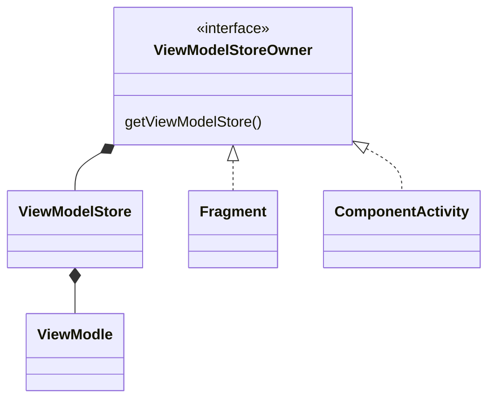

# ViewModle概述

下面的类图阐明了他们之间的关系





# ViewModelStoreOwner 

这个类似于 LifecycleOwner 是一种规范，Fragment和AppCompatActivity 等实现了该接口

```
public interface ViewModelStoreOwner {
    /**
     * Returns owned {@link ViewModelStore}
     *
     * @return a {@code ViewModelStore}
     */
    @NonNull
    ViewModelStore getViewModelStore();
}
```
重点看 ViewModelStore

#  关于ViewModelStore 

ViewModleStore的源码很简单：

```java
public class ViewModelStore {
    private final HashMap<String, ViewModel> mMap = new HashMap<>();
    final void put(String key, ViewModel viewModel) {
        ViewModel oldViewModel = mMap.put(key, viewModel);
        if (oldViewModel != null) {
            oldViewModel.onCleared();
        }
    }
    final ViewModel get(String key) {
        return mMap.get(key);
    }

    Set<String> keys() {
        return new HashSet<>(mMap.keySet());
    }

    /**
     *  Clears internal storage and notifies ViewModels that they are no longer used.
     */
    public final void clear() {
        for (ViewModel vm : mMap.values()) {
            vm.clear();
        }
        mMap.clear();
    }
}
```
这个就不用怎么说了,强调的是，在ComponentActivity的  OnDestroy，会调用  clear 方法。

```java
  getLifecycle().addObserver(new LifecycleEventObserver() {
            @Override
            public void onStateChanged(@NonNull LifecycleOwner source,
                    @NonNull Lifecycle.Event event) {
                if (event == Lifecycle.Event.ON_DESTROY) {
                    // Clear out the available context
                    mContextAwareHelper.clearAvailableContext();
                    // And clear the ViewModelStore
                    if (!isChangingConfigurations()) {
                        getViewModelStore().clear();
                    }
                }
            }
        });
```
作为LiveData宿主的**ViewModel的源码更简单，无非在使用的时候，注意onClear方法做好垃圾回收**


**请注意**

ViewModelStore  只有 clear 方法 public 的，意味着，使用者并不能直接 put 或者 get 一个ViewModle的。

那么我们怎么去创建或者获取一个ViewModle呢，通过**ViewModleProvider**，其中对于Fragment和Activity 有对应的扩展方法。


**问题**

为什么会这样设计？


# ViewModel 详解


ViewModel的代码没有多少，我们主要看的是 mBagOfTags 这个属性，在调用 clear 方法的时候，对mBagOfTag中的对象进行清理关闭，这也是我们使用ViewModle ，根本不需要去管理生命周期的原因。而这个清理对开发者来说太难了。因此并没有开放给开发者。

我们看下 viewModelScope 的代码

```java
private const val JOB_KEY = "androidx.lifecycle.ViewModelCoroutineScope.JOB_KEY"
public val ViewModel.viewModelScope: CoroutineScope
    get() {
        val scope: CoroutineScope? = this.getTag(JOB_KEY)
        if (scope != null) {
            return scope
        }
        return setTagIfAbsent(
            JOB_KEY,
            CloseableCoroutineScope(SupervisorJob() + Dispatchers.Main.immediate)
        )
    }
internal class CloseableCoroutineScope(context: CoroutineContext) : Closeable, CoroutineScope {
    override val coroutineContext: CoroutineContext = context

    override fun close() {
        coroutineContext.cancel()
    }
}
```
我们为什么不用关心viewModelScope 的cancel问题？

因为 ViewModelStore 的clear 会调用 ViewModel的clear,然后对 mBagOfTags 中value 进行close处理。因此用户不用关心其关闭内存泄露等问题。


但是。请注意！！！

ViewModle 的 setTagIfAbsent 并没有开放给用户使用。猜测是因为为了安全。


**面试题**

为什么viewModelScope  可以自动取消?

因为 ViewModelOwner 的clear 方法会调用 ViewModle 的clear方法，ViewModel中的mBagOfTags 中的对象会进行逐步关闭。

对于自己定义的对象，如果需要关闭清理。可以重写 onClear 方法，并在方法中进行自己的清理逻辑。


# LiveData

这个就比较复杂，有一篇很好的博客说明了整个工作过程。https://juejin.cn/post/7085037365101592612


我们需要搞清楚，LiveData 下面几个问题：

- LiveData 是如何感知生命周期变化
- LiveData 数据是具有粘性的


## LiveData 是如何感知生命周期的变化 - LifecycleBoundObserver


看下 LiveData 的 observer方法：

```
    public void observe(@NonNull LifecycleOwner owner, @NonNull Observer<? super T> observer) {
        assertMainThread("observe");
        if (owner.getLifecycle().getCurrentState() == DESTROYED) {
            // ignore
            return;
        }
        LifecycleBoundObserver wrapper = new LifecycleBoundObserver(owner, observer);
        ObserverWrapper existing = mObservers.putIfAbsent(observer, wrapper);
        if (existing != null && !existing.isAttachedTo(owner)) {
            throw new IllegalArgumentException("Cannot add the same observer"
                    + " with different lifecycles");
        }
        if (existing != null) {
            return;
        }
        owner.getLifecycle().addObserver(wrapper);
    }
```

逻辑很明白了，LifecycleBoundObserver 实现了 LifecycleEventObserver 然后通过  owner.getLifecycle().addObserver(wrapper) 实现了对生命周期的观察。


**补充** 

当 收到 OnDestroy 事件的时候，会自动移除观察者（LifecycleBoundObserver）。


# Fragment 中  viewLifecycleOwner 和  this(本身ifecycleOwner) 区别

这个其实非常的简单，看下源代码大概都知道怎么回事。viewLifecycleOwner 在 Fragment 的destroyView 中就发出 onDestroy 的事件了。


