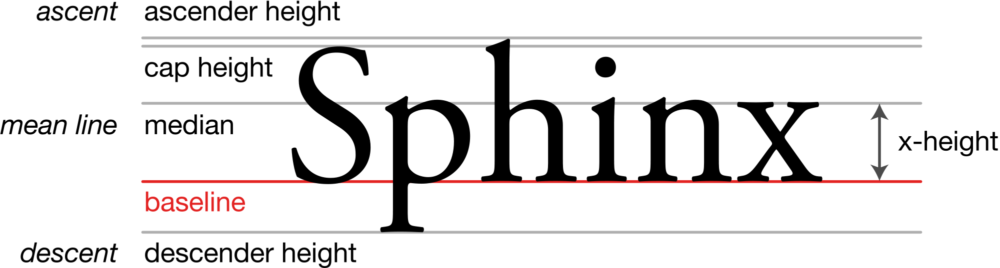
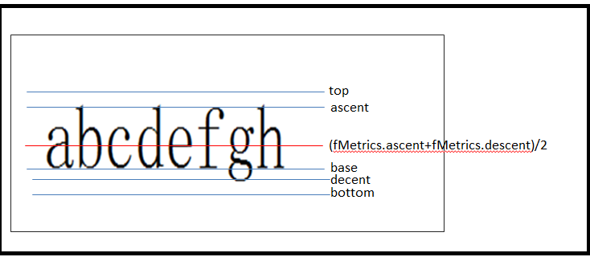

# 概述

每一次绘制文字的时候， 都要去查相关的资料，麻烦，现在记录下。

先上一张图：

FontMetrics


<div style = "background:white">




</div>

<div style = "height:40px"></div>


# TextView 的 includeFontPadding 属性


如果设置为 true 表示，这个高度重包含了 ascent 和 descent的高度；false 则不包含；


# 在 Canvas 上绘制文字

在开始之前，先放一张图"，这张图 就是 FontMetrics ，这个才是绘制的关键



以中线为准，下面是正的，上面是负的，所以，ascent 和 top 都是负数，在计算的时候需要特别注意。

1.先创建paint

```koltin
val paint = Paint().apply{
    color = Color.white
       textSize = resources.getDimension(R.dimen.common_24)
       textAlign = Paint.Align.LEFT
        style = Paint.Style.FILL
     }
```
请注意，textAlgin 这个值非常的重要，它表示text 绘制的起始点的x,y坐标，一般的是用Left ,表示绘制的起点坐标在左边。


2.开始绘制

简单的绘制代码：

```koltin
canvas.drawText("草”, 0, 0f, paint)
```

当你满怀信息的时候，发现绘制的文字怎么只有下半部分，上半部分被什么遮挡了。然后你抓狂了。

> 请注意，文字绘制的“原点”实际上是 “中线”,这个中线指的是 上面图中的红线。这么就清楚了，现在让文字完整，需要进行这样的操作。

```koltin
 val y = measuredHeight / 2 - (paint.fontMetrics.ascent + paint.fontMetrics.descent) / 2
 canvas.save()
 canvas.translate(0f, y)
 canvas.drawText("草”, 0, 0f, paint)
 canvas.restore()

```

当然也可以这样
```
 val y = measuredHeight / 2 - (paint.fontMetrics.ascent + paint.fontMetrics.descent) / 2

 canvas.drawText("草”, 0, y, paint)
```

**上面的文字高度相当于includeFontPadding = false**

# 总结

 之前，每次去绘制 文字的时候都要去查资料，这里记录下