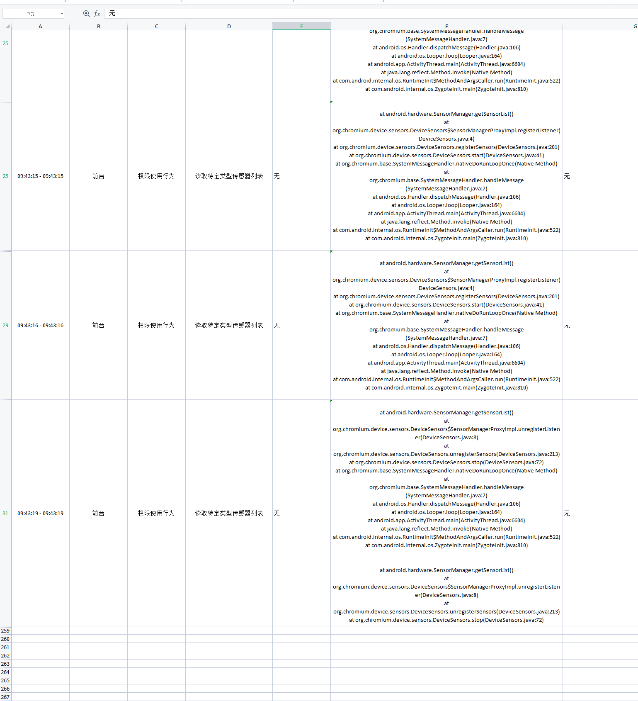
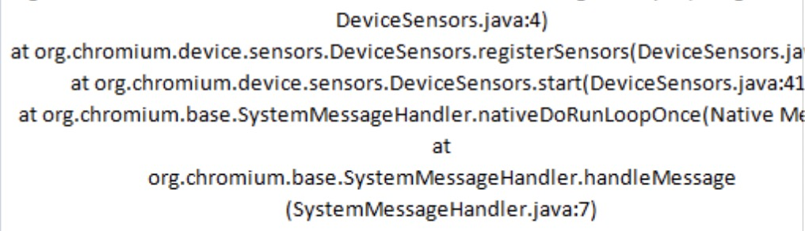
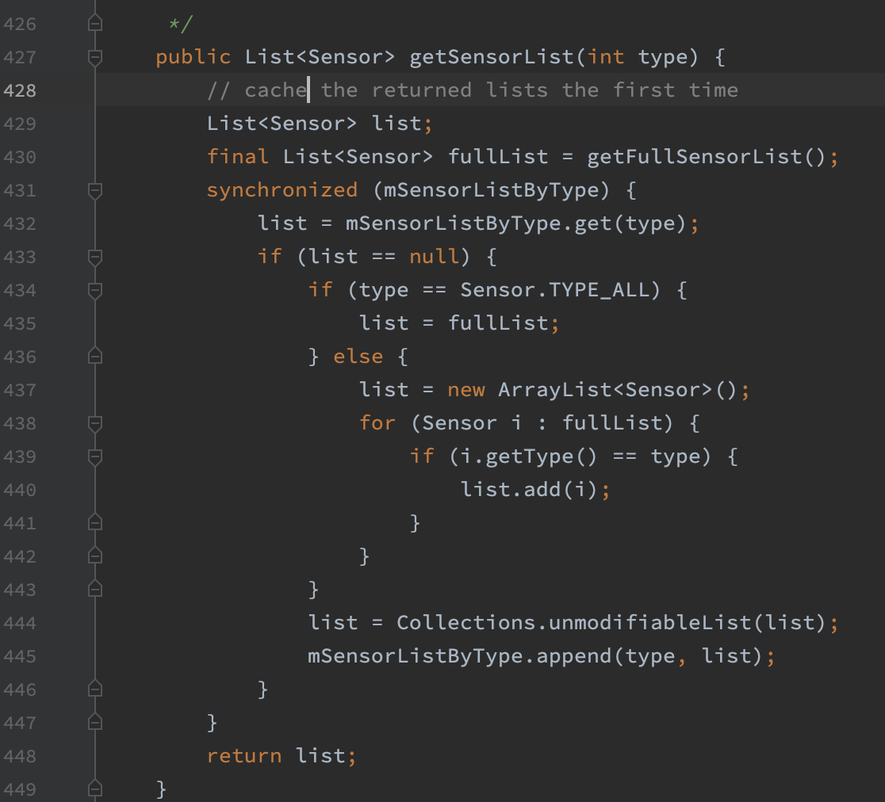
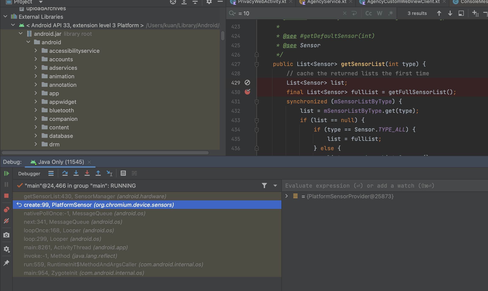
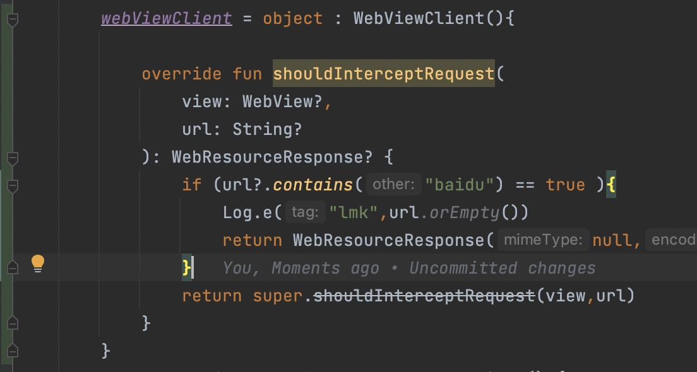

# 背景

被小米拒绝，原因是在隐私浏览界面，存在读取传感器列表的行为，并给出了具体的日志记录



摘出关键的日志：




问题很清楚了，就是 这个页面有js 调用传感器相关的功能。

而且 H5的规范中也有关于传感器使用的标准：
https://developer.mozilla.org/en-US/docs/Web/API/Accelerometer


我们在 SensorManager.java 的430 行打一个断点


确实，在加载该页面的时候，debug模式下，进入该断点处




# 给 H5定位具体的js文件

按照正常的流程，这件事就归 前端人员去定位问题了，看js 中哪一行代码使用了传感器。诡异的就是，这h5的开发人员实在是太菜了。半天都没定位到问题js，不胜其烦。于是帮助前端定位到具体的问题js.


## 如何定位？


WebViewClient 有一个 shouldInterceptRequest 的 回调方法，从里面可以看到资源的请求，加载情况（包括接口的访问）。通过逐条资源的拦截定位出问题的 js代码

最终定位到百度地图 的js

类似于下面的代码




```
  override fun shouldInterceptRequest(
                view: WebView?,
                request: WebResourceRequest?
            ): WebResourceResponse? {
                return null;
            }
```

return null 表示的是不进行资源的任何拦截，系统进行正常的访问。return WebResourceResponse();则表示拦截请求，用拦截的资源去做。

通过拦截一个个js 文件。最终确定是  https://api.map.baidu.com/api?v=2.0&ak=n3AVuW68VEccXZGyOunaqal1QqGmWGjI

这个js库出了问题。然后将这个情况反馈给 H5.


# 总结

只能说H5 的能力不足，但从Android 的角度上看，需要对 WebView 非常熟悉，才能帮忙定位到具体出问题的js上。