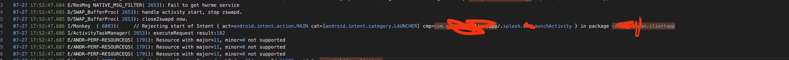
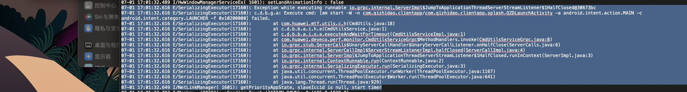

华为的审核被拒了多次，很多都是华为审核本身的问题，记录下：


# 情况1

> 你的应用被系统检测出存在【启动失败】功能问题，不符合华为应用市场审核标准。测试失败的手机是 荣耀Magic4 magic Os 7.1

当华为发送日志过来后，经过日志分析，发现有这么一行

 

基本判定是 monkey 的问题。

然后找到 monkey 的源码
https://android.googlesource.com/platform/development/+/master/cmds/monkey/src/com/android/commands/monkey/Monkey.java


在 277 行，可以找到类似的日志打印。


**这个就是华为monkey白名单问题**

> 最终提交了一个工单，重新提交审核后上线，没有改任何app代码。

# 情况2

> 审核不通过，审核意见是“你的应用被系统检测出存在启动失败功能问题”，测试手机是mate30 pro

通过日志分析，发现有如下日志：



从日志上看是华为 CmdUtils 工具有问题。

``` shell 
adb shell  am start -W -n com.qizhidao.clientapp/com.qizhidao.clientapp.splash.QZDLaunchActivity -a android.intent.action.MAIN -c android.intent.category.LAUNCHER -f 0x1020000
```
这行命令在本地运行时没有任何问题的。


**该问题属于华为脚本的问题，最终提交工单，附加日志然后重新提交等待上架**


