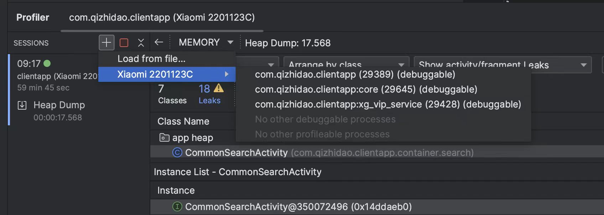

# 概述

修复内存泄露问题，首先要找到内存泄露点。其工具有

- [leakcanary](https://github.com/square/leakcanary)
- MAT
- 腾讯的[matrix](https://github.com/Tencent/matrix#matrix_cn)包含了一系列的工具
- Android 自带的 Profiler
- 启动严格模式的VmPolicy

一般情况下 Profiler 已经完全够用了。个人感觉Android Profiler 比leakcanary 更加的精确和好用

严格模式 使用代码如下：
```java 
StrictMode.setVmPolicy(new StrictMode.VmPolicy.Builder() 
 .detectActivityLeaks()
  .detectLeakedClosableObjects()
  .detectLeakedRegistrationObjects()
  .detectLeakedSqlLiteObjects()
  .penaltyLog() 
  .build()); 
```
然后在日志中过滤 tag 是 StrictMode 相关的日志


#  内存泄露分析的基本原理

通过获取内存快照，生成 内存快照hprof 文件，通过解析hprof文件，分析出内存泄露点。

- GC Root 。 关于这一部分具体的知识，得看一本《深入理解Java虚拟机》相关的内容
- Native;Shallow ;Retained 分别代表的内存区域
> Shallow Heap 代表一个对象结构自身所占用的内存大小，不包括其属性引用对象所占的内存。如 java.util.ArrayList 对象的 Shallow Heap 包含8字节的对象头、8字节的对象数组属性 elementData 引用 、 4字节的 size 属性、4字节的 modCount 属性（从 AbstractList 继承及对象头占用内存大小），有的对象可能需要加对齐填充但 ArrayList 自身已对齐不需补充，注意不包含 elementData 具体数据占用的内存大小。

> Retained Heap 是一个对象被 GC 回收后，可释放的内存大小，等于释放对象的 Retained Heap 中所有对象的 Shallow Heap 的和


#  Android Profiler 实际使用


- 1.找到Profiler工具


可以双击 shift 键，然后 输入 profiler


- 2.关联要调试的应用


  
- 3. capture heap dump 
  
  经过多次APP页面跳转，各种功能使用后，开始 Capture heap dump


>如图，选中Capture heap dump 选项，然后点击 Rcored 此时生成内存的快照，过一段时间后，会生成如下的分析结果:


- 4.分析内存泄露

从结果看，有18个内存泄露


我们分析第一个 CommonSearchActivity

选中 References然后勾选 Show nearest GC root only ;展示了如下内存泄露路径了


这就很明确了，指出了具体的类 MobSecVerifyLogin ；去这个类看下 lambdda 表达式的 iCreateViewListener,iFinishOAuthPageListener,iWeChatAuthListener

**然后这垃圾代码是谁写的就是谁改，在然后发现是离职的前同事写的。考虑下如何打补丁吧**


# 几个典型的案例


  ## 案例一—— Context 泄露

- 内部类问题
- 单利模式Context 问题


一个比较隐蔽的是，Context 作为参数经过层层传递后，不经意间内存泄露。


> 有一个下载的功能，其中文件保存在内存存储中，需要使用 context 去获取 fileDir ;下载任务本身时间较长，然后context 一直被持有，导致内存泄露；解决的方式很简单，使用 context.getApplicationContext

### 总结
对于Context 的内存使用，当Contex作为参数传递的时候，如无必要，则传入Application的Context


## 案例二——   Fragment 中 by lazy 的错误使用

Fragemnt 中View 是可以被销毁重建的，因此对View 的引用需要特别注意，比如下面的代码

```koltin
import com.qizhidao.clientapp.vendor.utils.eyes.Eyes
import java.io.File
import java.text.SimpleDateFormat
import java.util.Locale

class CameraFragment : Fragment() {
    private val cameraLayout: CameraLayout by lazy {
        CameraLayout(requireContext())
    }

    override fun onCreateView(
        inflater: LayoutInflater,
        container: ViewGroup?,
        savedInstanceState: Bundle?
    ): View = cameraLayout

}

```
当 Fragment 多次 attach 和 detach 的使用，View 会进行重建销毁，当 onDestroyView  后 cameraLayout 并没有被销毁。

## 案例三  这个内存泄露的比较隐蔽

下面是简化后的代码
``` java 
class JsVisibleObserver(val activity: FragmentActivity) :
    LifecycleObserver {
    private var jsVisibleCount = 0
    private val activityLifeCallBack = object : Application.ActivityLifecycleCallbacks {
        override fun onActivityCreated(activity: Activity, savedInstanceState: Bundle?) {}
        override fun onActivityStarted(activity: Activity) {}
        override fun onActivityResumed(activity: Activity) {}
        override fun onActivityPaused(a: Activity) {
            if (a != activity) {
                jsVisibleCount++
            }
        }

        override fun onActivityStopped(activity: Activity) {}
        override fun onActivitySaveInstanceState(activity: Activity, outState: Bundle) {}
        override fun onActivityDestroyed(activity: Activity) {}
    }

    init {
        activity.application.registerActivityLifecycleCallbacks(activityLifeCallBack)
    }


    override fun onStateChanged(source: LifecycleOwner, event: Lifecycle.Event) {
       when(event){
           Lifecycle.Event.ON_RESUME ->{ }
           Lifecycle.Event.ON_STOP ->{ }
           Lifecycle.Event.ON_DESTROY ->{
               onDestroy()
           }else ->{
           }
       }
    }
    fun onDestroy() {
        activity.application.unregisterActivityLifecycleCallbacks(activityLifeCallBack)
    }
}
```

使用 JsVisibleObserver 的代码如下

```Java
 val jsVisibleObserver = JsVisibleObserver(this)
lifecycle.addObserver(jsVisibleObserver)
```

这样写是没有任何问题的，也不会有内存泄露问题。


迭代任务来了，使用JsVisibleObserver 的代码要改成这样：

```
class TestActivity :FragmentActivity{
    var jsVisibleObserver:JsVisibleObserver?= null
    private fun init(){
         jsVisibleObserver?.let {
                lifecycle.removeObserver(it)
            }
            jsVisibleObserver = JsVisibleObserver(this@BaseWebViewActivity, this)
            lifecycle.addObserver(jsVisibleObserver!!)
    }
}

```

**上面的代码是否有问题？？？？？？？？**


答案是有的！

因为JsVisibleObserver 的 onDestroy 进行了  unregisterActivityLifecycleCallbacks，而onDestroy  是通过 LifecycleObserver 进行通知的。但是：

```java 
 jsVisibleObserver?.let {
                lifecycle.removeObserver(it)
            }
```
removeObserver后，onDestroy 则永远都不会被调用，于是内存泄露了。修复也很简单，一种修复的方式是在ActivityLifecycleCallbacks 的 onActivityDestroyed 进行反注册。


### 对于使用到 LifecycleObserver 的代码时候，一定要多看几眼


## 案例四 CameraX 的内存泄露

我们按照  Google 的教程 https://developer.android.com/codelabs/camerax-getting-started?hl=zh-cn#0 
完成开发，然后发现内存泄露了。


然后去搜索相关的问题，发现这个 issues 还挂在他们项目下 https://github.com/android/camera-samples/issues/94

这就有点离谱了！！！！！！！

看来官方的库也不能信啊

## 案例四

下面的代码有没有内存泄露问题？

```java 
private fun isConnectNet(context: Context?): Boolean {
    return context?.let {
        if (Build.VERSION.SDK_INT >= Build.VERSION_CODES.M) {
            val connectivityManager =
                (context.getSystemService(Context.CONNECTIVITY_SERVICE) as ConnectivityManager)
            val network =
                connectivityManager.getNetworkCapabilities(connectivityManager.activeNetwork)
            network?.hasCapability(NetworkCapabilities.NET_CAPABILITY_VALIDATED) ?: false
        } else {
            true
        }
    } ?: true
}
```

初看好像没啥问题，但是用profiler工具一检查，问题就来了，有内存泄露，指向的是 ConnectivityManager 引用了 context 。

解决方式也很简单：context.getApplicationContenxt


**总结：**需要使用Context的地方尽量使用 Application
