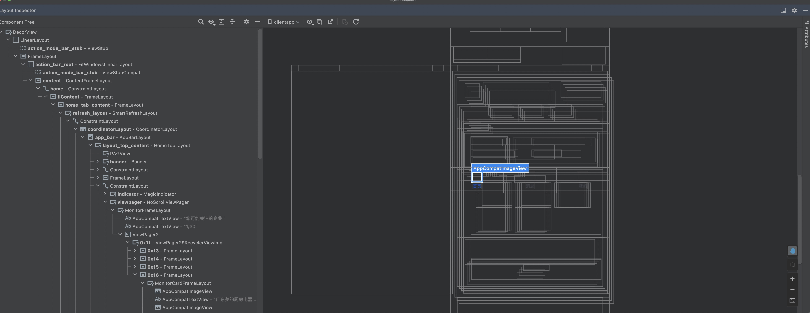

# 概述

页面的卡顿对用户来说感受最为明显。但是找出

## View 性能分析工具

 -  开发者选项中的 HWUI 呈现模式分析

需要注意的对于显示的柱状图，明白各个颜色代表什么意思。

-  通过 Layout Inspector 工具分析 视图的图层



## 性能优化手段

-  对于那种复杂的动画，使用 surface进行绘制。
-  PrecomputedText 
- Litho
- 除了View 的 draw 在主线外，其它的可以放到子线程进行


## Track 分析（执行时间分析）

使用方式

- 指定track 文件，其文件名字后缀为 .track
- Debug.startMethodTracing 和 Debug.stopMethodTracing 等其他方式确定代码范围
- 将生成的 track文件放入 Android studio 中，直接查看

```
val f = File(parent.context.filesDir,"xxx.track")
Debug.startMethodTracing(f.absolutePath)

//代码范围
Debug.stopMethodTracing()        

```

生成的 xxx.track 文件直接放到 Android studio 中


## System Trace(时间，性能分析)

该工具，根据描述是放到 sdk/platform-tools/trace 目录下的

但是我没有找到，估计是已经移除了该工具。

## Android Profiler 的使用


## profilo（https://github.com/facebookincubator/profilo）


# 开源的性能监测工具

## matrix https://github.com/Tencent/matrix#matrix_android_cn

腾讯的开源工具