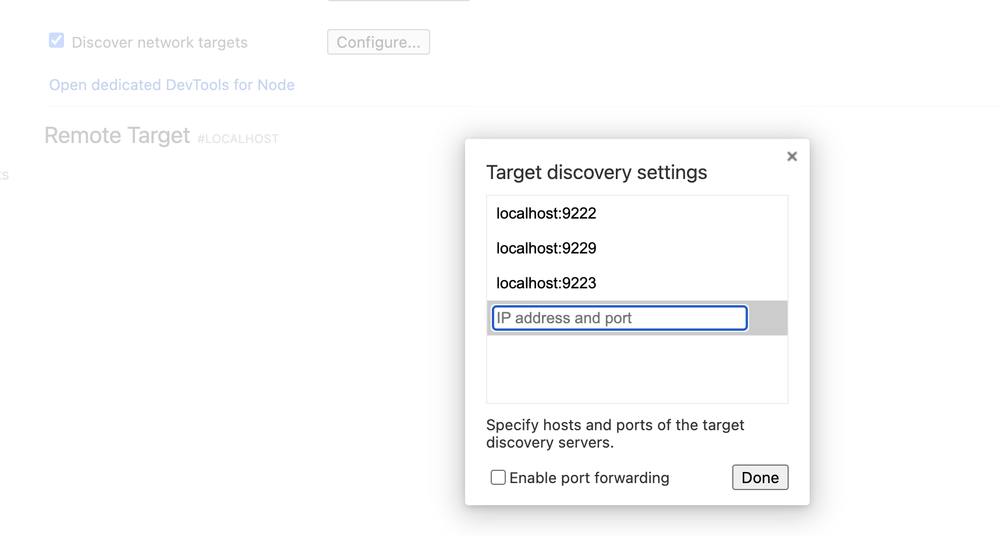

# 如何调试 H5 页面

- 在chrome  中输入 chrome://inspect/#devices
-  新建 harmony.sh 文件，并将下面内容复制到文件中
  ``` shell
  #!/bin/bash

# Initial port number
INITIAL_PORT=9222
 
# Get the current port number, use initial port number if not set previously
CURRENT_PORT=${PORT:-$INITIAL_PORT}

# Get the list of all PIDs that match the condition
PID_LIST=$(hdc shell cat /proc/net/unix | grep webview_devtools_remote_ | awk -F '_' '{print $NF}')

if [ -z "$PID_LIST" ]; then
    echo "Failed to retrieve PID from the device"
    exit 1
fi

# Increment the port number
PORT=$CURRENT_PORT

# Forward ports for each application one by one
for PID in $PID_LIST; do
    # Increment the port number
    PORT=$((PORT + 1))

    # Execute the hdc fport command
    hdc fport tcp:$PORT localabstract:webview_devtools_remote_$PID
 
    # Check if the command executed successfully
    if [ $? -ne 0 ]; then
        echo "Failed to execute hdc fport command"
        exit 1
    fi
done

# List all forwarded ports
hdc fport ls
```

- 在控制台中执行  bash harmony.sh
  
  然后控制台中会输出类似这样的：23E0224126000939    tcp:9223 localabstract:webview_devtools_remote_17699    [Forward]

-  在chrome://inspect/#devices 中配置  Discover network targets
  
  
  

- 完成后即可看到调试界面

# Harmony  web 组件的一些问题


## Cookie 的设置

对于一个 url，需要每次都配置cookie ,还有其它若干问题...... Harmony 的web 组件bug还是挺多的。