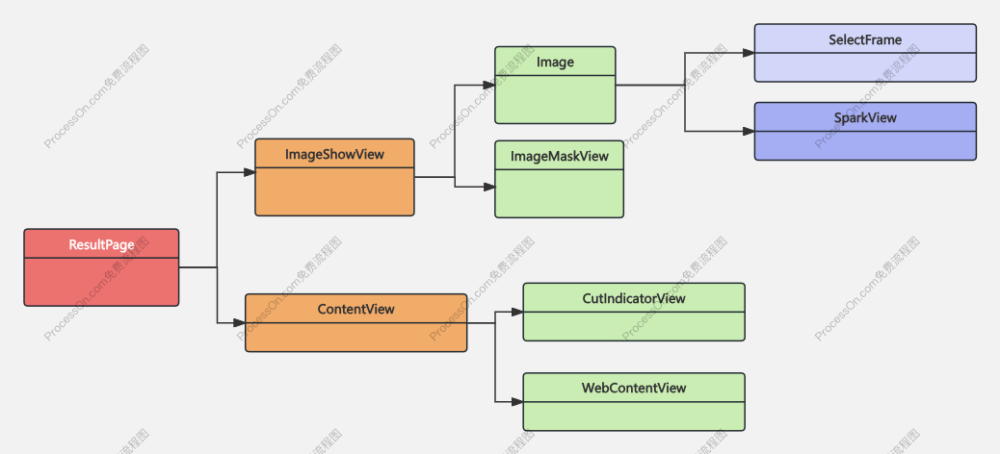

# 整体的架构设计

企知道 Harmony APP的整体架构如下：


-  单Ability 结构，属于单窗口应用；entry 是整个APP的入口
- 采用典型的分层架构，单向依赖，上层依赖下层，同层之间禁止相互依赖。
- CS 贯穿所有层，提供了同层，不同层之间的通信。
- 业务层，采用微服务的架构模式。迭代，改动限制在一个业务模块，最小化测试，即使发生问题也不会扩散
  
## CS

CS 是组件通信框架用于弥补Harmony组件通信问题，提供除了 页面跳转外所有的服务。CS设计思想是：“模块即服务”，借鉴了微服务的思想，每一个模块看做是可以向外提供的服务。通过Uri规范服务的唯一性。

<font color="red">由于编译插件支持原因，CS Harmony 还无法做到全自动化，需要手动注册服务</font>

CS组件包含了CsService(数据通信)，CsViewBuilder（View共享），VirtualService（虚拟地址匹配）三大服务。

```ts
@ViewPath('qzd:view//search/openView')
export class OpenSearchView implements CsViewBuilder {
  getViewBuilder(params: ViewBuilderParams): WrappedBuilder<object[]> {
    // code 
  }
}
```
虚拟地址服务例子
```ts
@VirtualPath(['/qzd-virtual-path/tabPage'])
export class VirtualTabPage implements VirtualService {

  matching(matchUri:uri.URI, ext?:VirtualParams):void{
  }
}
```
“/qzd-virtual-path/tabPage” 为约定的虚拟地址


**关于Uri地址规范问题**

- Navigation 跳转规范
>  qzd:app//search/photo

- CsService 服务地址规范
> qzd:app//search/recommend/policy


- CsViewBuilder 共享View的规范  
>  qzd:view//search/openView  

规则如下：
- scheme = qzd，
- authority 部分，CsViewBuilder 为view,而CsService和Navigation 是app;
- path 部分为：模块名称/具体功能

### 关于页面跳转Navigation的简述

<font color = "red">**CS框架 一开始提供页面的跳转，后来随着Navigation的成熟，CS删除了页面跳转相关内容。**</font>

项目一开始使用router ，后面切换到  Navigation 。关于 Navigation 的使用，查阅其具体的文档即可，这里要阐述二个内容。

#### 主界面Tab的设计

- Tab 是服务端动态配置的。
- 我们需要每一个Tab 有自己独立的生命周期。
 >比如”首页“的Tab 切换到 "我的"tab 时候，需要进行上报，停止各种动画，当切换到首页的时候，又需要同步数据，开始动画等。
  
这个设计，在Android 中采用 每一个Tab 都是一个Fragment，使用FragmentManger 去管理，每一个Fragment 都有独立的生命周期，FragmentManger.setMaxlifecycle 精确的控制生命周期。

在Harmony 中如何设计？

因为只有 NavDestination 有生命周期，于是首页的容器为Navigation，使用独立的NavPathStack，每一个Tab使用 NavDestination 包裹。tab 的切换，转换NavPathStack 相关操作。


## lib 层

.....

## vendor 层

公共功能模块。

vendor_http  提供网络数据交换服务。其加密，解密模块需要注意。

vendor_warehouse:

> warehouse 仓库的意思，这个地方放置各种公共功能，如定位，分享，客服等。当一个公共服务不知道放置在哪里的时候，就放到这个模块。

## 业务层

业务层，承当了各种业务，首页，综合搜索，h5容器等等。每个人维护各自的模块，将风险控制到模块内，有效防止风险扩散。


# 开发


## mvvm 模式

ArkUi 是一个<font color= red>声明式的UI</font>。Android，iOS的原生开发属于命名式的。

- 最大的区别是，命令式的UI，UI编写本身属于编程的一部分，属于代码模块（mvc,mvp）。

- 声明式ui，UI是对数据的描述，所以数据成了关键。
- 因为是数据的描述；数据变化才引起UI变化，数据变化抽象为数据状态管理

mvvm 模式是Harmony 推荐的模式。

下面链接是关于如何认识mvc/mvp/mvvm/mvi

https://juejin.cn/post/6901200799242649607


## 响应式编程

绝大多数人不理解什么是响应式编程。RxJava,Rxswift为早期有代表性的响应式框架。

简单的理解为；以数据流动和数据变化为中心的编程范式。主要作用是<font color = red>【少写一些口水代码】</font>

举例子：

专利图片搜索中，有这样的场景

> 拍照，对拍摄的图片压缩到指定大小，然后上传图片到服务端，上传完成后保存历史记录，接着访问服务，得到切图信息，接着根据切图信息，切图,最终进行界面渲染。

对于这么复杂的场景，响应式编程如下：

```ts 
  upload(file: string) {
    this.recognizeState = PageState.LOADING
    this.repository.compressPic(file)  // 压缩图片
      .then((file) => {
        this.file = file
        return this.repository.upload(file) // 上传
      })
      .then((url: string) => {
        this.repository.saveHistory(url) // 保存历史记录
        return url
      })
      .then((url:string)=>{
        return this.repository.getAnalysis(url) // 分析图片
      })
      .then((data) => {
        return this.repository.cutPic(this.file!!, data) // 切图
      })
      .then((result) => {
        this.resultReduction(result) 
      })
      .catch((error: BusinessError) => {
        this.recognizeState = PageState.FAILED
      })
  }
```
上面的代码来自 RecognizeViewModel

## UI适配


- 使用lpx 进行屏幕适配。直接将设计图的尺寸映射到界面构建中。


# 实践


## 功能拆分，分层设计

### 首页设计
背景介绍
> 首页有点复杂，包含了二楼，悬停，搜索框，热词，钻石位app快捷入口，报告区域，ai,Banner，千人千面等功能。包含了二个主要的手势操作（进入/退出二楼，搜索框悬停）


分层设计，分为三层：
1. 第一层（HomePage）进入/退出二楼手势操作。这里需要注意对fling手势的处理。
2. 第二层（HomePageContent），承接功能区域（搜索框，热词，钻石位app快捷入口，报告区域，ai,Banner,...）和悬停手势。
3. 千人千面（HomeTabView）。

<image src= "./assets/harmony_qzd_home.png" width = 150></image>

   
通过这种分层设计，减少了开发的复杂度，便于协作，各自负责各自模块，互相不受任何影响。如二楼部分雷总去开发，千人千面由宏斌去做，手势操作和组合各个模块功能由我去做，各司其职，每个人的改动局限在自己的模块，问题不会扩散。如千人千面一直持续迭代中，测试只需要测试对应的功能，无需将整个首页全部测试（因为首页没有任何代码改动）。


下面是简单的一个类图，不考虑Model 层，仅仅考虑View层


### 综合搜索

综合搜索也同样复杂，但也是采用分层设计。第一层是输入界面，第二层是搜索提示，第三层是中间页面，第四层才是搜索结果。

搜索结果因为有筛选功能，又进行了分层。通过若干分层设计，搜索中间页，联想词都，搜索结果页面都可以独立维护。

#### <font color = red>如何将各种卡片进行解耦？数据和界面渲染分开</font>


1. ViewData 为一个渲染数据的抽象

由于arkTs 语言和 arkUi 的特性，ViewData 设计如下
```ts
export class ViewData<T extends Object> {
  viewBuilder: WrappedBuilder<T[]>
  data: T | null

  constructor(viewBuilder: WrappedBuilder<T[]>, data: T | null = null) {
    this.viewBuilder = viewBuilder
    this.data = data
  }
}

```

2.真正的渲染卡片的代码如下：

```ts
@Builder
export function ItemDecoration(index: number, item: ViewData<Object>) {
    Column() {
      // 真正的内容渲染
      item.viewBuilder.builder(item.data)

    }.margin({ left: lpx(16), right: lpx(16) })
}
```

渲染卡片的页面并不知道卡片的任何信息。这样界面渲染部分和数据实际上是隔离的，他们之间通过ViewData建立联系。数据的生产组装在 SearchChannelViewModel进行的。


在这种架构设计下，每一种类型的卡片都可以独立开发，可以将不同的卡片分散给不同的开发者，大幅度提升开发效率，缩短开发工期，每一次的卡片改动仅仅局限在卡片相关的文件里面。


### HistoryView 展示了如何自定义布局


## 专利图片搜索-集大成者

专利图片搜索模块，几乎包含了所有的技术点。

1. 图片处理（压缩，裁剪，保存等）
2. Canvas使用：UploadAnimation（上传动画），SparkView（闪烁动画），SelectFrame（选中区域）等
3. 手势操作。
4. 响应式编程示例：RecognizeViewModel
5. 拍照（图片形变，模糊等处理
6. ...


下面是搜索结果页面的类图（View层面）





需要注意的是，图片的单位是 px,Harmony 默认的单位是 vp,APP为了UI适配，使用的单位是vp,因此特别注意单位的转换。举个例子。

- 通过拉动选中区域的边缘，可以得到一块新选中区域，这个选中的区域 用 rect :number[] 表示，rect 单位为 vp.


- 将rect转为为  px 单位，得到 pxRect:number[]
- 图片宽度/屏幕宽度 得到一个比值 scale,那么 图片裁剪区域为：finalRect = pxRect * scale


