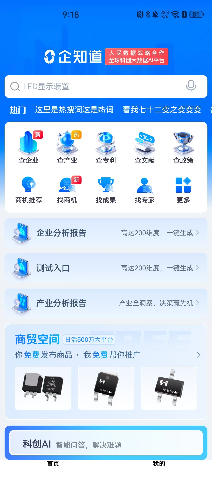

近四年，Android项目80% 的代码被重构重写。

- 21年初步解决项目稳定性问题；
- 22年完成项目组件化(自研CS轻量级组件化框架)，规范代码，all in koltin；
- 23年新技术，新架构大量使用；重写基础组件
- 24年文件预览，地图预览插件化；编译工具升级，重写大量插件。

Android的技术架构和业务架构经历多次变化，项目趋于稳定。紧追最前沿技术，去探索各种可能， 按照Android开发迭代计划，24年应使用Compose替换原生UI构建。但是24年主要投精力投入Harmony项目开发。

# Compose 是什么？

Android原生UI 构建工具包。
- Android 官方推荐。
- 声明式
- 抛弃原有的View体系，重现构建了一套新的Ui体系。
- 非常高效（代码量少，开发简单,... ）

实测发现，UI构建效率比原生开发至少提升10倍。

# Compose Multiplatform

未来纯粹的原生开发很少了，跨平台是大趋所势。为什么选择Compose Multiplatform？它的优势是什么？

- 项目单纯使用Compose替换原生UI构建，收益低。
- 跨平台(Android，iOS，桌面(window mac,linux),web平台),100%原生流畅性
- **不仅仅是UI，还可以 share logic**
- 参考其它跨平方案优缺点，做到低成本，高效率
- 谷歌持续支持

**k2 编译器将 kt代码编译成对应平台代码。**

# 企知道开发进度

目前完成Compose基础知识的学习，项目搭建，有可运行的最小demo。demo可学习界面构建，网络请求，图片加载等技术如何实现。

项目地址：git@gitlab.qizhidao.com:multiplatform/qzd_app.git

下面是demo的截图。

因为目前正在开发中，很多知识理解了大概，在这里也不好给大家分享，因为怕自己理解错误。等项目框架完全搭建完成，技术掌握熟练后再进行技术分享。

## 架构

整体框架正在逐步完善中,各种基础库也逐步完善中。下面三个库是目前最紧迫的，完成这三个库，业务开发才能大面积展开。按照Harmony开发经验看，3月底完成整体架构的搭建。

- View基础库（已经完成部分，不影响界面构建）
- 组件化框架（调研，设计中）
> 用于Android 的CS 组件化框架适用于JvM 平台，对 Compose Multiplatform 需要重新开发
- 网络库（目前可用，需要持续完善）

## 业务层面

下面是优先处理事务。

- 业务开发模式架构探索（完成）
- 主界框架搭建（进行中）
- 综合搜索业务框架搭建(待开发)
- 公共组件开发（下拉刷新，上拉加载更多，banner...）

争取在下周完成主界面的框架搭建。完成后Compose开发基本入门。

## 兼容特定平台

根据开发进度逐步整理。埋点，im,拍照等，与平台相关的需要平台自己处理。

# 补充

-----
------
 为什么大家都在关注跨平台？
 - 成本
-  效率

下面是跨平台的简单发展史.代表着发展路线的变化。

h5->ReactNative->Flutter->Compose Multiplatform

###  H5-跨平台方案最成熟

有了H5但为啥还在探索其它跨平台？

性能太差，复杂的动画和交互无法完成。
>  离线部署解决资源加载问题（所谓的白屏问题），但无法解决交互的卡顿，也无法完成复杂交互开发。（商贸空间 头部占了整个屏幕的1/4~1/3）

v8 引擎几乎没有什么优化空间了。华为的arkTs 为了提高运行效率，几乎阉割了ts 的所有动态能力，整出不伦不类的玩意.

一些大公司，比如腾讯，华为，阿里，对chromium 内核剪裁；腾讯小程序最初方案也是这样，但后来也放弃了。

### ReactNative

由facebook开发并开源。

> 脸谱网的马克 · 扎克伯格在2012年评论说，依赖 HTML 而不是原生的移动版本对于公司来说并不是一个理想的决定。基于 html5的 Facebook 移动版本存在不稳定性问题，而且数据检索任务也很慢。随后，该公司专注于提出一个合适的替代方案，以便在移动平台上提供更好的用户体验。

- 性能比 H5 好一点，在低端手机上，照样卡顿;
- 至今都没突破 1.0 的版本。一些大公司如美团，小米去改动引擎等以提升运行效率。
- 技术原理：  ReactNative框架解释运行js脚本，通过bridge，映射 Virtual DOM 到真实的 UI 组件。

###  Flutter

本质上看做是精简版本的浏览器，或者一个游戏引擎。

- 谷歌支持的开源跨平台框架，一套代码可以运行在Android、iOS、Windows、macOS、Linux Desktop、Google Fuchsia

- 底层独立的渲染引擎，一致性的UI体验。可以看成是一个简约版本的浏览器。
- 影响力比较大。小程序，Harmony 都有来自flutter的代码。

劣势：

- 小问题太多，github上挂着 1w+ issues.
- 开发比较繁琐，不够简洁。由于设计缺陷，状态管理都需要额外框架支撑。
- 谷歌内部支持的资源越来越少。
- flutter 更多的是作为一个探索式的技术方案。

