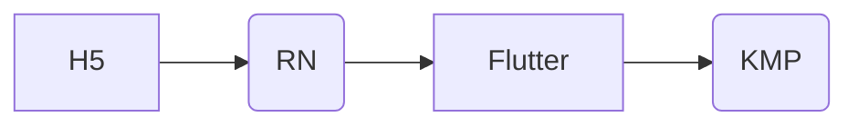
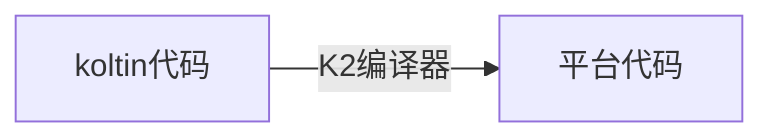

为什么大家都在关注跨平台？

- 成本
- 效率
- 一致性体验
- ...

[微信小程序]

- ReactNative 简称 RN  
- ComposeMultiplatform 简称为 KMP

# H5 跨平台最成熟方案

有了成熟的H5方案，但为啥还在探索其它跨平台？

- 碎片化（平台，Android版本，厂商），Webview 表现不一致。
- 白屏(单页面应用问题更突出)，网络环境影响很大。
- 交互和动画卡顿
- 复杂的交互方案无法落地

千元机器上，上面的问题被无限放大。

**如何优化？**

- 腾讯x5 内核，解决Android碎片化问题，拉平体验。最后公开版本时间为 2023-2-14
- 降低ES版本，ES5支持范围最广，代价是增大代码量，无法使用ES新特性
- CDN，离线部署（模版）..
- Canvas 和 WebGL 渲染（腾讯文档）

### H5未来如何

  V8引擎（内存管理优化，即使编译，并行编译），几乎没有优化空间。

然后呢？WebAssembly（17年第一个规范）！！

> 华为的ArkTs 为了提高运行效率，几乎阉割了ts 的所有动态能力，整出不伦不类的玩意

# ReactNative

RN 为代表的原生渲染方案。京东，微博，美团，叮咚买菜....等都采用了此方案。由facebook开发并开源。

> 脸谱网的马克 · 扎克伯格在2012年评论说，依赖 HTML 而不是原生的移动版本对于公司来说并不是一个理想的决定。基于 html5的 Facebook 移动版本存在不稳定性问题，而且数据检索任务也很慢。随后，该公司专注于提出一个合适的替代方案，以便在移动平台上提供更好的用户体验。
>

**技术特点**

ReactNative框架解释运行js脚本，通过bridge，映射 Virtual DOM 到真实的 UI 组件

- 性能比 H5 好一点，接近原生体验，但有表现不一致问题。
- 由于Bridge性能瓶颈，在低端手机上，照样卡顿;
- 支持原生组件扩展。
- 至今都没突破 1.0 的版本,仍然不停迭代。一些大公司如美团，小米去通过优化引擎等以提升运行效率。
- 微信小程序曾经考虑过该方案。

MAUI （.NET Multi-platform App UI ）,与RN类似的技术架构，语言换成了C#.由于少了一层bridge，代码直接编译对应平台代码，性能接近原生，但由于.net生态问题，采用的人少

 - Kuikly 腾讯开源，使用kt，原生渲染。性能比RN更好。

# 微信小程序方案

微信小程序也是跨平台的。微信小程序跨平台和 RN方案最本质区别是:微信使用webViwe渲染方案，RN 是原生渲染方案。

- 同RN，渲染层和逻辑层分离。webview只负责渲染，网络请求等由原生层去做。
- 摒弃了html.css 这一套，使用WXML,WXSS ，相当于自己建设一套规范。
- 开发有严格的要求。包括网络请求都必须使用微信提供的。

为了能正常的运行小程序，微信做了非常多的优化和限制，比如原生组件引入，最开始最多打开10层页面(每一层都是一个webView渲染）。Skyline 渲染，取代webView 渲染。

# Flutter

无论是H5，RN小程序，都是JS 语言编写，而JS语言，效率特别低下。

Flutter以Dart为开发语言。

本质上看做是精简版本的浏览器，或者一个游戏引擎。

- 谷歌支持的开源跨平台框架.
- 一套代码可以运行在Android、iOS、Windows、macOS、Linux Desktop、Google Fuchsia
- 底层独立的渲染引擎(Skia)，一致性的UI体验

Flutter 影响了很多公司团队。ArkUi，小程序都参考了Flutter的设计，有的甚至直接抄代码。

劣势：

- 小问题太多，github上挂着 1w+ issues
- 开发比较繁琐，不够简洁。由于设计缺陷，状态管理都需要额外框架支撑。
- 谷歌内部支持的资源越来越少。
- flutter 更多的是作为一个探索式的技术方案。

个人看来，Flutter完成了自己的历史使命，是一个比较彻底的方案，摒弃Js,新的页面构建和渲染规范，独立渲染层......

在现在看来，Flutter那一套UI规范太繁琐，不够直观 Widget  还分 StatelessWidget 和 StatefulWidget。Flutter 的最大问题就是出现太早了，没有参考。

# Compose Multiplatform

## 回顾下Android近四年进度

 80% 的代码被重构重写。

- 21年初步解决项目稳定性问题；
- 22年完成项目组件化(自研CS轻量级组件化框架)，规范代码，all in koltin；
- 23年新技术，新架构大量使用；重写基础组件
- 24年文件预览，地图预览插件化；编译工具升级，重写大量插件。

## Android UI 构建的演变

xml -> 纯代码构建（kt加持）--> Compose

- Android 的UI 设计，堪称失败典范
- 想写好UI 不容易。
- Compose 的构建速度是 Android 原生UI的 10倍不止。

### Compose 是什么？

一种构建原生Android界面新的工具包

- 声明式
- 极高的开发效率，比H5的效率都高
- 和现有的View体系兼容，无缝接入。

## 为什么选择 Compose Multiplatform？

 未来纯粹的原生开发很少了，跨平台是大趋所势。那 KMP的优势是什么？

- 一套代码可以运行在Android，iOS，桌面(window mac,linux),web浏览器
- 100% 的原生流畅性
- **不仅仅是UI，还可以 share logic**
-  作为后起之秀参考其它跨平方案优缺点，设计更加先进。 开发成本低
-  谷歌持续支持
  

底层技术原理

对比RN的原生渲染和Flutter全做，Compose Multiplatform做了兼顾。

独立的渲染层（Skia）：Android系统自带，iOS需打包集成。

# 计划

  1. 完成Android端 UI 重构重写（5月底）
   
    这个阶段完成Compose的技术探索与底层技术建设（公共View，组件化方案改造..）

  2. Android项目迁移到 ComposeMultiplatform（12月底）
   
    业务迁移，平台特性处理规范等。

  3. 其它平台逐步接入
   

# 其它跨平台方案

- taro  京东开源
- lynx  字节开源，抄袭了RN 和 Flutter 的杂合怪

  

