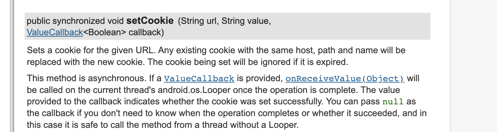

# bug 记录

- 44226  46133  版本，Android  target 是 12以上时，弹出输入法崩溃；

# 开发注意，在进行Android 适配的时候，最好进行一下最低内核版本的设置和指定

 这个破事真的多


# 概述

https://x5.tencent.com/docs/access.html

使用腾讯的TbsReaderView，浏览 pdf，doc等文件，碰到了下面的一些问题

- 用户第一次安装几乎不能正确的预览文件
- tbs官网上相关的资料很少，也没有清晰的文档。

# 问题分析与解决
第一个问题的原因：
> TBS 的内核非常大，第一次使用的时候会从微信，qq或者qq浏览器中copy内核文件，如果都没有则从服务器下发内核，这这个过程导致耗费时间，当内核没有准备完成时，使用tbs，就使用切换到系统的内核。

所以再内核没有准备好的时候，当然无法使用。

于是，再使用前需要判断内核是否准备完成，如果内核还没有准备完成则需要


## 内核初始化和下载过程的处理

根据官网的说法，tbs内核有初始化过程，再第一次使用的时候，有下载的过程。
```
  map[TbsCoreSettings.TBS_SETTINGS_USE_SPEEDY_CLASSLOADER] = true
            map[TbsCoreSettings.TBS_SETTINGS_USE_DEXLOADER_SERVICE] = true
            QbSdk.initTbsSettings(map)
            val cb = object : QbSdk.PreInitCallback {
                //x5內核初始化完成的回调，为true表示x5内核加载成功，否则表示x5内核加载失败，会自动切换到系统内核。
                override fun onViewInitFinished(arg0: Boolean) {
                  
                }
                // webView 验证完毕
                override fun onCoreInitFinished() {
        
                }
            }
            QbSdk.setTbsListener(object : TbsListener {
                override fun onDownloadFinish(erroerCode: Int) {
        
                }

                override fun onInstallFinish(errorCode: Int) {
                
                }

                override fun onDownloadProgress(p0: Int) {
                
                }
            })
            //x5内核初始化接口
            //X5初始化耗时将近1300ms
            QbSdk.setDownloadWithoutWifi(true)
            QbSdk.initX5Environment(application, cb)
```

于是需要记录 tbs的初始化和下载的整个过程状态，在使用前需要判断其状态过程，如果处于下载中，或者还没有准备好，那么就不能使用内核，需要等待内核下载完成

```
/**
 * tbs 内核初始化过程的监听
 */
interface OnTbsInitListener {
    fun stateChange(code: Int)
}

var isX5WebCoreInit: Boolean = false


/**
 * 浏览器内核初始化完成
 */
const val TSB_CORE_INIT_COMPLETE = 300


const val TBS_CORE_INIT_NOT_COMPLETE = 301


/**
 * 内核安装成功 200,其它的都表示失败
 */
const val TSB_CORE_INSTALL_FINISH = 200

/**
 * 内核安装失败
 */
const val TBS_CORE_INSTALL_FAILURE = 201

/**
 * 内核下载完成的标志
 */
const val TBS_CORE_DOWNLOAD_FINISH = 100

/**
 * 内核下载失败
 */
const val TSB_CORE_DOWNLOAD_FAILURE = 101

/**
 * 请慎重使用，谁使用谁释放，不负责清理,不释放一定造成内存泄露
 */
var tbsInitListener: OnTbsInitListener? = null
    set(value) {
        field = value
        if (isX5WebCoreInit) {
            value?.stateChange(tbsCoreInitStatus)
        } else {
            value?.stateChange(tbsDownloadState)
        }
    }

/**
 *  tbs 内核的初始化情况
 *  0 - 还未初始化
 *  1-  初始化完成

 */
@Volatile
var tbsCoreInitStatus = TBS_CORE_INIT_NOT_COMPLETE
    set(value) {
        field = value
        tbsInitListener?.stateChange(value)
    }

/**
 * tbs 内核的下载进度[0~100]
 */
@Volatile
var tbsDownloadState = -1
    set(value) {
        field = value
        tbsInitListener?.stateChange(value)
    }

```

于是在使用的时候，先判断 tbs的内核有没有准备好

```
   if (WebViewHelperKt.getTbsCoreInitStatus() == TBS_CORE_INIT_NOT_COMPLETE
                || TbsDownloader.isDownloading()
                || TbsDownloader.isDownloadForeground()
                || TbsDownloader.needDownload(getApplicationContext(), TbsDownloader.DOWNLOAD_OVERSEA_TBS)
        ) {
            // 表明内核还没有准备好，应该显示内核准备的界面
        
        }
```

下面是内核还没有准备好的一段伪代码，表示当Tbs 内核还没有准备好时的处理


```

 tbsInitListener = object : OnTbsInitListener {
            override fun stateChange(code: Int) {
                // 注意
                view?.post {
                    when (code) {
                        TBS_CORE_INIT_NOT_COMPLETE -> {
                            tvText.text = "浏览内核正在初始化中..."
                            progress.visibility = View.VISIBLE
                        }
                        TSB_CORE_INIT_COMPLETE -> {
                            if (TbsDownloader.isDownloading()
                                || TbsDownloader.isDownloadForeground()
                                || TbsDownloader.needDownload(
                                    requireContext().applicationContext,
                                    TbsDownloader.DOWNLOAD_OVERSEA_TBS
                                )
                            ) {
                                tvText.text = "浏览内核初始化..."
                                progress.visibility = View.VISIBLE
                            } else {
                                progress.visibility = View.GONE
                                tvText.text = "浏览内核初始化完成"
                                if (tbsCoreNotInstall.not()) {
                                    tbsInitFinish()
                                }
                            }
                        }
                        TSB_CORE_INSTALL_FINISH -> {
                            progress.visibility = View.GONE
                            tvText.text = "浏览内核安装完成"
                            tbsCoreNotInstall = false
                            tbsInitFinish()
                        }
                        TBS_CORE_INSTALL_FAILURE -> {
                            progress.visibility = View.GONE
                            tvText.text = "浏览内核安装失败"
                            tbsCoreNotInstall = false
                            tbsInitFinish()
                        }
                        TBS_CORE_DOWNLOAD_FINISH -> {
                            progress.visibility = View.GONE
                            tvText.text = "浏览内核下载完成"
                            tbsCoreNotInstall = true
                        }
                        TSB_CORE_DOWNLOAD_FAILURE -> {
                            progress.visibility = View.GONE
                            tvText.text = "浏览内核下载失败"
                            tbsCoreNotInstall = true
                        }
                        in 0 until TBS_CORE_DOWNLOAD_FINISH -> {
                            tbsCoreNotInstall = true
                            progress.visibility = View.VISIBLE
                            tvText.text = "浏览内核下载进度$code%"
                        }
                        // 不清楚什么情况
                        else -> {
                            tbsInitFinish()
                        }
                    }
                }
            }
        }
        if (TbsDownloader.needDownload(
                requireActivity().applicationContext,
                TbsDownloader.DOWNLOAD_OVERSEA_TBS
            )
        ) {
            tbsCoreNotInstall = true
            TbsDownloader.startDownload(requireContext().applicationContext)
        }
```


## TbsReaderView 使用的坑

解决内核初始化问题，以为就完了？ too yong too simple 。TbsReadView 除了在快速接入的文档中提到后就再也没有官方资料了，包括demo 和 Api 文档。


TbsReadView  相关回调必须再构造函数中传入，这决定了 这个对象不能通过 xml 去写，只能是代码加入。


```
  tbsReaderView = TbsReaderView(requireActivity()) { code, p1, p2 ->

        }
```

在回调给的 code 中，杂乱无章，例如   NOTIFY_CANDISPLAY = 12 表示能预览，但是这后面又有其他错误码的回到。另外，5045 这个code 没有任何解释， TbsReaderView 上显示一个正在加载的动画,长时间都不能显示出内容

经过多次测试，一种解决的办法代码如下：

```java 

 val handler = object : Handler(Looper.getMainLooper()) {
        override fun handleMessage(msg: Message) {
            super.handleMessage(msg)
            if (msg.what == TBS_SEND_ERROR_MSG) {
                notOpenFileModel()
            }
        }
    }
 val   tbsReaderView = TbsReaderView(requireActivity()) { code, p1, p2 ->
            when (code) {
                TbsReaderView.ReaderCallback.NOTIFY_CANDISPLAY -> {
                    isNotifyCanDisplay = true
                    handler.removeMessages(TBS_SEND_ERROR_MSG)
                }
                TbsReaderView.ReaderCallback.NOTIFY_ERRORCODE , 5045 -> {
                    if (isNotifyCanDisplay.not()) {
                        // 我也不知道为什么这样,反正这样做能缓解问题，tbs 不透明，也没有文档，只能这样测试出来
                        handler.removeMessages(TBS_SEND_ERROR_MSG)
                        handler.sendEmptyMessageDelayed(TBS_SEND_ERROR_MSG, 3 * 1000)
                    }
                }
            }
        }
```

# 总结


使用腾讯的tbs 服务，总的来说，确实可以加快渲染速度，但是有着自身无法克服的困难，特别是文档不完整和其他一些奇怪的问题，诸如，再内核切换过程中，可能导致 cookie 丢失等情况。

上面的是针对项目中的问题，给出一种解决方案。


# Tbs典型的一些bug 


**场景**

用户反馈，在h5界面浏览的时候，卡住了，然后退出页面，然后突然崩溃了，然后再也打不开了。

下面是主要的崩溃日志：

```
46:17.428  1000  2871  3152 I HwNetworkPolicyManager: getHwUidPolicy uid = 10165 policy = 0
03-12 15:46:17.439 10165 28445 28445 E LoadedApk: Unable to instantiate appComponentFactory
03-12 15:46:17.439 10165 28445 28445 E LoadedApk: java.lang.ClassNotFoundException: Didn't find class "androidx.core.app.CoreComponentFactory" on path: DexPathList[[zip file "/data/app/com.example.android_ksbao_stsq-la3b4RBgQg2m3-_KCI3POQ==/base.apk"],nativeLibraryDirectories=[/data/app/com.example.android_ksbao_stsq-la3b4RBgQg2m3-_KCI3POQ==/lib/arm64, /data/app/com.example.android_ksbao_stsq-la3b4RBgQg2m3-_KCI3POQ==/base.apk!/lib/arm64-v8a, /system/lib64, /hw_product/lib64, /system/product/lib64]]
03-12 15:46:17.439 10165 28445 28445 E LoadedApk: 	at dalvik.system.BaseDexClassLoader.findClass(BaseDexClassLoader.java:209)
03-12 15:46:17.439 10165 28445 28445 E LoadedApk: 	at java.lang.ClassLoader.loadClass(ClassLoader.java:379)
03-12 15:46:17.439 10165 28445 28445 E LoadedApk: 	at java.lang.ClassLoader.loadClass(ClassLoader.java:312)
03-12 15:46:17.439 10165 28445 28445 E LoadedApk: 	at android.app.LoadedApk.createAppFactory(LoadedApk.java:270)
03-12 15:46:17.439 10165 28445 28445 E LoadedApk: 	at android.app.LoadedApk.createOrUpdateClassLoaderLocked(LoadedApk.java:1005)
03-12 15:46:17.439 10165 28445 28445 E LoadedApk: 	at android.app.LoadedApk.getClassLoader(LoadedApk.java:1129)
03-12 15:46:17.439 10165 28445 28445 E LoadedApk: 	at android.app.LoadedApk.getResources(LoadedApk.java:1419)
03-12 15:46:17.439 10165 28445 28445 E LoadedApk: 	at android.app.ContextImpl.createAppContext(ContextImpl.java:2662)
03-12 15:46:17.439 10165 28445 28445 E LoadedApk: 	at android.app.ContextImpl.createAppContext(ContextImpl.java:2644)
03-12 15:46:17.439 10165 28445 28445 E LoadedApk: 	at android.app.ActivityThread.handleBindApplication(ActivityThread.java:7452)
03-12 15:46:17.439 10165 28445 28445 E LoadedApk: 	at android.app.ActivityThread.access$2600(ActivityThread.java:260)
03-12 15:46:17.439 10165 28445 28445 E LoadedApk: 	at android.app.ActivityThread$H.handleMessage(ActivityThread.java:2435)
03-12 15:46:17.439 10165 28445 28445 E LoadedApk: 	at android.os.Handler.dispatchMessage(Handler.java:110)
03-12 15:46:17.439 10165 28445 28445 E LoadedApk: 	at android.os.Looper.loop(Looper.java:219)
03-12 15:46:17.439 10165 28445 28445 E LoadedApk: 	at android.app.ActivityThread.main(ActivityThread.java:8668)
03-12 15:46:17.439 10165 28445 28445 E LoadedApk: 	at java.lang.reflect.Method.invoke(Native Method)
03-12 15:46:17.439 10165 28445 28445 E LoadedApk: 	at com.android.internal.os.RuntimeInit$MethodAndArgsCaller.run(RuntimeInit.java:513)
03-12 15:46:17.439 10165 28445 28445 E LoadedApk: 	at com.android.internal.os.ZygoteInit.main(ZygoteInit.java:1109)
03-12 15:46:17.448  1000  1606  2327 I chatty  : uid=1000(system) InputDispatcher expire 2 lines
03-12 15:46:17.490  1000 28602 28979 E BoosterNty: onOemHookRawEvent decodes failed.
03-12 15:46:17.516 10165 30670 30670 F linker  : error: unable to open file "/data/local"
03-12 15:46:17.521 10165 30671 30671 F linker  : error: unable to open file "/data/local"
03-12 15:46:17.527 10165 30672 30672 F linker  : error: unable to open file "/data/local"
03-12 15:46:17.531 10165 30674 30674 F linker  : error: unable to open file "/data/local"
03-12 15:46:17.536 10473 27315 27315 W HwApsManager: HwApsManagerService, registerCallback, start !
03-12 15:46:17.538 10165 30675 30675 F linker  : error: unable to open file "/data/local"

.....
03-12 15:46:25.432 10473 27315 27315 W FileUtils: Failed to chmod(/data/user/0/com.tencent.mm/app_tbs_64): android.system.ErrnoException: chmod failed: EACCES (Permission denied)
03-12 15:46:25.434 10473 27315 27315 W FileUtils: Failed to chmod(/data/user/0/com.tencent.mm/app_tbs_64): android.system.ErrnoException: chmod failed: EACCES (Permission denied)
```

刚开始的时候，盯着 java.lang.ClassNotFoundException: Didn't find class "androidx.core.app.CoreComponentFactory" 这个奔溃，但实际上主要的问题时下面这个

```
03-12 15:46:25.432 10473 27315 27315 W FileUtils: Failed to chmod(/data/user/0/com.tencent.mm/app_tbs_64): android.system.ErrnoException: chmod failed: EACCES (Permission denied)
03-12 15:46:25.434 10473 27315 27315 W FileUtils: Failed to chmod(/data/user/0/com.tencent.mm/app_tbs_64): android.system.ErrnoException: chmod failed: EACCES (Permission denied)
```

就是tbs崩溃之前锁定了对应的文件，然后就崩溃了，重新打开时不行了


# Tbs 诡异的方法设计

在Tbs 的 api 文档中，充斥着这样的设计：



通过是否传入某个参数，来确定方法是同步调用还是异步的，匪夷所思


接入腾讯的sdk ,一定要仔细的看文档。


# Tbs 文件预览功能的坑


如果文件没有文件类型后缀，竟然没法预览，我草

# TBS 的静态集成方案

https://www.jianshu.com/p/b0c79786fbe6
