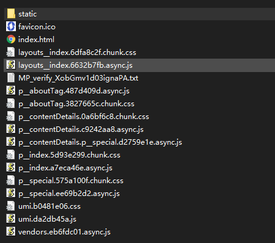
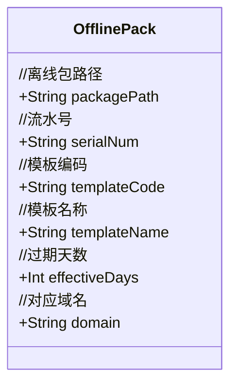

# 概述

H5 的秒开是一套组合技术方案，由多种技术方案构成，常用的包括：

- 模板离线包缓存
- 内容数据预加载
- 资源文件拦截缓存
- WebView的容器化改造（依赖上面的条件）

在企知道App中，用到技术有：模板离线包缓存，内容数据预加载。


  一个简单的网页目录结构可能如下：
  


简单的说，webView加载url 需要下载对应的完整文件，然后再渲染出来。

**H5页面的样式（css,js,静态资源如图标）是不会变化的，变化的只是内容，我们分离出变化与不变的部分，不变的部分打包成模板样式离线包，缓存在本地，WebView省去了下载样式文件这个步骤。**
   

> 变化的部分是内容，可以将内容预加载，提前缓存到本地，加快H5 的打开。


关于代码：
**几乎所有业务逻辑代码都在一个文件中，重点是梳理业务逻辑，为下一个阶段的重构做准备**

# 离线包下载管理

- 服务端和前端已经分离好模板离线包了，并提供好下载地址
- 不同的页面样式不同，对应的离线包不同，需要某种策略知道需要加载哪个离线包。
- 需要某种策略，当样式变化后，对应的离线包失效，需要重新拉取最新的。


模板离线包实体


**离线包缓存策略**

APP有三种缓存策略

-  APP启动后，从服务器获取所有可缓存的模板离线包数据，如果本地不存在该离线包就开启下载。
-  当使用该离线包的时候，发现该离线包不存在，通过templateCode获取离线包信息，然后下载该离线包。
-  通过消息推送推送离线包信息，如果本地不存在则下载。


```mermaid
graph TB


 s>App启动]
 s2>使用时发现缺失]
 s3>推送离线包信息]

    
 op1[查询所有可缓存的离线包信息]
 op2[遍历离线包信息]
 op3[下载.zip]
 op4[解压并删除下载包.zip]

op5[通过code获取离线包信息]

 c1{需要下载吗}   
 e((结束))

 s-->op1-->op2-->c1
 c1==是-->op3-->op4-->e
 c1==否-->e
s2-->op5-->op3
s3-->c1

```


**如何确定使用哪个离线包模板**

一种是根据serialNum 和 templateCode 确定使用的模板。模板的使用者需要指定这两个值。

另一种是通过 domain 确定使用的模板。


**关于本地离线包**

根据templateCode 和 serialNum 生成对应的文件目录，然后将下载的离线包解压到此。判断离线包是否存在，是根据对应的文件目录是否存在。
> 这种判断方式显然是有问题的，比如删除某几个文件，离线包数据就不完整了；现有的方案没有做数据完整性的验证。


# 内容数据预加载


内容数据预加载达到更快的打开速度。

- 在拉取首页信息流的时候，对信息流中的内容预加载。WebView 通过 QZDAPP_dataLoad 桥接方法，拉取预加载在本地的数据。
- 通过 QZDAPP_cacheContents 桥接方法，被动的进行内容缓存。在首页老板智库页面就用了此方法。

关于内容缓存这一块，使用了三级缓存，内存，数据库和网络缓存，Lru 算法


# 静态资源缓存

如网页中的图片，是可以缓存在本地的。

Android App 端暂时没做。

# 其它方案

  在企知道App中，做了模板离线包缓存，内容预加载，这些都属于数据缓存方面，节省的是网络加载的时间，但是html解析时间没有优化，可以进行容器化改造，进一步加快速度。


# 总结

 口水化代码需要进行重构，使其逻辑更加清晰，职责更加明确，便于后面的移植和维护。

整理出来的问题和漏洞：

 - 模板管理和内容缓存的代码放在一个类（WebViewTemplateManagement）中，这个类相当的臃肿，应该拆分。
 - 根据离线包的目录是否存在，判断离线包是否需要下载；当离线包内容不全时，造成不可预知的后果（如解压失败，部分文件被删除）
 - 没有缓存模板数据。如果拉取服务端模板数据失败，根据 domain 去查找缓存的模板离线包就会失败。
 - 其它的漏洞
  
  

## 需要添加的
- 应该添加上静态资源文件的缓存
- WebView 的容器化改造


