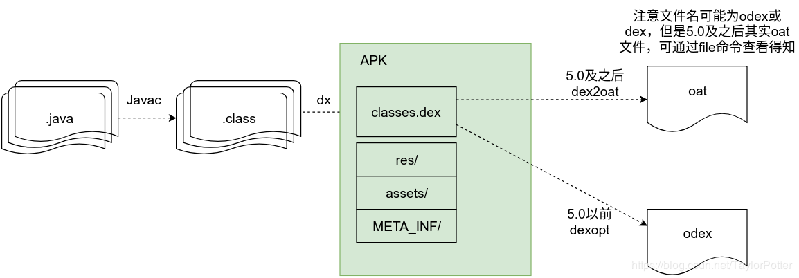

# 概述

在 bugly 上收到了一些零星的bug反馈，而且都集中在华为手机上;有同事使用华为手机同样遭遇到该问题，在启动的过程中，APP崩溃了，但是该问题不是全都都有只是在一些零星的手机上出现； 该问题，在测试，monkey中都没有出现，而是在零星的手机上出现，更诡异的是，用户使用一段时间就会出现，出现后，就一直崩溃过去了。


通过 adb bugreport 捞出了日志，其中关键的日志如下：

``` java 
 11-16 21:52:08.976 10230  7335  7335 F DEBUG: Abort message: 'Inlined method resolution crossed dex file boundary: from void com.alibaba.android.arouter.routes.ARouter$$Group$$market.loadInto(java.util.Map) in /data/app/com.qizhidao.clientapp-_OJpVM-skhedM9W8HiEnsg==/base.apk/0x7e2c046ea0 to void com.alibaba.android.arouter.routes.ARouter$$Group$$market$2.<init>(com.alibaba.android.arouter.routes.ARouter$$Group$$market) in /data/user/0/com.qizhidao.clientapp/files/prodexdir/00O000ll111l_0.dex/0x7e2c11b1c0. This must be due to duplicate classes or playing wrongly with class loaders. The runtime is in an unsafe state.'

 11-16 21:52:09.137 10230  7335  7335 F DEBUG   : backtrace:
11-16 21:52:09.137 10230  7335  7335 F DEBUG   :       #00 pc 000000000007066c  /apex/com.android.runtime/lib64/bionic/libc.so (abort+160) (BuildId: b91c775ccc9b0556e91bc575a2511cd0)
11-16 21:52:09.137 10230  7335  7335 F DEBUG   :       #01 pc 00000000004e0d60  /apex/com.android.runtime/lib64/libart.so (art::Runtime::Abort(char const*)+2512) (BuildId: 691979e9d66dfedf3fd32d27da323a02)
11-16 21:52:09.137 10230  7335  7335 F DEBUG   :       #02 pc 000000000000c600  /system/lib64/libbase.so (android::base::LogMessage::~LogMessage()+684) (BuildId: 7e6f8e823512d07994e0f2250d7d708b)
11-16 21:52:09.137 10230  7335  7335 F DEBUG   :       #03 pc 0000000000505670  /apex/com.android.runtime/lib64/libart.so (art::GetResolvedMethod(art::ArtMethod*, art::CodeInfo const&, art::BitTableRange<art::InlineInfo> const&)+1092) (BuildId: 691979e9d66dfedf3fd32d27da323a02)
11-16 21:52:09.137 10230  7335  7335 F DEBUG   :       #04 pc 000000000050415c  /apex/com.android.runtime/lib64/libart.so (art::StackVisitor::GetMethod() const+156) (BuildId: 691979e9d66dfedf3fd32d27da323a02)
11-16 21:52:09.137 10230  7335  7335 F DEBUG   :       #05 pc 0000000000534624  /apex/com.android.runtime/lib64/libart.so (_ZZN3art12StackVisitor9WalkStackILNS0_16CountTransitionsE0EZNKS_6Thread16GetCurrentMethodEPjbbE4$_94EEvRKT0_PS3_PNS_7ContextENS0_13StackWalkKindEbbEN18LambdaStackVisitor10VisitFrameEv$921f399b639a950d9725101552a34e29+16) (BuildId: 691979e9d66dfedf3fd32d27da323a02)
11-16 21:52:09.137 10230  7335  7335 F DEBUG   :       #06 pc 000000000050310c  /apex/com.android.runtime/lib64/libart.so (_ZN3art12StackVisitor9WalkStackILNS0_16CountTransitionsE0EEEvb+936) (BuildId: 691979e9d66dfedf3fd32d27da323a02)
11-16 21:52:09.137 10230  7335  7335 F DEBUG   :       #07 pc 0000000000523558  /apex/com.android.runtime/lib64/libart.so (art::Thread::DumpStack(std::__1::basic_ostream<char, std::__1::char_traits<char>>&, bool, BacktraceMap*, bool) const+472) (BuildId: 691979e9d66dfedf3fd32d27da323a02)
11-16 21:52:09.137 10230  7335  7335 F DEBUG   :       #08 pc 000000000053e748  /apex/com.android.runtime/lib64/libart.so (art::DumpCheckpoint::Run(art::Thread*)+844) (BuildId: 691979e9d66dfedf3fd32d27da323a02)
11-16 21:52:09.137 10230  7335  7335 F DEBUG   :       #09 pc 0000000000537348  /apex/com.android.runtime/lib64/libart.so (art::ThreadList::RunCheckpoint(art::Closure*, art::Closure*)+504) (BuildId: 691979e9d66dfedf3fd32d27da323a02)
11-16 21:52:09.137 10230  7335  7335 F DEBUG   :       #10 pc 000000000053650c  /apex/com.android.runtime/lib64/libart.so (art::ThreadList::Dump(std::__1::basic_ostream<char, std::__1::char_traits<char>>&, bool)+500) (BuildId: 691979e9d66dfedf3fd32d27da323a02)
11-16 21:52:09.137 10230  7335  7335 F DEBUG   :       #11 pc 00000000004e0a34  /apex/com.android.runtime/lib64/libart.so (art::Runtime::Abort(char const*)+1700) (BuildId: 691979e9d66dfedf3fd32d27da323a02)
11-16 21:52:09.137 10230  7335  7335 F DEBUG   :       #12 pc 000000000000c600  /system/lib64/libbase.so (android::base::LogMessage::~LogMessage()+684) (BuildId: 7e6f8e823512d07994e0f2250d7d708b)
11-16 21:52:09.137 10230  7335  7335 F DEBUG   :       #13 pc 0000000000505670  /apex/com.android.runtime/lib64/libart.so (art::GetResolvedMethod(art::ArtMethod*, art::CodeInfo const&, art::BitTableRange<art::InlineInfo> const&)+1092) (BuildId: 691979e9d66dfedf3fd32d27da323a02)
11-16 21:52:09.137 10230  7335  7335 F DEBUG   :       #14 pc 000000000059c808  /apex/com.android.runtime/lib64/libart.so (_ZN3artL27DoGetCalleeSaveMethodCallerEPNS_9ArtMethodEmb.llvm.6663324568842481628+164) (BuildId: 691979e9d66dfedf3fd32d27da323a02)
11-16 21:52:09.137 10230  7335  7335 F DEBUG   :       #15 pc 000000000059ca80  /apex/com.android.runtime/lib64/libart.so (art::GetCalleeSaveMethodCallerAndOuterMethod(art::Thread*, art::CalleeSaveType)+296) (BuildId: 691979e9d66dfedf3fd32d27da323a02)
11-16 21:52:09.137 10230  7335  7335 F DEBUG   :       #16 pc 00000000005af320  /apex/com.android.runtime/lib64/libart.so (artResolveStringFromCode+36) (BuildId: 691979e9d66dfedf3fd32d27da323a02)
11-16 21:52:09.137 10230  7335  7335 F DEBUG   :       #17 pc 00000000001482fc  /apex/com.android.runtime/lib64/libart.so (art_quick_resolve_string+156) (BuildId: 691979e9d66dfedf3fd32d27da323a02)
11-16 21:52:09.137 10230  7335  7335 F DEBUG   :       #18 pc 0000000000009298  /data/app/com.qizhidao.clientapp-_OJpVM-skhedM9W8HiEnsg==/oat/arm64/base.odex (com.alibaba.android.arouter.routes.ARouter$$Group$$market.loadInto+5944)
11-16 21:52:09.137 10230  7335  7335 F DEBUG   :       #19 pc 0000000000147334  /apex/com.android.runtime/lib64/libart.so (art_quick_invoke_stub+548) (BuildId: 691979e9d66dfedf3fd32d27da323a02)
11-16 21:52:09.137 10230  7335  7335 F DEBUG   :       #20 pc 00000000001561b4  /apex/com.android.runtime/lib64/libart.so (art::ArtMethod::Invoke(art::Thread*, unsigned int*, unsigned int, art::JValue*, char const*)+252) (BuildId: 691979e9d66dfedf3fd32d27da323a02)
11-16 21:52:09.137 10230  7335  7335 F DEBUG   :       #21 pc 00000000002fd900  /apex/com.android.runtime/lib64/libart.so (art::interpreter::ArtInterpreterToCompiledCodeBridge(art::Thread*, art::ArtMethod*, art::ShadowFrame*, unsigned short, art::JValue*)+384) (BuildId: 691979e9d66dfedf3fd32d27da323a02)
11-16 21:52:09.137 10230  7335  7335 F DEBUG   :       #22 pc 00000000002f8bd0  /apex/com.android.runtime/lib64/libart.so (bool art::interpreter::DoCall<false, false>(art::ArtMethod*, art::Thread*, art::ShadowFrame&, art::Instruction const*, unsigned short, art::JValue*)+912) (BuildId: 691979e9d66dfedf3fd32d27da323a02)
11-16 21:52:09.137 10230  7335  7335 F DEBUG   :       #23 pc 00000000005cccfc  /apex/com.android.runtime/lib64/libart.so (MterpInvokeInterface+884) (BuildId: 691979e9d66dfedf3fd32d27da323a02)
11-16 21:52:09.137 10230  7335  7335 F DEBUG   :       #24 pc 0000000000141a14  /apex/com.android.runtime/lib64/libart.so (mterp_op_invoke_interface+20) (BuildId: 691979e9d66dfedf3fd32d27da323a02)
11-16 21:52:09.137 10230  7335  7335 F DEBUG   :       #25 pc 000000000001d248  /data/app/com.qizhidao.clientapp-_OJpVM-skhedM9W8HiEnsg==/oat/arm64/base.vdex (com.alibaba.android.arouter.core.LogisticsCenter.completion+178)
11-16 21:52:09.137 10230  7335  7335 F DEBUG   :       #26 pc 00000000005ce408  /apex/com.android.runtime/lib64/libart.so (MterpInvokeStatic+1136) (BuildId: 691979e9d66dfedf3fd32d27da323a02)
11-16 21:52:09.137 10230  7335  7335 F DEBUG   :       #27 pc 0000000000141994  /apex/com.android.runtime/lib64/libart.so (mterp_op_invoke_static+20) (BuildId: 691979e9d66dfedf3fd32d27da323a02)
11-16 21:52:09.137 10230  7335  7335 F DEBUG   :       #28 pc 000000000001e286  /data/app/com.qizhidao.clientapp-_OJpVM-skhedM9W8HiEnsg==/oat/arm64/base.vdex (com.alibaba.android.arouter.launcher._ARouter.navigation+44)
11-16 21:52:09.137 10230  7335  7335 F DEBUG   :       #29 pc 00000000005d1a78  /apex/com.android.runtime/lib64/libart.so (MterpInvokeVirtualQuick+1368) (BuildId: 691979e9d66dfedf3fd32d27da323a02)
11-16 21:52:09.137 10230  7335  7335 F DEBUG   :       #30 pc 0000000000145594  /apex/com.android.runtime/lib64/libart.so (mterp_op_invoke_virtual_quick+20) (BuildId: 691979e9d66dfedf3fd32d27da323a02)
11-16 21:52:09.137 10230  7335  7335 F DEBUG   :       #31 pc 000000000001de5a  /data/app/com.qizhidao.clientapp-_OJpVM-skhedM9W8HiEnsg==/oat/arm64/base.vdex (com.alibaba.android.arouter.launcher.ARouter.navigation+8)
11-16 21:52:09.137 10230  7335  7335 F DEBUG   :       #32 pc 00000000005cb860  /apex/com.android.runtime/lib64/libart.so (MterpInvokeVirtual+1432) (BuildId: 691979e9d66dfedf3fd32d27da323a02)
11-16 21:52:09.137 10230  7335  7335 F DEBUG   :       #33 pc 0000000000141814  /apex/com.android.runtime/lib64/libart.so (mterp_op_invoke_virtual+20) (BuildId: 691979e9d66dfedf3fd32d27da323a02)
11-16 21:52:09.137 10230  7335  7335 F DEBUG   :       #34 pc 000000000001dc52  /data/app/com.qizhidao.clientapp-_OJpVM-skhedM9W8HiEnsg==/oat/arm64/base.vdex (com.alibaba.android.arouter.facade.Postcard.navigation+10)
11-16 21:52:09.137 10230  7335  7335 F DEBUG   :       #35 pc 00000000005cb860  /apex/com.android.runtime/lib64/libart.so (MterpInvokeVirtual+1432) (BuildId: 691979e9d66dfedf3fd32d27da323a02)
11-16 21:52:09.137 10230  7335  7335 F DEBUG   :       #36 pc 0000000000141814  /apex/com.android.runtime/lib64/libart.so (mterp_op_invoke_virtual+20) (BuildId: 691979e9d66dfedf3fd32d27da323a02)
11-16 21:52:09.137 10230  7335  7335 F DEBUG   :       #37 pc 000000000001dc3a  /data/app/com.qizhidao.clientapp-_OJpVM-skhedM9W8HiEnsg==/oat/arm64/base.vdex (com.alibaba.android.arouter.facade.Postcard.navigation+2)
11-16 21:52:09.137 10230  7335  7335 F DEBUG   :       #38 pc 00000000005cb860  /apex/com.android.runtime/lib64/libart.so (MterpInvokeVirtual+1432) (BuildId: 691979e9d66dfedf3fd32d27da323a02)
11-16 21:52:09.137 10230  7335  7335 F DEBUG   :       #39 pc 0000000000141814  /apex/com.android.runtime/lib64/libart.so (mterp_op_invoke_virtual+20) (BuildId: 691979e9d66dfedf3fd32d27da323a02)
11-16 21:52:09.137 10230  7335  7335 F DEBUG   :       #40 pc 000000000001dc2a  /data/app/com.qizhidao.clientapp-_OJpVM-skhedM9W8HiEnsg==/oat/arm64/base.vdex (com.alibaba.android.arouter.facade.Postcard.navigation+2)
11-16 21:52:09.137 10230  7335  7335 F DEBUG   :       #41 pc 00000000005cb860  /apex/com.android.runtime/lib64/libart.so (MterpInvokeVirtual+1432) (BuildId: 691979e9d66dfedf3fd32d27da323a02)
11-16 21:52:09.137 10230  7335  7335 F DEBUG   :       #42 pc 0000000000141814  /apex/com.android.runtime/lib64/libart.so (mterp_op_invoke_virtual+20) (BuildId: 691979e9d66dfedf3fd32d27da323a02)
11-16 21:52:09.137 10230  7335  7335 F DEBUG   :       #43 pc 00000000000ece68  /data/data/com.qizhidao.clientapp/files/prodexdir/00O000ll111l_5.dex (com.qizhidao.clientapp.market.h$a.a+20)
11-16 21:52:09.137 10230  7335  7335 F DEBUG   :       #44 pc 00000000005cb860  /apex/com.android.runtime/lib64/libart.so (MterpInvokeVirtual+1432) (BuildId: 691979e9d66dfedf3fd32d27da323a02)
11-16 21:52:09.137 10230  7335  7335 F DEBUG   :       #45 pc 0000000000141814  /apex/com.android.runtime/lib64/libart.so (mterp_op_invoke_virtual+20) (BuildId: 691979e9d66dfedf3fd32d27da323a02)
11-16 21:52:09.137 10230  7335  7335 F DEBUG   :       #46 pc 000000000013a2f4  /data/data/com.qizhidao.clientapp/files/prodexdir/00O000ll111l_7.dex (com.qizhidao.clientapp.qizhidao.home.HomeViewModel2$b.invoke+4)
11-16 21:52:09.137 10230  7335  7335 F DEBUG   :       #47 pc 00000000005cb860  /apex/com.android.runtime/lib64/libart.so (MterpInvokeVirtual+1432) (BuildId: 691979e9d66dfedf3fd32d27da323a02)
11-16 21:52:09.137 10230  7335  7335 F DEBUG   :       #48 pc 0000000000141814  /apex/com.android.runtime/lib64/libart.so (mterp_op_invoke_virtual+20) (BuildId: 691979e9d66dfedf3fd32d27da323a02)
11-16 21:52:09.137 10230  7335  7335 F DEBUG   :       #49 pc 000000000013a310  /data/data/com.qizhidao.clientapp/files/prodexdir/00O000ll111l_7.dex (com.qizhidao.clientapp.qizhidao.home.HomeViewModel2$b.invoke)
11-16 21:52:09.137 10230  7335  7335 F DEBUG   :       #50 pc 00000000005cd060  /apex/com.android.runtime/lib64/libart.so (MterpInvokeInterface+1752) (BuildId: 691979e9d66dfedf3fd32d27da323a02)
11-16 21:52:09.137 10230  7335  7335 F DEBUG   :       #51 pc 0000000000141a14  /apex/com.android.runtime/lib64/libart.so (mterp_op_invoke_interface+20) (BuildId: 691979e9d66dfedf3fd32d27da323a02)
11-16 21:52:09.137 10230  7335  7335 F DEBUG   :       #52 pc 00000000004e31fc  /data/data/com.qizhidao.clientapp/files/prodexdir/00O000ll111l_1.dex (kotlin.v.getValue+40)
11-16 21:52:09.137 10230  7335  7335 F DEBUG   :       #53 pc 00000000005cd060  /apex/com.android.runtime/lib64/libart.so (MterpInvokeInterface+1752) (BuildId: 691979e9d66dfedf3fd32d27da323a02)
11-16 21:52:09.137 10230  7335  7335 F DEBUG   :       #54 pc 0000000000141a14  /apex/com.android.runtime/lib64/libart.so (mterp_op_invoke_interface+20) (BuildId: 691979e9d66dfedf3fd32d27da323a02)
11-16 21:52:09.137 10230  7335  7335 F DEBUG   :       #55 pc 000000000013a39c  /data/data/com.qizhidao.clientapp/files/prodexdir/00O000ll111l_7.dex (com.qizhidao.clientapp.qizhidao.home.HomeViewModel2.g+4)
11-16 21:52:09.137 10230  7335  7335 F DEBUG   :       #56 pc 00000000005cdbfc  /apex/com.android.runtime/lib64/libart.so (MterpInvokeDirect+1168) (BuildId: 691979e9d66dfedf3fd32d27da323a02)
11-16 21:52:09.137 10230  7335  7335 F DEBUG   :       #57 pc 0000000000141914  /apex/com.android.runtime/lib64/libart.so (mterp_op_invoke_direct+20) (BuildId: 691979e9d66dfedf3fd32d27da323a02)
11-16 21:52:09.137 10230  7335  7335 F DEBUG   :       #58 pc 000000000013a540  /data/data/com.qizhidao.clientapp/files/prodexdir/00O000ll111l_7.dex (com.qizhidao.clientapp.qizhidao.home.HomeViewModel2.a)
11-16 21:52:09.137 10230  7335  7335 F DEBUG   :       #59 pc 00000000005cb860  /apex/com.android.runtime/lib64/libart.so (MterpInvokeVirtual+1432) (BuildId: 691979e9d66dfedf3fd32d27da323a02)
11-16 21:52:09.137 10230  7335  7335 F DEBUG   :       #60 pc 0000000000141814  /apex/com.android.runtime/lib64/libart.so (mterp_op_invoke_virtual+20) (BuildId: 691979e9d66dfedf3fd32d27da323a02)
11-16 21:52:09.137 10230  7335  7335 F DEBUG   :       #61 pc 00000000001379fc  /data/data/com.qizhidao.clientapp/files/prodexdir/00O000ll111l_7.dex (com.qizhidao.clientapp.qizhidao.home.HomeFragment2.H7+8)
11-16 21:52:09.137 10230  7335  7335 F DEBUG   :       #62 pc 00000000005cdbfc  /apex/com.android.runtime/lib64/libart.so (MterpInvokeDirect+1168) (BuildId: 691979e9d66dfedf3fd32d27da323a02)
11-16 21:52:09.137 10230  7335  7335 F DEBUG   :       #63 pc 0000000000141914  /apex/com.android.runtime/lib64/libart.so (mterp_op_invoke_direct+20) (BuildId: 691979e9d66dfedf3fd32d27da323a02)
11-16 21:52:09.137 10230  7335  7335 F DEBUG   :       #64 pc 00000000001379da  /data/data/com.qizhidao.clientapp/files/prodexdir/00O000ll111l_7.dex (com.qizhidao.clientapp.qizhidao.home.HomeFragment2.I7+22)
11-16 21:52:09.137 10230  7335  7335 F DEBUG   :       #65 pc 00000000005ce408  /apex/com.android.runtime/lib64/libart.so (MterpInvokeStatic+1136) (BuildId: 691979e9d66dfedf3fd32d27da323a02)
11-16 21:52:09.137 10230  7335  7335 F DEBUG   :       #66 pc 0000000000141994  /apex/com.android.runtime/lib64/libart.so (mterp_op_invoke_static+20) (BuildId: 691979e9d66dfedf3fd32d27da323a02)
11-16 21:52:09.137 10230  7335  7335 F DEBUG   :       #67 pc 0000000000137c26  /data/data/com.qizhidao.clientapp/files/prodexdir/00O000ll111l_7.dex (com.qizhidao.clientapp.qizhidao.home.HomeFragment2.M7+14)
11-16 21:52:09.137 10230  7335  7335 F DEBUG   :       #68 pc 00000000005cdbfc  /apex/com.android.runtime/lib64/libart.so (MterpInvokeDirect+1168) (BuildId: 691979e9d66dfedf3fd32d27da323a02)
11-16 21:52:09.137 10230  7335  7335 F DEBUG   :       #69 pc 0000000000141914  /apex/com.android.runtime/lib64/libart.so (mterp_op_invoke_direct+20) (BuildId: 691979e9d66dfedf3fd32d27da323a02)
11-16 21:52:09.137 10230  7335  7335 F DEBUG   :       #70 pc 0000000000137490  /data/data/com.qizhidao.clientapp/files/prodexdir/00O000ll111l_7.dex (com.qizhidao.clientapp.qizhidao.home.HomeFragment2.j7+592)
11-16 21:52:09.137 10230  7335  7335 F DEBUG   :       #71 pc 00000000005cdbfc  /apex/com.android.runtime/lib64/libart.so (MterpInvokeDirect+1168) (BuildId: 691979e9d66dfedf3fd32d27da323a02)
11-16 21:52:09.137 10230  7335  7335 F DEBUG   :       #72 pc 0000000000141914  /apex/com.android.runtime/lib64/libart.so (mterp_op_invoke_direct+20) (BuildId: 691979e9d66dfedf3fd32d27da323a02)
11-16 21:52:09.137 10230  7335  7335 F DEBUG   :       #73 pc 000000000013787e  /data/data/com.qizhidao.clientapp/files/prodexdir/00O000ll111l_7.dex (com.qizhidao.clientapp.qizhidao.home.HomeFragment2.onViewCreated+26)
11-16 21:52:09.137 10230  7335  7335 F DEBUG   :       #74 pc 00000000005cb860  /apex/com.android.runtime/lib64/libart.so (MterpInvokeVirtual+1432) (BuildId: 691979e9d66dfedf3fd32d27da323a02)
11-16 21:52:09.137 10230  7335  7335 F DEBUG   :       #75 pc 0000000000141814  /apex/com.android.runtime/lib64/libart.so (mterp_op_invoke_virtual+20) (BuildId: 691979e9d66dfedf3fd32d27da323a02)
11-16 21:52:09.137 10230  7335  7335 F DEBUG   :       #76 pc 00000000002c3d0c  /data/data/com.qizhidao.clientapp/files/prodexdir/00O000ll111l_0.dex (androidx.fragment.app.Fragment.performViewCreated+8)
11-16 21:52:09.137 10230  7335  7335 F DEBUG   :       #77 pc 00000000005cb860  /apex/com.android.runtime/lib64/libart.so (MterpInvokeVirtual+1432) (BuildId: 691979e9d66dfedf3fd32d27da323a02)
11-16 21:52:09.137 10230  7335  7335 F DEBUG   :       #78 pc 0000000000141814  /apex/com.android.runtime/lib64/libart.so (mterp_op_invoke_virtual+20) (BuildId: 691979e9d66dfedf3fd32d27da323a02)
11-16 21:52:09.137 10230  7335  7335 F DEBUG   :       #79 pc 00000000002bbc32  /data/data/com.qizhidao.clientapp/files/prodexdir/00O000ll111l_0.dex (androidx.fragment.app.FragmentStateManager.createView+522)
11-16 21:52:09.137 10230  7335  7335 F DEBUG   :       #80 pc 00000000005cb860  /apex/com.android.runtime/lib64/libart.so (MterpInvokeVirtual+1432) (BuildId: 691979e9d66dfedf3fd32d27da323a02)
11-16 21:52:09.137 10230  7335  7335 F DEBUG   :       #81 pc 0000000000141814  /apex/com.android.runtime/lib64/libart.so (mterp_op_invoke_virtual+20) (BuildId: 691979e9d66dfedf3fd32d27da323a02)
11-16 21:52:09.137 10230  7335  7335 F DEBUG   :       #82 pc 00000000002bc2a4  /data/data/com.qizhidao.clientapp/files/prodexdir/00O000ll111l_0.dex (androidx.fragment.app.FragmentStateManager.moveToExpectedState+232)
11-16 21:52:09.137 10230  7335  7335 F DEBUG   :       #83 pc 00000000005cb860  /apex/com.android.runtime/lib64/libart.so (MterpInvokeVirtual+1432) (BuildId: 691979e9d66dfedf3fd32d27da323a02)
11-16 21:52:09.137 10230  7335  7335 F DEBUG   :       #84 pc 0000000000141814  /apex/com.android.runtime/lib64/libart.so (mterp_op_invoke_virtual+20) (BuildId: 691979e9d66dfedf3fd32d27da323a02)
11-16 21:52:09.137 10230  7335  7335 F DEBUG   :       #85 pc 00000000002b930a  /data/data/com.qizhidao.clientapp/files/prodexdir/00O000ll111l_0.dex (androidx.fragment.app.FragmentManager.executeOpsTogether+554)
11-16 21:52:09.137 10230  7335  7335 F DEBUG   :       #86 pc 00000000005cdbfc  /apex/com.android.runtime/lib64/libart.so (MterpInvokeDirect+1168) (BuildId: 691979e9d66dfedf3fd32d27da323a02)
11-16 21:52:09.137 10230  7335  7335 F DEBUG   :       #87 pc 0000000000141914  /apex/com.android.runtime/lib64/libart.so (mterp_op_invoke_direct+20) (BuildId: 691979e9d66dfedf3fd32d27da323a02)
11-16 21:52:09.137 10230  7335  7335 F DEBUG   :       #88 pc 00000000002ba318  /data/data/com.qizhidao.clientapp/files/prodexdir/00O000ll111l_0.dex (androidx.fragment.app.FragmentManager.removeRedundantOperationsAndExecute+168)
11-16 21:52:09.137 10230  7335  7335 F DEBUG   :       #89 pc 00000000005cdbfc  /apex/com.android.runtime/lib64/libart.so (MterpInvokeDirect+1168) (BuildId: 691979e9d66dfedf3fd32d27da323a02)
11-16 21:52:09.137 10230  7335  7335 F DEBUG   :       #90 pc 0000000000141914  /apex/com.android.runtime/lib64/libart.so (mterp_op_invoke_direct+20) (BuildId: 691979e9d66dfedf3fd32d27da323a02)
11-16 21:52:09.137 10230  7335  7335 F DEBUG   :       #91 pc 00000000002b7422  /data/data/com.qizhidao.clientapp/files/prodexdir/00O000ll111l_0.dex (androidx.fragment.app.FragmentManager.execPendingActions+42)
11-16 21:52:09.137 10230  7335  7335 F DEBUG   :       #92 pc 00000000005cb860  /apex/com.android.runtime/lib64/libart.so (MterpInvokeVirtual+1432) (BuildId: 691979e9d66dfedf3fd32d27da323a02)
11-16 21:52:09.137 10230  7335  7335 F DEBUG   :       #93 pc 0000000000141814  /apex/com.android.runtime/lib64/libart.so (mterp_op_invoke_virtual+20) (BuildId: 691979e9d66dfedf3fd32d27da323a02)
11-16 21:52:09.137 10230  7335  7335 F DEBUG   :       #94 pc 00000000002b5422  /data/data/com.qizhidao.clientapp/files/prodexdir/00O000ll111l_0.dex (androidx.fragment.app.FragmentManager$5.run+6)
11-16 21:52:09.137 10230  7335  7335 F DEBUG   :       #95 pc 00000000002ce22c  /apex/com.android.runtime/lib64/libart.so (_ZN3art11interpreterL7ExecuteEPNS_6ThreadERKNS_20CodeItemDataAccessorERNS_11ShadowFrameENS_6JValueEbb.llvm.10887373532384510885+320) (BuildId: 691979e9d66dfedf3fd32d27da323a02)
11-16 21:52:09.137 10230  7335  7335 F DEBUG   :       #96 pc 00000000005bc090  /apex/com.android.runtime/lib64/libart.so (artQuickToInterpreterBridge+1012) (BuildId: 691979e9d66dfedf3fd32d27da323a02)
11-16 21:52:09.137 10230  7335  7335 F DEBUG   :       #97 pc 0000000000150468  /apex/com.android.runtime/lib64/libart.so (art_quick_to_interpreter_bridge+88) (BuildId: 691979e9d66dfedf3fd32d27da323a02)
11-16 21:52:09.137 10230  7335  7335 F DEBUG   :       #98 pc 0000000000899eec  /system/framework/arm64/boot-framework.oat (android.os.Handler.dispatchMessage+76) (BuildId: 6e4646237361a21448639f9cbe5b64c978005ca6)
11-16 21:52:09.137 10230  7335  7335 F DEBUG   :       #99 pc 000000000089d5c8  /system/framework/arm64/boot-framework.oat (android.os.Looper.loop+1512) (BuildId: 6e4646237361a21448639f9cbe5b64c978005ca6)
11-16 21:52:09.137 10230  7335  7335 F DEBUG   :       #100 pc 0000000000581bb4  /system/framework/arm64/boot-framework.oat (android.app.ActivityThread.main+4868) (BuildId: 6e4646237361a21448639f9cbe5b64c978005ca6)
11-16 21:52:09.137 10230  7335  7335 F DEBUG   :       #101 pc 00000000001475b8  /apex/com.android.runtime/lib64/libart.so (art_quick_invoke_static_stub+568) (BuildId: 691979e9d66dfedf3fd32d27da323a02)
11-16 21:52:09.137 10230  7335  7335 F DEBUG   :       #102 pc 00000000001561d4  /apex/com.android.runtime/lib64/libart.so (art::ArtMethod::Invoke(art::Thread*, unsigned int*, unsigned int, art::JValue*, char const*)+284) (BuildId: 691979e9d66dfedf3fd32d27da323a02)
11-16 21:52:09.137 10230  7335  7335 F DEBUG   :       #103 pc 00000000004d8820  /apex/com.android.runtime/lib64/libart.so (art::(anonymous namespace)::InvokeWithArgArray(art::ScopedObjectAccessAlreadyRunnable const&, art::ArtMethod*, art::(anonymous namespace)::ArgArray*, art::JValue*, char const*)+104) (BuildId: 691979e9d66dfedf3fd32d27da323a02)
11-16 21:52:09.137 10230  7335  7335 F DEBUG   :       #104 pc 00000000004da248  /apex/com.android.runtime/lib64/libart.so (art::InvokeMethod(art::ScopedObjectAccessAlreadyRunnable const&, _jobject*, _jobject*, _jobject*, unsigned long)+1476) (BuildId: 691979e9d66dfedf3fd32d27da323a02)
11-16 21:52:09.137 10230  7335  7335 F DEBUG   :       #105 pc 000000000046412c  /apex/com.android.runtime/lib64/libart.so (art::Method_invoke(_JNIEnv*, _jobject*, _jobject*, _jobjectArray*)+52) (BuildId: 691979e9d66dfedf3fd32d27da323a02)
11-16 21:52:09.137 10230  7335  7335 F DEBUG   :       #106 pc 00000000000f8c34  /system/framework/arm64/boot.oat (art_jni_trampoline+180) (BuildId: abf4f2e5bcafc34b1aeb96dcb5bc32cfdf708baa)
11-16 21:52:09.137 10230  7335  7335 F DEBUG   :       #107 pc 0000000000b1cdd8  /system/framework/arm64/boot-framework.oat (com.android.internal.os.RuntimeInit$MethodAndArgsCaller.run+136) (BuildId: 6e4646237361a21448639f9cbe5b64c978005ca6)
11-16 21:52:09.137 10230  7335  7335 F DEBUG   :       #108 pc 0000000000b2586c  /system/framework/arm64/boot-framework.oat (com.android.internal.os.ZygoteInit.main+3660) (BuildId: 6e4646237361a21448639f9cbe5b64c978005ca6)
11-16 21:52:09.137 10230  7335  7335 F DEBUG   :       #109 pc 00000000001475b8  /apex/com.android.runtime/lib64/libart.so (art_quick_invoke_static_stub+568) (BuildId: 691979e9d66dfedf3fd32d27da323a02)
11-16 21:52:09.137 10230  7335  7335 F DEBUG   :       #110 pc 00000000001561d4  /apex/com.android.runtime/lib64/libart.so (art::ArtMethod::Invoke(art::Thread*, unsigned int*, unsigned int, art::JValue*, char const*)+284) (BuildId: 691979e9d66dfedf3fd32d27da323a02)
11-16 21:52:09.137 10230  7335  7335 F DEBUG   :       #111 pc 00000000004d8820  /apex/com.android.runtime/lib64/libart.so (art::(anonymous namespace)::InvokeWithArgArray(art::ScopedObjectAccessAlreadyRunnable const&, art::ArtMethod*, art::(anonymous namespace)::ArgArray*, art::JValue*, char const*)+104) (BuildId: 691979e9d66dfedf3fd32d27da323a02)
11-16 21:52:09.137 10230  7335  7335 F DEBUG   :       #112 pc 00000000004d848c  /apex/com.android.runtime/lib64/libart.so (art::InvokeWithVarArgs(art::ScopedObjectAccessAlreadyRunnable const&, _jobject*, _jmethodID*, std::__va_list)+408) (BuildId: 691979e9d66dfedf3fd32d27da323a02)
11-16 21:52:09.137 10230  7335  7335 F DEBUG   :       #113 pc 00000000003d7cf8  /apex/com.android.runtime/lib64/libart.so (art::JNI::CallStaticVoidMethodV(_JNIEnv*, _jclass*, _jmethodID*, std::__va_list)+660) (BuildId: 691979e9d66dfedf3fd32d27da323a02)
11-16 21:52:09.137 10230  7335  7335 F DEBUG   :       #114 pc 00000000001015c4  /system/lib64/libandroid_runtime.so (_JNIEnv::CallStaticVoidMethod(_jclass*, _jmethodID*, ...)+116) (BuildId: a92c351fcfda20f10ff25c04ed924f5f)
11-16 21:52:09.137 10230  7335  7335 F DEBUG   :       #115 pc 0000000000104c48  /system/lib64/libandroid_runtime.so (android::AndroidRuntime::start(char const*, android::Vector<android::String8> const&, bool)+1248) (BuildId: a92c351fcfda20f10ff25c04ed924f5f)
11-16 21:52:09.137 10230  7335  7335 F DEBUG   :       #116 pc 00000000000034e0  /system/bin/app_process64 (main+1168) (BuildId: 3dc4e1c3832386d747cee6ace24f22b9)
11-16 21:52:09.137 10230  7335  7335 F DEBUG   :       #117 pc 000000000006b108  /apex/com.android.runtime/lib64/bionic/libc.so (__libc_init+108) (BuildId: b91c775ccc9b0556e91bc575a2511cd0)

```


# 问题分析

在测试中没有发现问题，monkey 中也没发现，正式包经过了资源缩减和代码混淆后加固上应用市场，在崩溃日志中找到下面

在日志中找到   com.alibaba.android.arouter.routes ；那么首先怀疑 是不是阿里的Arouter 和加固引发的问题？


在Arouter 中确实找到了这样的一个 issue

https://github.com/alibaba/ARouter/issues/779


加固的问题？去掉加固显然是不可能的；而且如果是加固的问题，应该大面积出现，但显然不是。


问题好像陷入了僵局，走出舒适区，我们从编译开始整理思路吧


#  复习知识


关于 Android 运行相关的知识点： 

https://source.android.com/devices/tech/dalvik/configure


其中关键的文字如下:

ART 使用预先 (AOT) 编译，并且从 Android 7.0（代号 Nougat，简称 N）开始结合使用 AOT、即时 (JIT) 编译和配置文件引导型编译。所有这些编译模式的组合均可配置，我们将在本部分中对此进行介绍。例如，Pixel 设备配置了以下编译流程：

最初安装应用时不进行任何 AOT 编译。应用前几次运行时，系统会对其进行解译，并对经常执行的方法进行 JIT 编译。
当设备闲置和充电时，编译守护程序会运行，以便根据在应用前几次运行期间生成的配置文件对常用代码进行 AOT 编译。
下一次重新启动应用时将会使用配置文件引导型代码，并避免在运行时对已经过编译的方法进行 JIT 编译。在应用后续运行期间经过 JIT 编译的方法将会添加到配置文件中，然后编译守护程序将会对这些方法进行 AOT 编译。

上面的流程不是对每一个设备一样

ART 包括一个编译器（dex2oat 工具）和一个为启动 Zygote 而加载的运行时 (libart.so)。dex2oat 工具接受一个 APK 文件，并生成一个或多个编译工件文件，然后运行时将会加载这些文件。文件的个数、扩展名和名称因版本而异，但在 Android O 版本中，将会生成以下文件：

.vdex：其中包含 APK 的未压缩 DEX 代码，以及一些旨在加快验证速度的元数据。
.odex：其中包含 APK 中已经过 AOT 编译的方法代码。
.art (optional)：其中包含 APK 中列出的某些字符串和类的 ART 内部表示，用于加快应用启动速度。

oat : art运行的文件，包含了dex 文件和编译出的本地机器指令文件


https://source.android.com/devices/tech/dalvik/jit-compiler


