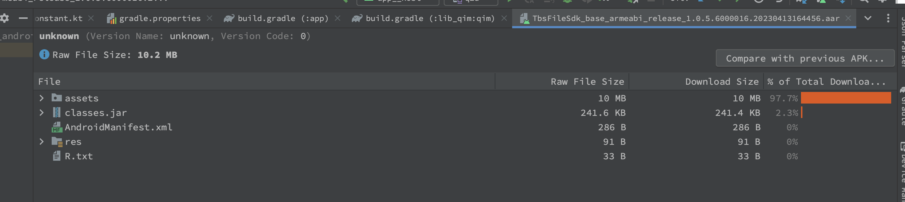
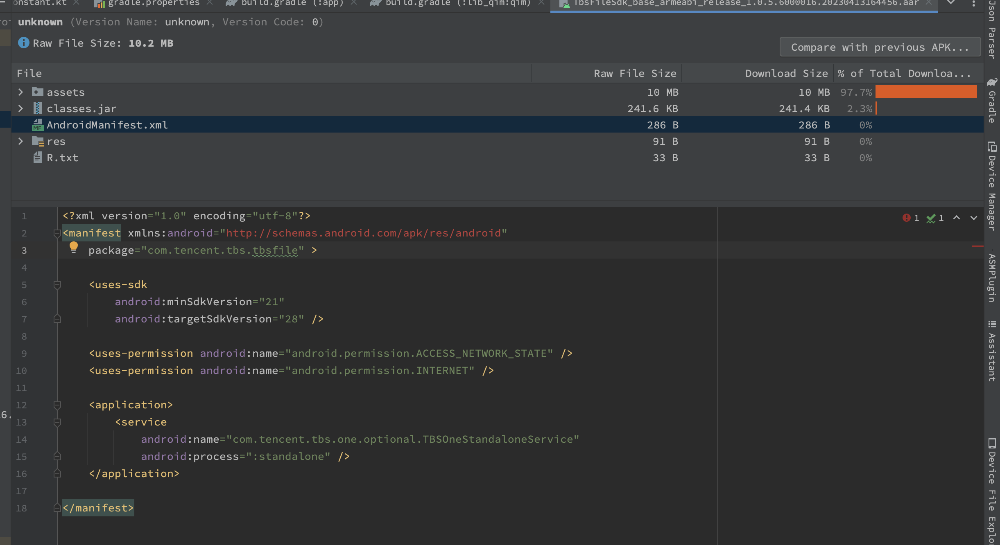

# 概述

文件浏览服务是APP中一个重要服务，需要支持 pdf,word,ppt,xls 等格式；在 44286 版本之前，x5内核直接提供该能力。在 44286 版本后，腾讯将 文件浏览服务独立出来，单独收费；

TBS 服务。单独集成增加apk 10M 的大小，这个在我看来是不可接受的。于是和腾讯商量，能不能做成动态下发的方式，腾讯的回答是可以，但是价格实在是太贵，1年给出 10万的报价。这个价格，公司不接受。

但是将apk 包增加 10M，我这边肯定不接受，于是进行插件化开发。

# 开发过程

## 第一轮尝试

有了插件化相关的开发知识后，将tbs sdk 和部分业务代码打包到 插件 apk 中，然后 资源共享问题以及 SDK 中包含了 一个 Service，导致问题太多；

于是第一轮尝试失败

- 四大组件需要进行注册，使用 插件apk 中组件比较麻烦；
- 对插件化的理解还不够深入。

## 第二轮尝试

对SDK 中内容进行分析，其截图如下：

我们发现,SDK 中真正大的原因是 assets 中资源太大了；那么我们动态下发只是对 assets 中的资源下发就行了。在宿主 apk中，针对 assets 的资源进行合并就好了。

- 拆分 SDK（unzip)，将assets 从中剔除，放入到插件apk的assets 中；
- 使用 jar cvf newsdk.aar -C c/ . 重新打包成新的 aar SDK包
- 将newsdk.aar 继承到 宿主中

这样一顿操作是OK的，插件apk 能够正常的运行起来。

但是这种拆解的方式，为以后得升级留下麻烦，那我可不可以将四大组件提前在 宿主 AndroidManifest.xml中预埋；实际上拆分也是为了这个目的。

## 第三轮尝试

看下 SDK 中 AndroidManifest.xml 的内容

发现只有Service相关的注册，于是将Service 复制到宿主 apk 的AndroidManifest.xml 中

其次 宿主apk 中不涉及相关的资源访问。

该方法是 OK的。

# 总结

因为时间很紧迫，没有太多的时间去处理资源合并和四大组件问题，只能“取巧了”。

- 四大组件采用提前插装的方式。
- 资源没有采取合并的方式。而是插件资源独立
  

