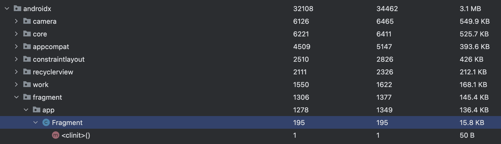

2023-11-4 补充，ResourceLoader 的使用，摈弃 Resource.

# 概述

插件化说简单也简单，说复杂也复杂；

说简单。就是如果 apk中仅仅是代码，而不涉及到资源合并，和四大组件，那就简单；如果涉及到四大组件，就比较难了。真正的麻烦是四大组件的处理。

- 静态代理。
- 通过插件 ASM 去添加代理代码，腾讯Shadow；
- 骚操作，使用hook，反射等技术（强烈不推荐，需要进行大量的版本兼容，深刻的理解Android系统级别代码）

前两种是建立在插件apk开发是自己开发打包；对于第三方的apk，要么进行拆包，对四大组件进行修改，要么就是最后一种方法，各种反射，hook；


在Android 11 之后，插件资源合并变得非常的简单，只需要通过 ResoureLoader就可以将插件apk中的资源合并到Resources中，非常的简单。Android 11 之前就有点痛苦了，得通过反射去进行。


# DexClassLoader 

如果不涉及到资源共享和四大组件问题，这个足够使用了。双亲委派机制，知道就行了。就是父类加载失败了，才是自己去加载。

## so 文件的处理

常用的做法是，解压apk文件，然后将so文件复制到对应的内部目录中，指定DexClassLoader lib的Path 路径。

# 资源处理

## 关于resources.arsc 相关的知识


可以简单的理解为资源 ID 和资源名称的一个映射关系。各个module中的 res 中资源最终都会被合并到一起。这个resources.arsc 就是资源映射，通过ID找资源，和 屏幕适配等。


ID的 起始数值，默认的是从 0x7开始的。当然我们可以改变这个顺序

在appt的时代，需要改 appt的代码去做但是在 appt2的时代，不需要了
appt2 中提供了资源ID 更改。在gralde中可以这样更改 ID 的起始编码
```js
android{
    androidResources {
        addtionalParameters("--package-id","0x89")
    }
}
```
于是我们可以在插件apk中指定 package-id 的起始ID

插件化开发中，加载插件的资源一定会引发资源ID 的冲突，所以，插件apk的资源起始ID一定要改。

## 插件资源ID另外的问题

如果插件和宿主共同使用了View库，比如使用 ConstraintLayout。有下面的代码：

```xml
<androidx.constraintlayout.widget.ConstraintLayout
    xmlns:android="http://schemas.android.com/apk/res/android"
    xmlns:app="http://schemas.android.com/apk/res-auto"
    xmlns:tools="http://schemas.android.com/tools"
    android:layout_width="match_parent"
    android:layout_height="match_parent"
    tools:ignore="MissingDefaultResource"
    tools:viewBindingIgnore="true">
    <TextView
        android:id="@+id/tv_description"
        android:layout_width="wrap_content"
        android:layout_height="wrap_content"
        android:layout_marginTop="@dimen/common_48"
        android:text="插件下载中，稍等片刻....."
        android:textColor="@color/qizhidao_color_text_title"
        android:textSize="@dimen/common_24"
        app:layout_constraintStart_toStartOf="parent"
        app:layout_constraintEnd_toEndOf="parent"
        app:layout_constraintBottom_toBottomOf="parent"
        app:layout_constraintTop_toBottomOf="parent">
    </TextView>

    </androidx.constraintlayout.widget.ConstraintLayout>

```

上面的布局代码，在宿主apk 中能正常的使用。但是如果宿主直接加载这个资源文件，那么呵呵呵了，app标签标记的属性设置全部失效。

为什么？因为宿主和插件中的resources.arsc中的 attr 中各有一份，id不一样。怎么解决呢？

到目前为止，没有没有很好的方法，有一种思路如下：
> 修改resources.arsc中 关于 attr 中对应的ID
但这种方式没有进行尝试。主要是过于麻烦。

**目前使用的方案是，使用纯代码构建UI**


## Android 11 的 ResouresLoader

使用非常的简单。无任何反射，无任何副作用

```java 
 if (Build.VERSION.SDK_INT >= Build.VERSION_CODES.R) {
     val resourcesLoader = ResourcesLoader().apply {
        val fileDescriptor = ParcelFileDescriptor.open(pluginFile,ParcelFileDescriptor.MODE_READ_ONLY)
        addProvider(ResourcesProvider.loadFromApk(fileDescriptor))
    }
     context.resources.addLoaders(resourcesLoader)
}
```


## 传统的做法：构建Resource对象

- PackageManager#getPackageArchiveInfo：根据 Apk 路径解析一个未安装的 Apk 的 PackageInfo
- PackageManager#getResourcesForApplication：根据 ApplicationInfo 创建一个 Resources 实例

于是构建Resource 的代码如下：
```java
    val packageManager = context.applicationContext.packageManager
        val packageInfo =
            packageManager.getPackageArchiveInfo(
                apkPathFile.absolutePath,
                PackageManager.GET_ACTIVITIES
                        or PackageManager.GET_META_DATA
                        or PackageManager.GET_SERVICES
                        or PackageManager.GET_PROVIDERS
                        or PackageManager.GET_SIGNATURES
            )?.apply {
                applicationInfo.sourceDir = apkPathFile.absolutePath
                applicationInfo.publicSourceDir = apkPathFile.absolutePath
            }

        val pluginAssets =  packageManager.getResourcesForApplication(packageInfo.applicationInfo).assets
        val pluginRes = Resources(
            pluginAssets,
            context.resources.displayMetrics,
            context.resources.configuration
        )
```

## 通过代理的方式进行资源合并,类似于下面的代码（没用过）

```
public class PluginResources extends Resources {
    private Resources hostResources;
    private Resources injectResources;

    public PluginResources(Resources hostResources, Resources injectResources) {
        super(injectResources.getAssets(), injectResources.getDisplayMetrics(), injectResources.getConfiguration());
        this.hostResources = hostResources;
        this.injectResources = injectResources;
    }

    @Override
    public String getString(int id, Object... formatArgs) throws NotFoundException {
        try {
            return injectResources.getString(id, formatArgs);
        } catch (NotFoundException e) {
            return hostResources.getString(id, formatArgs);
        }
    }

    // ...
}

```

## 另一种简单的方式

```Java
 val pluginAssets = AssetManager::class.java.newInstance().apply {
            val addAssetPath: Method =
                AssetManager::class.java.getDeclaredMethod("addAssetPath", String::class.java)
            addAssetPath.invoke(this, context.packageResourcePath)
            addAssetPath.invoke(this, apkPathFile.absolutePath)
        }
val        pluginRes = Resources(
            pluginAssets,
            context.resources.displayMetrics,
            context.resources.configuration
        )
```

# 四大组件的问题

四大组件的处理，一直是一个棘手的问题，主要是分三个流派

- 提前插桩法
这个最为简单。也没有什么副作用。

- 代理模式，其实这个跟插桩没啥本质区别。
  
> 无非是怎么插的问题。一种就直接代理模式搞起，另一种比较高级点，通过Gradle脚本的方式。Gradle的方式比较好的是可以处理各种第三方的库，缺点也明显，写插件需要一定的水平

- 各种反射，绕开系统

这里面的门道太多了。心累，不建议。

# 碰到的一些问题

遇到这样的问题：

```java
java.lang.IncompatibleClassChangeError

Structural change of androidx.fragment.app.Fragment is hazardous
```
发现，通过 Run 的安装包，和debug ，release 的包 Fragmemnt不一样，虽然编译的脚本都一样。



这种问题，检查下混淆配置即
可。确保插件apk 和宿主apk 的编译环境一致。所以说，插件化的代码一定要反复测试。