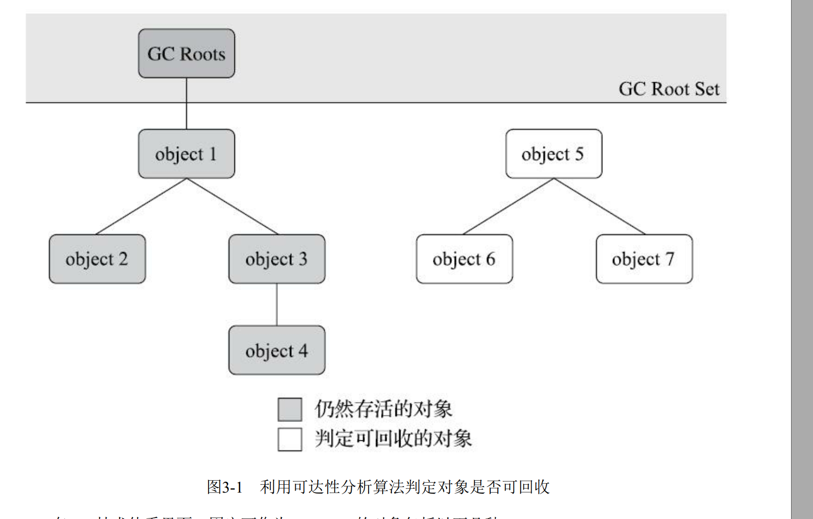
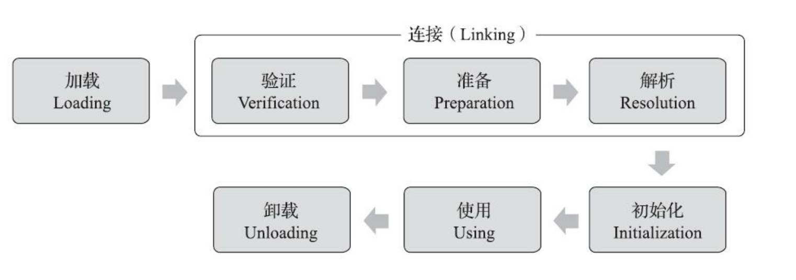

#  程序计数器

当前线程执行所执行的字节码的行号指示器，字节码解释器工作时就是通过改变这个计数器
的值来选取下一条需要执行的字节码指令， 它是程序控制流的指示器， 分支、 循环、 跳转、 异常处
理、 线程恢复等基础功能都需要依赖这个计数器来完成。

**每一个线程都有自己的程序计数器，互不干扰**

# Garbage Collected Heap

我们常常说的GC 就是  Garbage Collected 垃圾回收

## 如何确定对象已死

- 程序计数法
 
 > 无法解决循环引用问题。jvm 并没有采取该方法

- 可到达性分析算法

通过 GC Roots 的根对象作为起始点集，从这些节点开始， 根据引用关系向下搜索， 搜索过
程所走过的路径称为“引用链”（Reference Chain） ， 如果某个对象到GC Roots间没有任何引用链相连，
或者用图论的话来说就是从GC Roots到这个对象不可达时， 则证明此对象是不可能再被使用的。

## 引用

- 强引用
- 软引用  内存不足才回收
- 弱引用   对象存活到下一次GC前
- 虚引用

## 二次标记

- finalize 方法的作用

即使在可达性分析算法中判定为不可达的对象， 也不是“非死不可”的， 这时候它们暂时还处于“缓
刑”阶段， 要真正宣告一个对象死亡， 至少要经历两次标记过程： 如果对象在进行可达性分析后发现没
有与GC Roots相连接的引用链， 那它将会被第一次标记， 随后进行一次筛选， 筛选的条件是此对象是
否有必要执行finalize()方法。 假如对象没有覆盖finalize()方法， 或者finalize()方法已经被虚拟机调用
过， 那么虚拟机将这两种情况都视为“没有必要执行”。

## 垃圾回收算法

什么事分代收集理论？

-  弱分代假说 ：绝大多数对象都是朝生夕灭。也就是90%的对象活不过第一轮gc
-  强分代假说：熬过多次 gc仍然存活的对象难以消灭
- 跨代引用假说。相互引用的对象其生命周期应该是一致的

### 具体的算法

- 标记清除算法  ；不稳定（如果有大量的对象需要回收，效率低下），空间碎片化
- 标记复制  
> 将内存分为二个部分，将存活的对象复制到另一块区域，然后集中回收剩余的区域。问题是浪费空间，复制可能降低效率

- 标记整理算法   将存活的对象往一边移动。

# Class 文件

- Class字节码是Java跨平台的基础
- 任何一个Class文件都对应着唯一的类或者接口信息
-  八个字节为基础单位的二进制流

## 魔数
每一个Class文件的头四个字节。唯一的作用是确定这个文件是否为一个能被虚拟机接受的Class文件。0xCAFEBABE

后四个字节存储Class的版本号。5，6位是次版本号，7,8 是主版本号

## 常量池入口

## 访问标志

二个字节大小，确定 class 是 public 还是 private 是否是 abstract ，是否有final标志等等。

## 类索引，父类索引和接口索引集合

这个三项数据确定class 的继承关系

## 字段表集合

## 方法表集合

# 虚拟机的加载机制

Java虚拟机把描述类的数据从Class文件加载到内存， 并对数据进行校验、 转换解析和初始化， 最
终形成可以被虚拟机直接使用的Java类型， 这个过程被称作虚拟机的类加载机制。 

## 类的加载

class的生命周期

###  关于初始化
1）遇到new、 getstatic、 putstatic或invokestatic这四条字节码指令时， 如果类型没有进行过初始
化， 则需要先触发其初始化阶段。 能够生成这四条指令的典型Java代码场景有：
- ·使用new关键字实例化对象的时候。
- ·读取或设置一个类型的静态字段（被final修饰、 已在编译期把结果放入常量池的静态字段除外）
的时候。
- ·调用一个类型的静态方法的时候。

2） 使用java.lang.reflect包的方法对类型进行反射调用的时候， 如果类型没有进行过初始化， 则需
要先触发其初始化。

3） 当初始化类的时候， 如果发现其父类还没有进行过初始化， 则需要先触发其父类的初始化。

4） 当虚拟机启动时， 用户需要指定一个要执行的主类（ 包含main()方法的那个类） ， 虚拟机会先
初始化这个主类。

5） 当使用JDK 7新加入的动态语言支持时， 如果一个java.lang.invoke.MethodHandle实例最后的解
析结果为REF_getStatic、 REF_putStatic、 REF_invokeStatic、 REF_newInvokeSpecial四种类型的方法句
柄， 并且这个方法句柄对应的类没有进行过初始化， 则需要先触发其初始化。

6） 当一个接口中定义了JDK 8新加入的默认方法（ 被default关键字修饰的接口方法） 时， 如果有
这个接口的实现类发生了初始化， 那该接口要在其之前被初始化。

其中关键的，父类没有初始化先初始化父类。

关于类的初始化。是面试必问的问题。

### 加载
1） 通过一个类的全限定名来获取定义此类的二进制字节流。

2） 将这个字节流所代表的静态存储结构转化为方法区的运行时数据结构。

3） 在内存中生成一个代表这个类的java.lang.Class对象， 作为方法区这个类的各种数据的访问入
口。

### 验证

### 准备
准备阶段是正式为类中定义的变量（即静态变量， 被static修饰的变量） 分配内存并设置类变量初
始值的阶段，

### 解析

解析阶段是Java虚拟机将常量池内的符号引用替换为直接引用的过程

## 类加载器

**双亲委派模型**

双亲委派模型的工作过程是： 如果一个类加载器收到了类加载的请求， 它首先不会自己去尝试加
载这个类， 而是把这个请求委派给父类加载器去完成， 每一个层次的类加载器都是如此， 因此所有的
加载请求最终都应该传送到最顶层的启动类加载器中， 只有当父加载器反馈自己无法完成这个加载请
求（它的搜索范围中没有找到所需的类） 时， 子加载器才会尝试自己去完成加载

### 双亲委派模型的问题和补丁

SPI  - service provider interface

# 虚拟机字节码执行引擎

