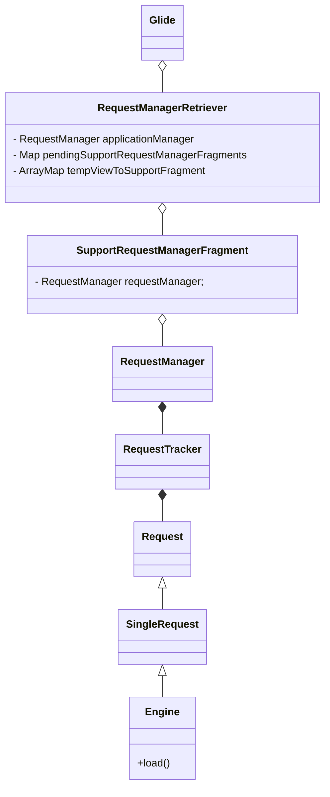
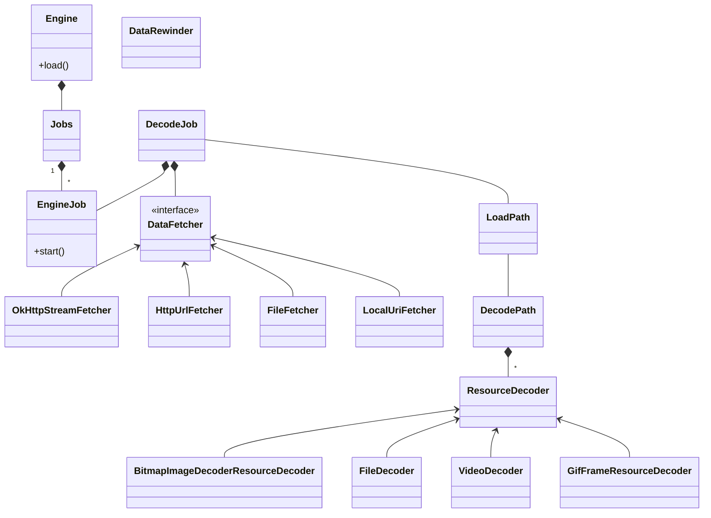
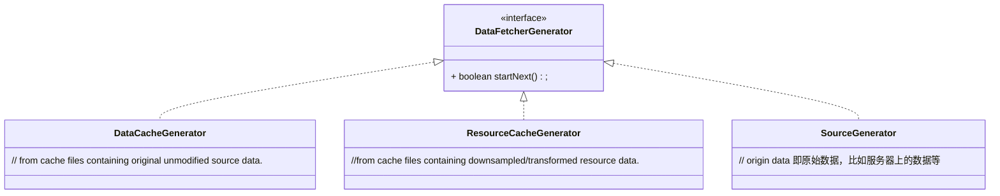

# 概述


- Glide 分为二个大模块分别是 管理Request部分和Request部分


## 整体架构分析
Glide 的结构本身并不复杂，为了性能的最优化，每一个层设计的复杂。比如缓存体系，从大的方面看时二层，但是每一层又进行了分层，这个设计由于图片的特殊性造成的。另外为了能自动管理各种图片的请求和绑定生命周期，中间添加了很多层去做。


GlideBuilder 是一个建造者模式的应用，并不需要太多的关心。

抛去细节，比如RequestBuilder 这些无关紧要的，下面Glide 顶层的架构设计图。关于缓存体系，encode,decode等细节，在 SingleRequest中。


**顶层的结构已经分析完成；接下来的主要是分析逻辑中心Engine** 
Engine部分才是真正的业务逻辑部分


- Jobs 类似一个容器作用，内部使用 HashMap 管理EngineJob 
- 请注意，EngineJob 类似一个代理者的作用，作用是启动 DecodeJob 这个任务,下面是关键代码
```
 public synchronized void start(DecodeJob<R> decodeJob) {
    this.decodeJob = decodeJob;
    GlideExecutor executor =
        decodeJob.willDecodeFromCache() ? diskCacheExecutor : getActiveSourceExecutor();
    executor.execute(decodeJob);
  }
```
- 通过 DataFetcher 拉取数据流后，在DeCodeJob 中对数据流进行解码。


**DataFetcher是什么**

远程图片数据流的拉取，这里的远程，可能是远程的服务端，也可能是相册中图片，但需要 ContentProvider 去拉。
请注意，DataFetcher 只负责数据流的拉取，自己本身是不负责图片的编码的。


**ResourceDecoder是什么**

这个就是解码器。那么DecodePath 怎么知道使用哪个解码器呢？嘿嘿，一个个的试.DecodePath 解码中的关键代码的代码

```java 
 @NonNull
  private Resource<ResourceType> decodeResourceWithList(
      DataRewinder<DataType> rewinder,
      int width,
      int height,
      @NonNull Options options,
      List<Throwable> exceptions)
      throws GlideException {
    Resource<ResourceType> result = null;
    //noinspection ForLoopReplaceableByForEach to improve perf
    for (int i = 0, size = decoders.size(); i < size; i++) {
      ResourceDecoder<DataType, ResourceType> decoder = decoders.get(i);
      try {
        DataType data = rewinder.rewindAndGet();
        if (decoder.handles(data, options)) {
          data = rewinder.rewindAndGet();
          result = decoder.decode(data, width, height, options);
        }
        // Some decoders throw unexpectedly. If they do, we shouldn't fail the entire load path, but
        // instead log and continue. See #2406 for an example.
      } catch (IOException | RuntimeException | OutOfMemoryError e) {
        if (Log.isLoggable(TAG, Log.VERBOSE)) {
          Log.v(TAG, "Failed to decode data for " + decoder, e);
        }
        exceptions.add(e);
      }

      if (result != null) {
        break;
      }
    }

    if (result == null) {
      throw new GlideException(failureMessage, new ArrayList<>(exceptions));
    }
    return result;
  }
```

我们可以看下gif 是如何解码的
```java 
/**
 * Decodes {@link Bitmap}s from {@link GifDecoder}s representing a particular frame of a particular
 * GIF image.
 */
public final class GifFrameResourceDecoder implements ResourceDecoder<GifDecoder, Bitmap> {
  private final BitmapPool bitmapPool;

  public GifFrameResourceDecoder(BitmapPool bitmapPool) {
    this.bitmapPool = bitmapPool;
  }

  @Override
  public boolean handles(@NonNull GifDecoder source, @NonNull Options options) {
    return true;
  }

  @Override
  public Resource<Bitmap> decode(
      @NonNull GifDecoder source, int width, int height, @NonNull Options options) {
    Bitmap bitmap = source.getNextFrame();
    return BitmapResource.obtain(bitmap, bitmapPool);
  }
}

```
嗯，很有意思了。


**DataRewinder**

等等！，我们似乎忘了 DataRewinder 的作用.从单词的意思理解是回流的意思。为什么有这种东西？因为这里的流可能被使用多次，比如流的的缓存，需要从流的头部读取一些信息等，因为流被反复使用，所以才增加了 DataRewinder


# 具体的分析


## Glide的使用过程

我们先不用去看缓存，各种解码器。


我们看下官网的使用例子
```

 Glide.with(this).load("https://goo.gl/gEgYUd").into(imageView);

```

-  Glide.with(this) 这行代码是获取一个 RequestManager
-  load("https://goo.gl/gEgYUd") 是一个 RequestBuilder构建 Request 的各种参数配置。
-  into(imageView)的背后
首先是 buildRequest;其实将这个Requet加入 RequestManger 去管理。


原来Glide的使用很简单，就是构建一个 Request 然后将这个Request加入 RequestManger。


## Glide 自动管理 Request

我们常说，使用Glide能自动的管理Bitmap的生命周期和自动感知生命周期进而自动管理Request.

这里包含了二个方面的内容。对于ImagView 所代表的ViewTarget,在onViewAttachedToWindow 的时候恢复请求，在 onViewDetachedFromWindow 的时候暂停请求。这就是 RecycleView 中ImagView中不用管的意思。


对于RequestManger ，其绑定了一个SupportRequestManagerFragment 。通过观察Fragment的生命周期，进而控制 对于RequestManger 中所有Request


通过 
> adb shell dumpsys activity APP的包名

可以在打印出来的堆栈信息中，找到 SupportRequestManagerFragment 。


###  RequestManagerRetriever 管理  SupportRequestManagerFragment


RequestManagerRetriever 全局只有一个，它管理着 SupportRequestManagerFragment，进而间接管理 RequestManger。


这个类中代码很少，可以过一下
```java 
  final Map<android.app.FragmentManager, RequestManagerFragment> pendingRequestManagerFragments =
      new HashMap<>();

```


# Request详解


我们看下 SingleRequest。这里的代码比较多，从begin 方法开始看，省去很的细节，看这么一行


```java 
   if (Util.isValidDimensions(overrideWidth, overrideHeight)) {
        onSizeReady(overrideWidth, overrideHeight);
      } else {
        target.getSize(this);
      }
```

target.getSize 实际上是监听 View的测量结果，如果View 测量完成，会给一个宽度和高度。

主要看 onSizeReady 方法，然后发现真正的业务逻辑在 Engine 中进行的。


# Engine

从单词本身的意义理解，就是引擎的意思。但是具体的任务执行是 EngineJob。我们看下这个类中的代码。从代码的逻辑看，流程如下：


1. 从内存缓存中加载，即loadFromMemory。内存缓存分为二级
   - loadFromActiveResources
   - MemoryCache
2. 从磁盘中加载
   -  ResourceCache
   -  DataCache
3. 从数据源加载数据（不同的DataFetcher）


从这里看，似乎没看到 ArrayPool 这个缓存。这个缓存只在 ThumbFetcher 和  ByteBufferGifDecoder 上看到使用过
  

## DataFetcher 模块 

这个是远程加载数据模块，这里的远程指的是数据源可能是服务端，也可能是本地文件图片等，我们可以看下 HttpUrlFetcher 内容，但一般的，我们更多的使用OKHttp,这个时候，可以看下这个模块的内容。

但是 DataFetcher 谁去使用的？DataFetcherGenerator，关于Generator的意思机器。

### DataFetcherGenerator

通常，我们要使用一个图片资源步骤如下
- 先从缓存中读取。
- 缓存没有，则从网络中读取

同样，对于 DataFetcherGenerator 它就是干这个活的，它有三个实现类,对应着数据拿取策略


那么怎么使用 DataFetcherGenerator 的呢？在DecodeJob 中伪代码大概是这样的

```java
  while (!isCancelled
        && currentGenerator != null
        && !(isStarted = currentGenerator.startNext())) {
      stage = getNextStage(stage);
      currentGenerator = getNextGenerator();
      if (stage == Stage.SOURCE) {
        reschedule();
        return;
      }
    }

```

也就是先去缓存，缓存没有然后就是下一个。


##   解码

Glide 有很多解码器，负责将流解码成指定的图片格式。

LoadPath 这个类的非常奇怪，其注释是这样的。

> For a given com.bumptech.glide.load.data.DataFetcher for a given data class, attempts to fetch the data and then run it through one or more DecodePaths.


那么怎么选取合适的解码器呢？让人大跌眼镜的是下面的代码

```java
 Resource<Transcode> result = null;
    //noinspection ForLoopReplaceableByForEach to improve perf
    for (int i = 0, size = decodePaths.size(); i < size; i++) {
      DecodePath<Data, ResourceType, Transcode> path = decodePaths.get(i);
      try {
        result = path.decode(rewinder, width, height, options, decodeCallback);
      } catch (GlideException e) {
        exceptions.add(e);
      }
      if (result != null) {
        break;
      }
    }

    if (result == null) {
      throw new GlideException(failureMessage, new ArrayList<>(exceptions));
    }
```
就是一个个试！！！


# 阶段总结


##  关于缓存
  

从 GlideBuild 的缓存来看有四级缓存。
  - BitmapPool
  - LruArrayPool
  - LruResourceCache  内存缓存
  - InternalCacheDiskCacheFactory  磁盘缓存


在分析 Engine 的时候，分析了内存缓存和磁盘缓存，但是BitmapPool 确没有涉及？BitmapPool 分散到各个 transform 中的


## 关于Request


Requet 咋一看，以为是逻辑中心，其实我感觉这个就是一个中间层。承接着生命周期感知和真正图片加载的逻辑的是 Engine。EngineJob是主要的任务承担。


DecodeJob 这里的代码很有意思，数据的拉取，解码都是在这里进行的。DecodeJob 又承担着核心功能，


