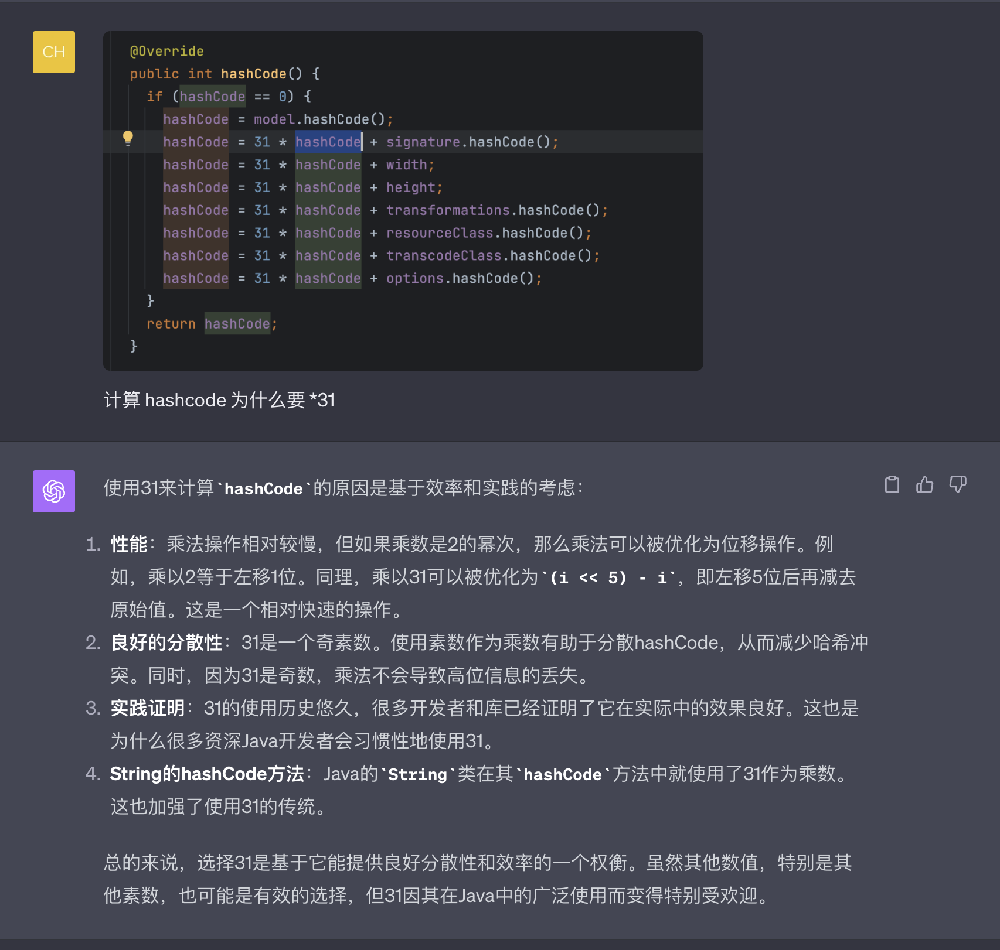
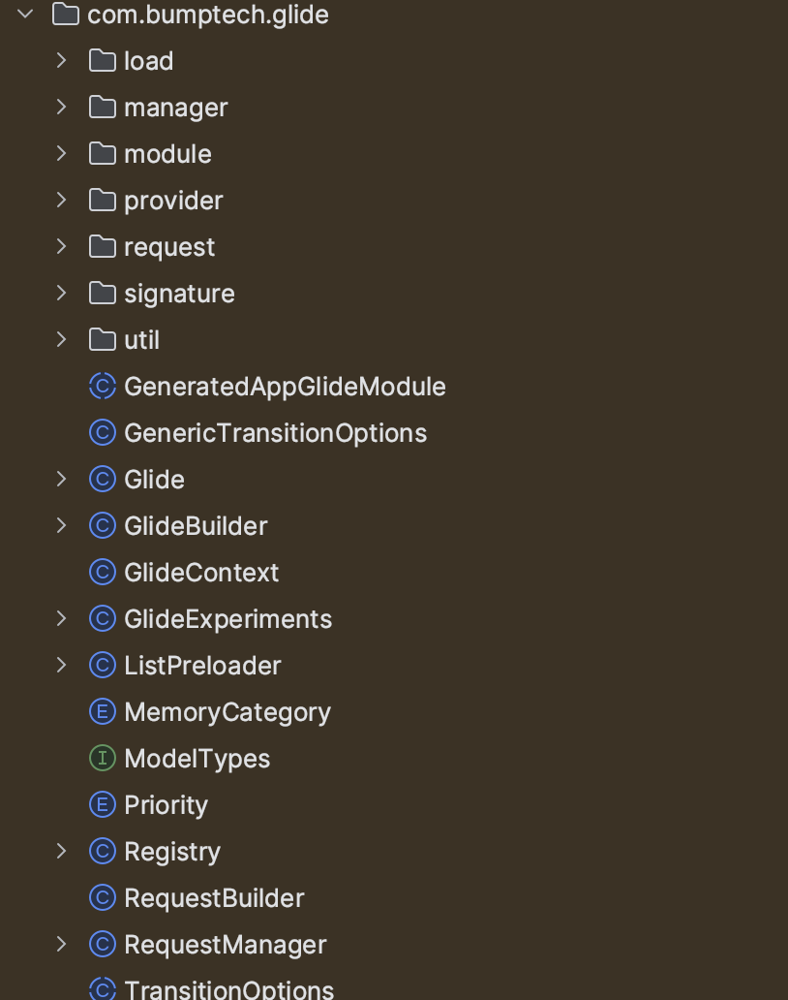

# 概述

Glide的二个大部分，一个是Request管理，另一个如图片的获取，解析，显示，这一部分的核心类就是Engine。

- Engine 的注释是这样的：Responsible for starting loads and managing active and cached resources.
- 这个是一个单例。全局就一个

Engine 通过 Jobs 管理着所有的 EngineJob。Engine中包含了远程资源拉取，缓存，解码等。实际上EnginJob 也只是一个门面模式。

**tips**

这个部分可以看下EngineKey ，看下唯一key的生成规则，还是挺有意思的，比如：

# DecodeJob 分析

DecodeJob 的构建是在Engine中进行的。构建完成后，通过EnginJob去启动。
- DecodeJob 是一个线程。
- 包含了最重要的 DataFetcher 模块，也包括了缓存的构建。

# 总结

分析到这个程度，感觉差不多了，再钻入细节中没有多大的意义。这个时候，回过头来看Glide的目录结构就清晰多了。

分析Glide的整体结构，惊叹于其架构的设计。可能每个模块我们都能写，但是如何组合成这样的精巧结构很难。
- Glide 类是一个集成了各种配置的门面。
- 管理Request
- 管理Job