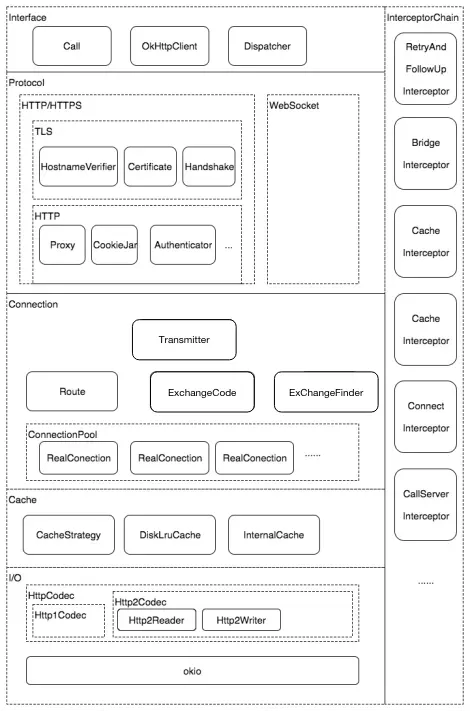

# 概述
OkHttp的架构上是非常简单的。

**细节问题**
- 底层的通信使用的是 socket 通信。
- 缓存三个体系，一个是连接池（TCP 建立连接是耗时的），二是根据HTPP的缓存规范（在CacheInterceptor中；最后是用户设置的Cache(可以简单的理解为一个 key-value结构).


## 架构问题

- 拦截器
- 职责链


# 整体架构分析

## 职责链的理解

这里的职责链，和我们从设计模式上看到的职责链模式有着很大的不同。这里的下一个任务是动态生成的。真正的逻辑处理是在各个 Interceptor.

下面的代码是去掉无关紧要的代码后的：

```java 
public interface Interceptor {
  Response intercept(Chain chain) throws IOException;
  interface Chain {
    Response proceed(Request request) throws IOException;

  }
}

```
Chain 只有一个子类，就是RealInterceptorChain,这个类的代码量也不多核心的业务逻辑代码在下面：

下面的代码是简化后的

```java

public final class RealInterceptorChain implements Interceptor.Chain {

  public Response proceed(Request request, Transmitter transmitter, @Nullable Exchange exchange)
      throws IOException {

// 删除了无关紧要的代码
    RealInterceptorChain next = new RealInterceptorChain(interceptors, transmitter, exchange,
        index + 1, request, call, connectTimeout, readTimeout, writeTimeout);
    Interceptor interceptor = interceptors.get(index);
    Response response = interceptor.intercept(next);
    return response;
  }
}
```

一个拦截器的示例：


```java

public final class BridgeInterceptor implements Interceptor{

    @Override public Response intercept(Chain chain) throws IOException {
    
    // 已经删除了无关紧要的代码
     Response networkResponse = chain.proceed(requestBuilder.build());

    }
}
```

上面就是整个框架的核心；理解了这个也就理解了OkHttp这个框架。

# 具体的拦截器功能

在 RealCall 的 getResponseWithInterceptorChain 方法中有如下代码：

```
  Response getResponseWithInterceptorChain() throws IOException {
    // Build a full stack of interceptors.
    List<Interceptor> interceptors = new ArrayList<>();
    interceptors.addAll(client.interceptors());
    interceptors.add(new RetryAndFollowUpInterceptor(client));
    interceptors.add(new BridgeInterceptor(client.cookieJar()));
    interceptors.add(new CacheInterceptor(client.internalCache()));
    interceptors.add(new ConnectInterceptor(client));
    if (!forWebSocket) {
      interceptors.addAll(client.networkInterceptors());
    }
    interceptors.add(new CallServerInterceptor(forWebSocket));

    Interceptor.Chain chain = new RealInterceptorChain(interceptors, transmitter, null, 0,
        originalRequest, this, client.connectTimeoutMillis(),
        client.readTimeoutMillis(), client.writeTimeoutMillis());
    
    // 省略无关紧要的代码
        
  }

```
上面涉及到的有：
- RetryAndFollowUpInterceptor -  失败和重定向
- BridgeInterceptor -  封装Request 和 Respond;比如添加请求头等信息都是在这个拦截器完成的
- CacheInterceptor  - 缓存相关的
- ConnectInterceptor - 真正的网络请求都在这里进行的
- CallServerInterceptor - 在上一步建立连接后，写入流，读取流等操作都是在这里进行的

上面五个拦截器串联了整个工作过程。现在看下面的架构图就显得清晰了、




# 连接池复用和Socket 通信已经DNS解析等细节问题


这里都是细节的问题，可以自己去看下代码


