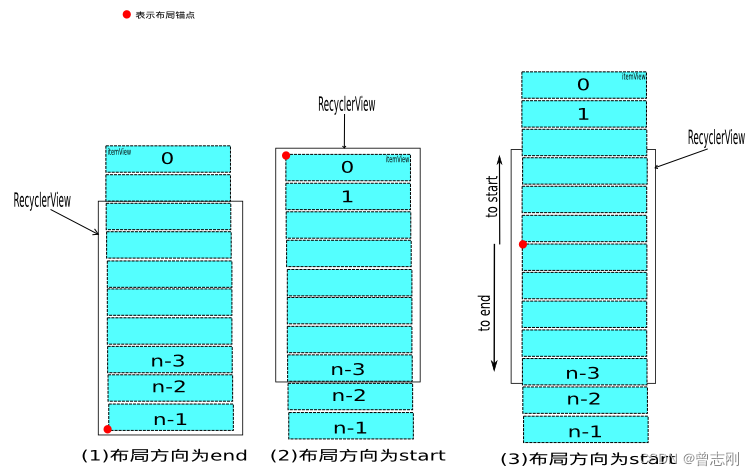

# 概述

RecyclerView 本身是一个ViewGroup;那么按照ViewGroup 的三大流程去分析就没什么问题。RecyclerView 本身是一个空架子，真正的布局计算放在各个LayoutManger上的。按照 缓存体系，布局体系进行总结。


## 几个注意事项
- LayoutParams 是持有 ViewHolder 的，所以通过View是能够得到View对应的ViewHolder 的。


# 缓存体系

请注意这里的缓存，针对的是ViewHolder的缓存。请注意是五级缓存，不是四级；viewCacheExtension 是用户定义，一般的用不上。

相关的二个类。Recycler 和 RecycleViewPool

- 五级缓存，attachedScrap,changeScrap,cacheView,viewCacheExtension 和 recycleViewPool
- viewCacheExtension 是用户自定义的，不用管
- RecycleViewPool 用户可以干涉，可以从外部设置，也可以设置每一个Type最大缓存数
- ttachedScrap,changeScrap 很多人认为是相同的，其实不同，
- tryGetViewHolderForPositionByDeadline 这个方法展示了拿取缓存的方法步骤。
> - 0) If there is a changed scrap, try to find from there
> - 1) Find by position from scrap/hidden list/cache


从取缓存顺序看,changeScrap 优先级最高。


## 从代码层面看缓存的过程

LayoutManger 在布局前会先  detachAndScrapAttachedViews ;一般的我不贴代码，但是下面的代实在是太重要了,所有的秘密都在这里。

```
        public void detachAndScrapAttachedViews(@NonNull Recycler recycler) {
            final int childCount = getChildCount();
            for (int i = childCount - 1; i >= 0; i--) {
                final View v = getChildAt(i);
                scrapOrRecycleView(recycler, i, v);
            }
        }

        private void scrapOrRecycleView(Recycler recycler, int index, View view) {
            final ViewHolder viewHolder = getChildViewHolderInt(view);
            if (viewHolder.shouldIgnore()) {
                if (DEBUG) {
                    Log.d(TAG, "ignoring view " + viewHolder);
                }
                return;
            }
            if (viewHolder.isInvalid() && !viewHolder.isRemoved()
                    && !mRecyclerView.mAdapter.hasStableIds()) {
                removeViewAt(index);
                recycler.recycleViewHolderInternal(viewHolder);
            } else {
                detachViewAt(index);
                recycler.scrapView(view);
                mRecyclerView.mViewInfoStore.onViewDetached(viewHolder);
            }
        }
```

- 如果viewHolder 没有失效，走detachViewAt的逻辑，此时View是没有移除ViewGroup的，缓存走scrapView的。
  
具体看 scrapView 的逻辑

```
  void scrapView(View view) {
            final ViewHolder holder = getChildViewHolderInt(view);
            if (holder.hasAnyOfTheFlags(ViewHolder.FLAG_REMOVED | ViewHolder.FLAG_INVALID)
                    || !holder.isUpdated() || canReuseUpdatedViewHolder(holder)) {
                if (holder.isInvalid() && !holder.isRemoved() && !mAdapter.hasStableIds()) {
                    throw new IllegalArgumentException("Called scrap view with an invalid view."
                            + " Invalid views cannot be reused from scrap, they should rebound from"
                            + " recycler pool." + exceptionLabel());
                }
                holder.setScrapContainer(this, false);
                mAttachedScrap.add(holder);
            } else {
                if (mChangedScrap == null) {
                    mChangedScrap = new ArrayList<ViewHolder>();
                }
                holder.setScrapContainer(this, true);
                mChangedScrap.add(holder);
            }
        }
```
简单的说，ViewHolder invalide的，被标识为 remove 那么放到 attachScrap中，否则changeScrap。

- 上面的情况是View还在ViewGroup中，还有一种就是View会从ViewGroup中移除。这个时候，走后面三个缓存的流程。具体的业务逻辑代码在 recycleViewHolderInternal 方法中。就不贴出了。

其中的一个细节就是 cacheView 的Size 默认只有 2.如果满了，移除的ViewHolder 将放到 recycleViewPool 中。


**说了这么多的recyclerViewPool，那么这个数什么呢？**

看下代码就知道怎么回事了，不说了，简单的理解为 key-value 结构。key 是 type. value是ViewHolder。


## 总结缓存体系

五个个缓存体系；

- 根据 View 是否被remove ，将缓存体系分为二组  attachedScrap,changeScrap 为一组，其View不会从ViewGroup中 remove掉。另外的cacheView,cacheViewExtend，recyclerViewPool都属于第二组 

- changeScrap 会在一次布局后将其清空


# 过程概述

这里有一篇文章讲解了该过程 
> https://blog.csdn.net/qq_23012315/article/details/50807224


其中重要的就是确定锚点，确定锚点后,后面的布局是根据锚点来的





大体过程：

- 确定锚点
-  detachAndScrapAttachedViews   
-  根据锚点布局（fill ,layoutChunk  ）;layoutChunk中可以看到熟悉的addView,measureChild，layout等代码


