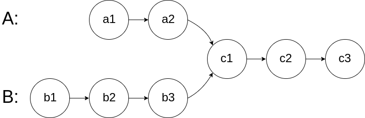

# 概述

数组和链表本身非常的简单，重点关注下下面的一些技能

- 二分查找问题
- 双指针
- 快慢指针
- 链表翻转（递归比较难以理解）

# 二分查找

下面是二分查找的代码
``` java
public class MiddleSearch {
    public int search(int[] array,int target){
        int left =0;
        int right = array.length;
        while (left < right){
            int middle = left + (right - left)/2;
            if (array[middle] == target){
                return middle;
            }else if (array[middle] < target){
                left = middle+1;
            }else {
                right = middle;www
            }
        }
        return  -1;
    }

    public static void main(String[] args){
        int[] array = {1,2,3,4,5,6,7,8};
        System.out.println(new MiddleSearch().search(array,4));
        System.out.println(new MiddleSearch().search(array,9));
    }
}
```

## 问题1
为什么 middle  = left +(right - left)/2 而不是 middle = (left +right)/2 呢？

因为 整数溢出问题；
## 问题二
关于left right 的边界问题
〉 就是如果 left,right 是左开右闭，那么后面每一次left和right的变化都满足这个左开右闭


# 长度最小的子数组

给定一个含有 n 个正整数的数组和一个正整数 s ，找出该数组中满足其和 ≥ s 的长度最小的 连续 子数组，并返回其长度。如果不存在符合条件的子数组，返回 0。

示例：

输入：s = 7, nums = [2,3,1,2,4,3] 输出：2 解释：子数组 [4,3] 是该条件下的长度最小的子数组。


> 该题目本身是不难的，就是双指针问题，但是写的时候，总是在细节上出毛病，记录一下

注意的是，双指针，那个指针在前，哪个在后。弄反了就麻烦了。

```Java
  int minSubArray(int[] array,int s){
        int sum = 0;
        int i = 0;
        int len = Integer.MAX_VALUE;
        for (int j = 0; j < array.length;j++){
            sum+= array[j];
            while (sum >= s){
                len = Math.min(len,j-i +1);
                sum -= array[i++];
            }
        }
        return len == Integer.MAX_VALUE? 0:len;
    }
```

# 删除链表倒数第N个节点

这个题就是典型的技巧性，双指针的问题；

- 二个指针，第一个指针先走N步；
- 第二个指针和第一个指针同时移动。
- 第二个指针到末尾了，那么第一个指针所在的位置就是倒数第N个节点，删除即可。

# 链表相交



求 A，B 链表的相交点；

这个题比较特殊

-  先求出 A，B链表的长度差 distance
-  最长的的链表先走 distance 距离，然后再同时走，每走一次对比一次。

# 判断是否是环形链表，并判断环的起点

- 通过快慢指针判断是否有环。
- 当在环相遇时；从头部出发一个指针，在相遇点出发一个指针，然后每次走一步，再次相遇点就是圆环起点。

# 链表翻转

递归的写法,这个需要理解一会儿

```java
    public  Linked  recursion(Linked current){
        if (current.next == null){
            return current;
        }
        Linked last = recursion(current.next);
        current.next.next = current;
        current.next = null;
        return last;
    }
```

常规写法，这个比较好理解

```java 

    public Linked overturn(Linked node){
        Linked pre = null;
        Linked cur = node;
        Linked temp = null;
        while (cur != null){
            temp = cur.next;
            cur.next = pre;
            pre = cur;
            cur = temp;
        }
        return pre;
    }
```
