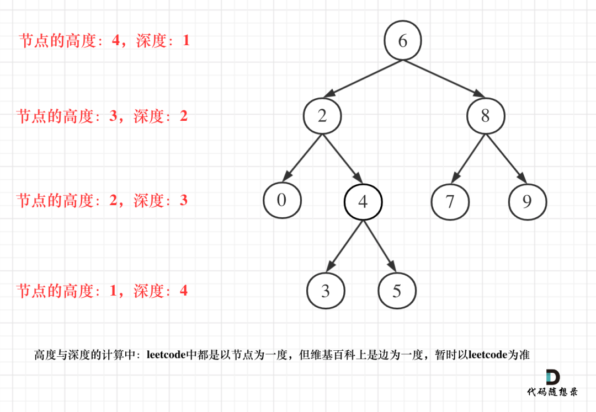

# 概述

先明白几个概念。

- 节点的度：一个节点拥有字树的数目，称为节点的度。

完全二叉树；二叉搜索树，平衡二叉搜索树


平衡二叉搜索树是为了解决二叉搜索树 的一些深度不合理的问题，极端情况下二叉搜索树退化成一个链表。


**二叉树节点的深度和高度**

其实概念是非常简单的

- 节点的深度，指的是从**根节点**到此节点最长简单路径的条数
- 节点的高度，指的是从该节点到叶子节点的最长简单路径的边条数



上面的图，我们以节点 2为例，深度为 6->2 所以 深度是2；2->4->3 所以最大高度是3.


**对于二叉树的最大深度等于根节点的最大高度**

## 二叉树的遍历问题

使用递归是一种非常简单的遍历方法。对于非递归的方法


### 前序遍历的非递归方法

**实际上，非递归方法，就是用 栈 来模拟递归过程。**

代码如下：

```
fun preTraversal(node:TreeNode){
    val stack = Stack<TreeNode>()
    var p:TreeNode? = node
    while (p != null || stack.isNotEmpty()){
        if (p != null){
            print(p.data)
            print(',')
            stack.push(p)
            p  = p.left
        }else{
            p = stack.pop()
            p = p.right
        }
    }
}
```

更简洁的一种写法

```
fun preTraversal2(node:TreeNode){
    val stack = Stack<TreeNode>()
    stack.push(node)
    while (stack.isEmpty().not()){
        val p = stack.pop()
        print(p.data)
        print(",")
        p.right?.let {
            stack.push(it)
        }
        p.left?.let {
            stack.push(it)
        }
    }
}
```

### 中序遍历

```
fun midTraversal(node: TreeNode){
    val stack = Stack<TreeNode>()
    var p:TreeNode?= node
    while (p != null || stack.isNotEmpty()){
        if (p != null){
            stack.push(p)
            p = p.left
        }else{
            p = stack.pop()
            print(p?.data)
            print(',')
            p = p?.right
        }
    }
}
```

### 后序遍历

这个有点意思
```
fun frontTraversal(node: TreeNode){
    val stack = Stack<TreeNode>()
    val list = ArrayList<TreeNode>()
    stack.push(node)
    while (stack.isNotEmpty()){
        val p = stack.pop()
        list.add(p)
        if (p.left != null){
            stack.push(p.left)
        }
        if (p.right != null){
            stack.push(p.right)
        }
    }
    list.reverse()
    list.forEach{
        print(it.data)
        print(',')
    }
}

```
### 层序遍历

```
fun levelTraversal(node: TreeNode){
    val queue = LinkedList<TreeNode>()
    queue.addLast(node)
    while (queue.isEmpty().not()){
        var len = queue.size
        while (len >0){
            val p = queue.removeFirst()
            print(p.data)
            print(',')
            p.left?.let {
                queue.addLast(it)
            }
            p.right?.let {
                queue.addLast(it)
            }
            len --
        }
        println()
    }
}
```


# 几个算法

二叉树 翻转，这个真的很简单。
> 听说 Homebrew的作者Max Howell，就是因为没在白板上写出翻转二叉树，最后被Google拒绝了。


翻转二叉树，就是交换节点的左子树和右子树，如果是递归写法

```

fun overTurn(node:TreeNode?){
    node?.let { node ->
        val left = node.left
        val right = node.right
        node.left = right
        node.right = left
        overTurn(left)
        overTurn(right)
    }
}
```

非递归版本

```
fun overTurn2(node: TreeNode){
    val stack = Stack<TreeNode>()
    stack.push(node)
    while (stack.isNotEmpty()){
        val n = stack.pop()
        val left = n.left
        val right = n.right
        n.right = left
        n.left = right
        left?.let {
            stack.push(it)
        }
        right?.let {
            stack.push(it)
        }
    }
}
```