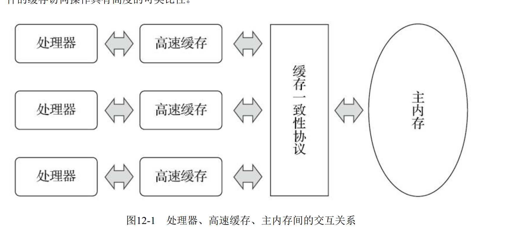

# 概述

为什么有线程安全问题？

## 工作内核和主内存数据一致性问题

- cup 和内存速度差异很大，于是引入高速缓存。
- 一个cup有自己的高速缓存，又共享一块主内存，那么数据一致性问题出现了。
- 为了解决缓存一致性问题，然后提出了各种协议





## 指令为什么要重排

除了增加高速缓存之外， 为了使处理器内部的运算单元能尽量被充分利用， 处理器可能会对输入
代码进行乱序执行（Out-Of-Order Execution） 优化， 处理器会在计算之后将乱序执行的结果重组， 保
证该结果与顺序执行的结果是一致的， 但并不保证程序中各个语句计算的先后顺序与输入代码中的顺
序一致， 因此如果存在一个计算任务依赖另外一个计算任务的中间结果， 那么其顺序性并不能靠代码
的先后顺序来保证。 与处理器的乱序执行优化类似， Java虚拟机的即时编译器中也有指令重排序
（Instruction Reorder） 优化。


# 主内存和工作内存

- 所有的变量存主内存
- 每一条线程有自己的工作内存。
> 线程对变量的所有操作（读取、 赋值等） 都必须在工作内
存中进行， 而不能直接读写主内存中的数据[3]。 不同的线程之间也无法直接访问对方工作内存中的变
量， 线程间变量值的传递均需要通过主内存来完成


## 内存之间相互操作 read write lock unlock

这里的内存之间，指的是工作内核和主内存


- lock 作用于主内存变量，把一个变量标识为一条线程独占状态
- unlock  作用于主内存的变量， 它把一个处于锁定状态的变量释放出来， 释放后的变量
才可以被其他线程锁定

## volatile

JVM 提供的轻量级同步机制

1.  可见性 
>  第一项是保证此变量对所有线程的可见
性， 这里的“可见性”是指当一条线程修改了这个变量的值， 新值对于其他线程来说是可以立即得知
的。

请注意，这个只对修饰的变量的可见性，对操作符则是有问题的,下面的代码就有问题

``` java 
volatile int a = 0

//省略了代码......
fun test(){
a++
}
```

2. 禁止指令重排优化

### volatile性能问题

volatile 在读数据的方面基本上没有性能损耗，在写方面，因为要插入内存屏障代码，因此要慢一些，但总体的性能比synchronized 好。

# 原子性，可见性与有序性

- 原子性 
synchronized关键字可以保证。

请注意，Java本身的内存模型保证了对基本变量的读写访问（除了long 和double ）外都具有原子性的。这里的内存指的是主内存。
接下来的表述非常的重要：

> 如果应用场景需要一个更大范围的原子性保证（经常会遇到） ， Java内存模型还提供了lock和
unlock操作来满足这种需求， 尽管虚拟机未把lock和unlock操作直接开放给用户使用， 但是却提供了更
高层次的字节码指令monitorenter和monitorexit来隐式地使用这两个操作。 这两个字节码指令反映到Java
代码中就是同步块——synchronized关键字， 因此在synchronized块之间的操作也具备原子性。


- 可见性

synchronized 和 final

定义：当一个线程修改了共享变量的值时， 其他线程能够立即得知这个修改

- 有序性
synchronized 和 volatile


# 先行发生原则

先行发生是Java内存模型中定义的两项操作之间的偏
序关系， 比如说操作A先行发生于操作B， 其实就是说在发生操作B之前， 操作A产生的影响能被操作B
观察到， “影响”包括修改了内存中共享变量的值、 发送了消息、 调用了方法等

# 线程安全

定义：当多个线程同时访问一个对象时， 如果不用考虑这些线程在运行时环境下
的调度和交替执行， 也不需要进行额外的同步， 或者在调用方进行任何其他的协调操作， 调用这个对
象的行为都可以获得正确的结果， 那就称这个对象是线程安全的

## 什么是可重入


若一个程序或子程序可以“在任意时刻被中断然后操作系统调度执行另外一段代码，这段代码又调用了该子程序不会出错”，则称其为可重入（reentrant或re-entrant）的。即当该子程序正在运行时，执行线程可以再次进入并执行它，仍然获得符合设计时预期的结果。与多线程并发执行的线程安全不同，可重入强调对单个线程执行时重新进入同一个子程序仍然是安全的。

简单的说，就是**同一个线程**可以反复进入而结果是符合预期的。

## 乐观锁和悲观锁

CAS  就是乐观锁；java9才开放给用户使用。但这种有逻辑漏洞，就是ABA问题。


## 理解 ThreadLocal

作用是在同一个线程内方便对象的共享。

- Thread  中 有一个 ThreadLocal.ThreadLocalMap threadLocals; 的属性
- ThreadLocal.ThreadLocalMap  就不多说了，map 结构啊
  

# synchronized 关键字再理解

在Java里面， 最基本的互斥同步手段就是synchronized关键字， 这是一种块结构（Block
Structured） 的同步语法。 synchronized关键字经过Javac编译之后， 会在同步块的前后分别形成
monitorenter和monitorexit这两个字节码指令。 这两个字节码指令都需要一个reference类型的参数来指明
要锁定和解锁的对象。 如果Java源码中的synchronized明确指定了对象参数， 那就以这个对象的引用作
为reference； 如果没有明确指定， 那将根据synchronized修饰的方法类型（如实例方法或类方法） ， 来
决定是取代码所在的对象实例还是取类型对应的Class对象来作为线程要持有的锁。

在执行monitorenter指令时， 首先要去尝试获取对象的锁。 如果
这个对象没被锁定， 或者当前线程已经持有了那个对象的锁， 就把锁的计数器的值增加一， 而在执行
monitorexit指令时会将锁计数器的值减一。 一旦计数器的值为零， 锁随即就被释放了。 如果获取对象
锁失败， 那当前线程就应当被阻塞等待， 直到请求锁定的对象被持有它的线程释放为止。


## synchronized 的局限性

- 被synchronized修饰的同步块在持有锁的线程执行完毕并释放锁之前， 会无条件地阻塞后面其他
线程的进入。 这意味着无法像处理某些数据库中的锁那样， 强制已获取锁的线程释放锁； 也无法强制
正在等待锁的线程中断等待或超时退出

- synchronized 是一个重量级的操作。在Java 6之前有严重的性能问题。但是经过Java6优化后。已经没有多少性能问题了。