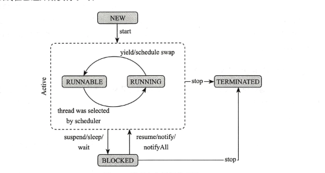

# 概述

学习代码的相关工程地址为:git@github.com:cugkuan/exercise.git

下面这张线程生命周期图非常的重要

- 守护线程

## 线程相关的方法

 - yield 
  提醒调度器，我愿意放弃当前cup资源。

  - 线程的优先级设置

- 线程 Interrupt 

可以理解当线程处于阻塞状态 的时候，可以被打断,并抛出异常

- join 

这个有点绕口，特别注意，就是会阻塞当前线程，直到 被join 的线程执行完毕。

## synchronized 关键字的理解

排他式的数据同步机制，无法控制时长，阻塞不可被中断 ，针对，synchronized 的缺点，可以自己封装一些锁；

##  volatitle 关键字

首先理解几个概念

- 原子性
- 可见性
- 顺序性

请注意，以上的概念针对多线程而言的，单线程不用考虑

原子性和数据库的事务有点类似，即使操作不可再分。可见性简单的理解，其变量一定是最新的，多个线程访问同一变量，能保证访问的变量值是最新的。顺序性，需要理解编译器对代码会进行重排，顺序性就是防止重排。

**volatitle 不保证原子性，但是保证可见性和顺序性**

由于volatitle 修饰的变量不保证原子性，那么有没有保证原子性的变量呢，有 Atomicboolean AutimicInteger 等 在 java.util.concurrent.atomic 目录下

# 线程间的通信问题

实际上，就是理解wait 和 notify,notifyAll

# ThreadLocal

数据副本

为每一个线程提供独立的数据副本。Thread Local 不是共享数据

# 读写分离设计的理解
 

读数据的时候，不影响数据，而写的时候，是影响数据的一致性的，而且一般的写是比较耗费资源的，因为有读写分离的设计。

读写分离设计，不是 创建数据副本（copyOrWriteList），实际上这种设计是不可变设计，跟String的设计思路差不都，修改都创建了一个新的对象。

# 不可变对象

# Hook的概念

