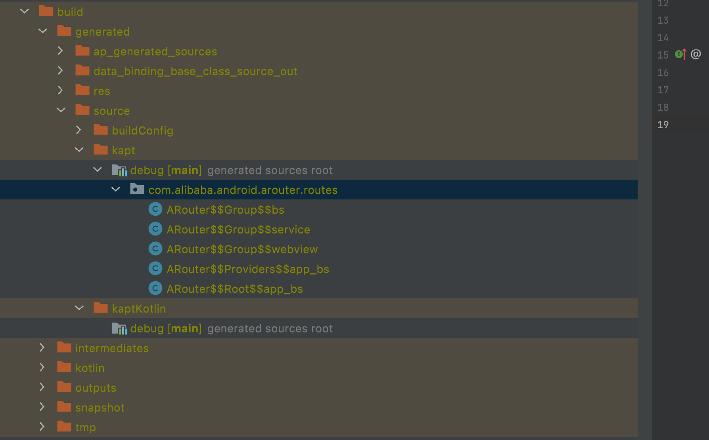

# 概述

组件化和路由框架是两件事情，路由框架是用来组件通信的一种具体方式。常用的路由框架有 [Arouter](https://github.com/alibaba/ARouter),[WMRouter](https://github.com/meituan/WMRouter) 等

另一种组件化通信的方式，是 [CC](https://github.com/luckybilly/CC) 号称为基于事件总线的通信方式。


其实，本质上大家都差不多，可能是设计思想的差异，如 WMRouter 号称是基于 SPI(service Provider Interface)的思想；Arouter 则非常的朴实无华


请注意：SPI这种编程思想非常好用。


在阅读代码之前，先抛开 gradle 插件，这些插件帮你做了很多事情，比如自动注册等，直接阅读本质代码。


# WMRouter 简单代码阅读

关于该框架的官方说法 是这样的： https://tech.meituan.com/2018/08/23/meituan-waimai-android-open-source-routing-framework.html


这个框架的ServiceLoader 给人造成了很大的困扰， 不过在阅读[美团外卖Android平台化架构演进实践](https://tech.meituan.com/2018/03/16/meituan-food-delivery-android-architecture-evolution.html)
的时候，看到这样的一段话：

> 汇总同层间通信的场景，大致上可以划分为：页面的跳转、基本数据类型的传递（包括可序列化的共有类对象的传递）、模块内部自定义方法和类的调用。针对上述情况，在我们的架构里面提供了二种平级间的通信方式：scheme路由和美团自建的ServiceLoaders sdk。scheme路由本质上是利用Android的scheme原理进行通信，ServiceLoader本质上是利用的Java反射机制进行通信。

根据他们的说法，页面的跳转，使用 scheme 路由分发，对象的获取使用 ServiceLoader ;这种设计有点......

感觉本质上.ServiceLoader 就是 接口下层。


WMrouter 个人感觉，采用了二套通信方式，分别是路由和接口下层，ServiceLoader只是接口下层的一种处理方式而已。


ServiceLoader 作为接口下层，不用去考虑处理，只需要看路由框架部分

> 把页面的跳转的 url 行为，抽象成一个 UriRequest ，UriHanlder 处理 UriRequest请求；于是我们只需要关心，WMRouter是如何把 UriRequest 匹配给 UriHanler 的就行了。


WMRouter 对于 uri 的考虑很多，她把一次的路由行为，封装成一个UriRequest,然后去找对应的UriHandler，按照官方的说法，所有的Uri分发都是通过 RootUriHandler 来处理

四种 UriHandler

- PageAnnotationHandler
-  UriAnnotationHandler
- RegexAnnotationHandler()
- StartUriHandler()

其中,框架作者的自己的说法如下:

> PageAnnotationHandler处理所有wm_router://page/*形式的URI跳转，根据path匹配由RouterPage注解配置的节点。

> UriAnnotationHandler根据URI的scheme+host，寻找并分发给对应的PathHandler，之后PathHandler再根据path匹配RouterUri注解配置的节点。

> RegexAnnotationHandler根据优先级和正则匹配尝试将URI分发给RouterRegex配置的每个节点。

> StartUriHandler尝试直接使用Android原生的隐式跳转启动URI，用于处理其他类型的URI，例如tel:*、mailto:*。


请注意，上面的划分只是一种逻辑上的划分，实际上处理都是一样，在底层的逻辑上，都是当UriHandler 进行处理，这个是面向对象的多态。


这些都是外在的，核心的看这个类
```java
public class PathHandler extends UriHandler {

    /**
     * path --> UriHandler
     */
    @NonNull
    private final CaseInsensitiveNonNullMap<UriHandler> mMap = new CaseInsensitiveNonNullMap<>();
    @Nullable
    private String mPathPrefix;
    @Nullable
    private UriHandler mDefaultHandler = null;

    /**
     * 设置path前缀
     */
    public void setPathPrefix(@Nullable String pathPrefix) {
        mPathPrefix = pathPrefix;
    }

    /**
     * 设置默认的ChildHandler。如果注册的ChildHandler不能处理，则使用默认ChildHandler处理。
     */
    public PathHandler setDefaultChildHandler(@NonNull UriHandler handler) {
        mDefaultHandler = handler;
        return this;
    }

    /**
     * 注册一个子节点
     *
     * @param path         path
     * @param target       支持ActivityClassName、ActivityClass、UriHandler
     * @param exported     是否允许外部跳转
     * @param interceptors 要添加的interceptor
     */
    public void register(String path, Object target, boolean exported,
            UriInterceptor... interceptors) {
        if (!TextUtils.isEmpty(path)) {
            path = RouterUtils.appendSlash(path);
            UriHandler parse = UriTargetTools.parse(target, exported, interceptors);
            UriHandler prev = mMap.put(path, parse);
            if (prev != null) {
                Debugger.fatal("[%s] 重复注册path='%s'的UriHandler: %s, %s", this, path, prev, parse);
            }
        }
    }

    /**
     * 注册一个子Handler
     *
     * @param path         path
     * @param handler      支持ActivityClassName、ActivityClass、UriHandler；exported默认为false
     * @param interceptors 要添加的interceptor
     */
    public void register(String path, Object handler, UriInterceptor... interceptors) {
        register(path, handler, false, interceptors);
    }

    /**
     * 注册若干个子Handler
     */
    public void registerAll(Map<String, Object> map) {
        if (map != null) {
            for (Map.Entry<String, Object> entry : map.entrySet()) {
                register(entry.getKey(), entry.getValue());
            }
        }
    }

    private UriHandler getChild(@NonNull UriRequest request) {
        String path = request.getUri().getPath();
        if (TextUtils.isEmpty(path)) {
            return null;
        }
        path = RouterUtils.appendSlash(path);
        if (TextUtils.isEmpty(mPathPrefix)) {
            return mMap.get(path);
        }
        if (path.startsWith(mPathPrefix)) {
            return mMap.get(path.substring(mPathPrefix.length()));
        }
        return null;
    }

    @Override
    protected boolean shouldHandle(@NonNull UriRequest request) {
        return mDefaultHandler != null || getChild(request) != null;
    }

    @Override
    protected void handleInternal(@NonNull final UriRequest request,
            @NonNull final UriCallback callback) {
        UriHandler h = getChild(request);
        if (h != null) {
            h.handle(request, new UriCallback() {
                @Override
                public void onNext() {
                    handleByDefault(request, callback);
                }

                @Override
                public void onComplete(int resultCode) {
                    callback.onComplete(resultCode);
                }
            });
        } else {
            handleByDefault(request, callback);
        }
    }

    private void handleByDefault(@NonNull UriRequest request, @NonNull UriCallback callback) {
        UriHandler defaultHandler = mDefaultHandler;
        if (defaultHandler != null) {
            defaultHandler.handle(request, callback);
        } else {
            callback.onNext();
        }
    }
}
```

至于如何把相关的配置生成 UriHandle ，可以看下面的这张图:


[WMRouter路由节点加载](http://susion.work/2019/02/28/android%E6%BA%90%E7%A0%81%E5%88%86%E6%9E%90/router/WMRouter%E8%B7%AF%E7%94%B1%E8%8A%82%E7%82%B9%E7%9A%84%E5%8A%A0%E8%BD%BD/)


# 关于ARouter 代码的简单分析


由于Arouter 比较典型，重点分析其代码过程


关注核心的类： Warehouse(仓库)， RouteMeta（描述配置类），LogisticsCenter（整个框架的逻辑中心），Postcard(一次路由行为相关信息)


Arouter 的核心逻辑都在 LogisticsCenter 中，所以，Arouter的阅读难度并不高。


## gradle 脚本帮我做的事情 


在编译阶段，帮我们生成对应的文件




我们点开其中的一个Root类，代码如下

```java 
public class ARouter$$Root$$app_bs implements IRouteRoot {
  @Override
  public void loadInto(Map<String, Class<? extends IRouteGroup>> routes) {
    routes.put("bs", ARouter$$Group$$bs.class);
    routes.put("service", ARouter$$Group$$service.class);
    routes.put("webview", ARouter$$Group$$webview.class);
  }
}
```
上面是 root类型的配置描述

下面是 group 的配置描述，这里的信息更加的丰富，我们看到了 RouteMeta 这个类，这个类就是配置描述。

```Java
public class ARouter$$Group$$webview implements IRouteGroup {
  @Override
  public void loadInto(Map<String, RouteMeta> atlas) {
    atlas.put("/webview/BaseWebViewActivity", RouteMeta.build(RouteType.ACTIVITY, BaseWebViewActivity.class, "/webview/basewebviewactivity", "webview", null, -1, -2147483648));
    atlas.put("/webview/HorizontalScreenWebViewActivity", RouteMeta.build(RouteType.ACTIVITY, HorizontalScreenWebViewActivity.class, "/webview/horizontalscreenwebviewactivity", "webview", null, -1, -2147483648));
  }
}

```
下面是 RouteMate的关键代码

```java 
public class RouteMeta {
    private RouteType type;         // Type of route
    private Element rawType;        // Raw type of route
    private Class<?> destination;   // Destination
    private String path;            // Path of route
    private String group;           // Group of route
    private int priority = -1;      // The smaller the number, the higher the priority
    private int extra;              // Extra data
    private Map<String, Integer> paramsType;  // Param type
    private String name;

    private Map<String, Autowired> injectConfig;  // Cache inject config.
}
```
在看下 RouteType
```java 
public enum RouteType {
    ACTIVITY(0, "android.app.Activity"),
    SERVICE(1, "android.app.Service"),
    PROVIDER(2, "com.alibaba.android.arouter.facade.template.IProvider"),
    CONTENT_PROVIDER(-1, "android.app.ContentProvider"),
    BOARDCAST(-1, ""),
    METHOD(-1, ""),
    FRAGMENT(-1, "android.app.Fragment"),
    UNKNOWN(-1, "Unknown route type");
    }

```

现在回过头去看 `ARouter$$Group$$webview` 中的代码，是不是更清晰了。


现在其实对 loadInto中， Map<String, Class<? extends IRouteGroup>> routes 中Map 是怎么来的很疑惑。下面的第二个部分就是解决这个疑惑。

> Root 的存在主要是为了性能方面的考虑，通过 Root 去找 Group

脚本的作用就是根据你 的配置，生成对应的 配置规范Class，为下一步注册做好准备。


## 注册

上面生成的Class文件如何找到? 通过扫描 dex 文件找到这些散落在各个角落的Class文件。通过Class 文件的名字，就可以用反射了....

核心的代码在 ClassUtils 的 getFileNameByPackageName 方法中。


以上的步骤就是脚本帮我们做的事情，没有脚本帮助我们可以自己注册配置，下面就是注册的核心代码了：

代码在 LogisticsCenter 的 init 中

``` java
for (String className : routerMap) {
                    if (className.startsWith(ROUTE_ROOT_PAKCAGE + DOT + SDK_NAME + SEPARATOR + SUFFIX_ROOT)) {
                        // This one of root elements, load root.
                        ((IRouteRoot) (Class.forName(className).getConstructor().newInstance())).loadInto(Warehouse.groupsIndex);
                    } else if (className.startsWith(ROUTE_ROOT_PAKCAGE + DOT + SDK_NAME + SEPARATOR + SUFFIX_INTERCEPTORS)) {
                        // Load interceptorMeta
                        ((IInterceptorGroup) (Class.forName(className).getConstructor().newInstance())).loadInto(Warehouse.interceptorsIndex);
                    } else if (className.startsWith(ROUTE_ROOT_PAKCAGE + DOT + SDK_NAME + SEPARATOR + SUFFIX_PROVIDERS)) {
                        // Load providerIndex
                        ((IProviderGroup) (Class.forName(className).getConstructor().newInstance())).loadInto(Warehouse.providersIndex);
                    }
                }
```

rootMap 就是  第一步中脚本帮我们生成的Class 类名，通过类名反射生成对象，注册到Warehouse对应的map中。

现在终于搞明白了第一个部分中的这个问题
> Map<String, Class<? extends IRouteGroup>> routes 中Map 是怎么来的。


！tip  
> 这里有个小细节，由于 Group 类型的 class可能很多，在实际中用到的不到 20%,Arouter不是把所有的 Class 一股脑的注册，而是只注册了 Root

最核心的注册机制弄懂了，接下来来就是如何找的问题。


## 如何通过 URL 找到对应的Class 并完成相关的行为？

RouteMate 有一个唯一的子类，Postcard。

补全 Postcard 中的信息，基本上就完成了一次路由行为。


而完善 Postcard 信息的核心代码就在下面的方法中。

```java 
 LogisticsCenter.completion(postcard);
```

- 从 Warehouse 中根据 path找到对应的 RouteMata 信息
- 如果 Group 对象没创建，就去创建（前面说的优化就指的这里）
- 通过 RouteMate信息补全 Postcard 中缺失的部分信息
- 解析 URL的参数部分，补全 Postcard 中另外的参数信息
- 通过 RouteMate中的 type,做对应的处理，比如 对于 Provider 类型，如果没有创建，就赶快创建。

补全了PostCard 信息表明已经找到了对应的 Class，接下来就是具体的的执行了，这里的代码就不粘贴了，是Activity 类型，就启动对应的 Activity，是Fragment 类型就创建对象并设置参数.....


RouteMate 真的是 贯穿整个核心啊。


