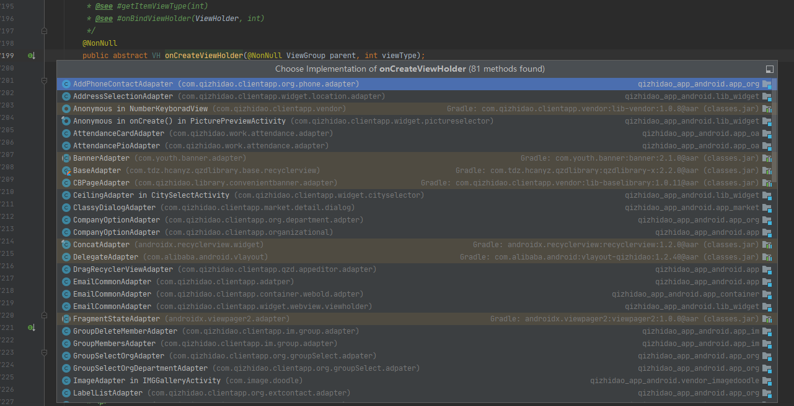
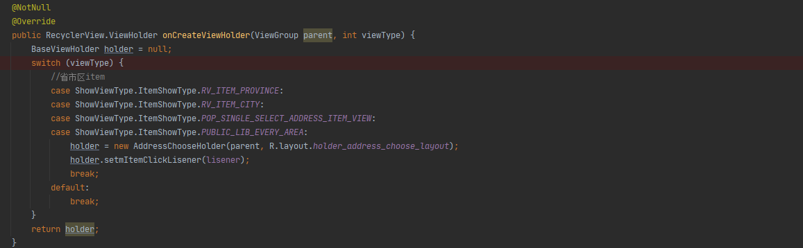

monkey 自动化测试中，抛出了这样的一个bug
[崩溃日志描述](./file/crash-202107161701.log.txt)


核心的崩溃记录:
```java
// Long Msg: java.lang.NullPointerException: Attempt to read from field 'android.view.View androidx.recyclerview.widget.RecyclerView$ViewHolder.itemView' on a null object reference
// 	at androidx.recyclerview.widget.RecyclerView$Adapter.createViewHolder(RecyclerView.java:7296)
// 	at androidx.recyclerview.widget.RecyclerView$Recycler.tryGetViewHolderForPositionByDeadline(RecyclerView.java:6416)
// 	at androidx.recyclerview.widget.RecyclerView$Recycler.getViewForPosition(RecyclerView.java:6300)
// 	at androidx.recyclerview.widget.RecyclerView$Recycler.getViewForPosition(RecyclerView.java:6296)
// 	at com.alibaba.android.vlayout.ExposeLinearLayoutManagerEx$LayoutState.next(ExposeLinearLayoutManagerEx.java:1628)
// 	at com.alibaba.android.vlayout.VirtualLayoutManager$LayoutStateWrapper.next(VirtualLayoutManager.java:1143)
// 	at com.alibaba.android.vlayout.layout.BaseLayoutHelper.nextView(BaseLayoutHelper.java:116)
// 	at com.alibaba.android.vlayout.layout.LinearLayoutHelper.layoutViews(LinearLayoutHelper.java:92)
// 	at com.alibaba.android.vlayout.layout.BaseLayoutHelper.doLayout(BaseLayoutHelper.java:318)
// 	at com.alibaba.android.vlayout.VirtualLayoutManager.layoutChunk(VirtualLayoutManager.java:741)
// 	at com.alibaba.android.vlayout.ExposeLinearLayoutManagerEx.fill(ExposeLinearLayoutManagerEx.java:1161)
// 	at com.alibaba.android.vlayout.ExposeLinearLayoutManagerEx.onLayoutChildren(ExposeLinearLayoutManagerEx.java:365)
// 	at com.alibaba.android.vlayout.VirtualLayoutManager.onLayoutChildren(VirtualLayoutManager.java:536)
// 	at androidx.recyclerview.widget.RecyclerView.dispatchLayoutStep2(RecyclerView.java:4309)
// 	at androidx.recyclerview.widget.RecyclerView.dispatchLayout(RecyclerView.java:4012)
// 	at androidx.recyclerview.widget.RecyclerView.onLayout(RecyclerView.java:4578)
```

# bug 修复过程

上面的崩溃日志，已经明确的指明了 崩溃点，ViewHolder 的空指针异常。打开RecyclerVie代码文件，定位到7296行：

代码如下：
```java 
   @NonNull
        public final VH createViewHolder(@NonNull ViewGroup parent, int viewType) {
            try {
                TraceCompat.beginSection(TRACE_CREATE_VIEW_TAG);
                final VH holder = onCreateViewHolder(parent, viewType);
                if (holder.itemView.getParent() != null) {
                    throw new IllegalStateException("ViewHolder views must not be attached when"
                            + " created. Ensure that you are not passing 'true' to the attachToRoot"
                            + " parameter of LayoutInflater.inflate(..., boolean attachToRoot)");
                }
                holder.mItemViewType = viewType;
                return holder;
            } finally {
                TraceCompat.endSection();
            }
        }
```
第 7296 行代码 是
```
 if (holder.itemView.getParent() != null) 
```

现在看出引发空指针的问题，holder 为 null,而创建 holder 的代码是:

```
 final VH holder = onCreateViewHolder(parent, viewType);
```

定位到 onCreateViewHolder方法，这是一个抽象的方法。我们就看 这个方法哪些子类的具体实现





接下来就是一个累活了，一个个的去看。比如这个类：AddressSelectionAdapter



明显就是没有覆盖完所有的可能，导致 holder可能没有创建完成，然后引发崩溃。


那么修复就简单了，简单所有的 onCreateViewHolder 方法实现，看看有没有 null 返回。


# 总结

这个bug 修复没有什么难度，仅此记录